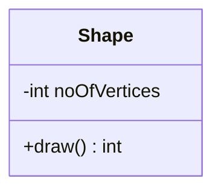
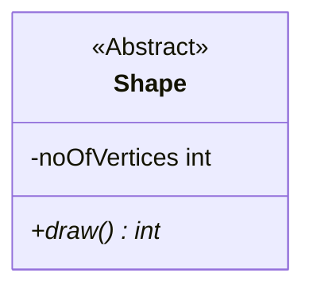
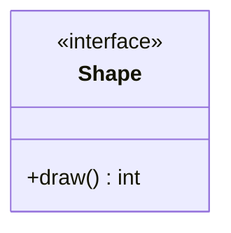
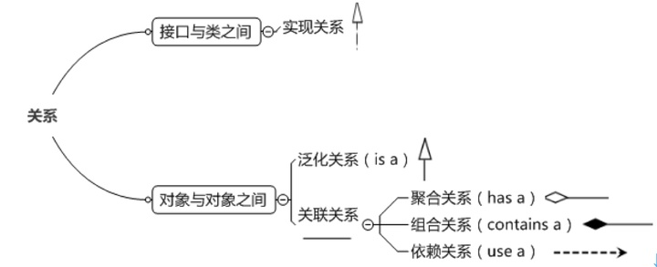
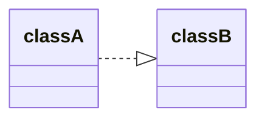
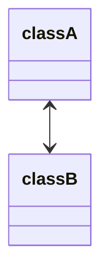
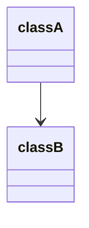
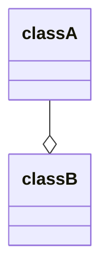
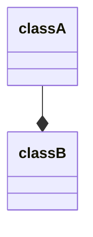
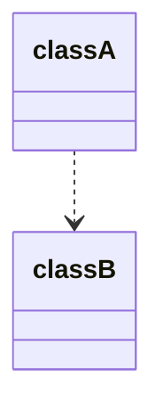

# 类图

## 一句话结论

类图是 UML 中**使用最广泛的静态图**，由类、接口、关联、协作和约束组成，直接映射面向对象语言：它描述类的属性、操作及系统约束，既用于可视化与文档化系统静态视图，也用于构建可执行代码，并是组件图和部署图的基础。

## 核心概念

- **定义**：类图由类、接口、关联、协作和约束组成；用活动类表示并发性；描述类的属性和操作以及对系统施加的约束。
- **定位**：类图是唯一直接映射到面向对象语言的图，表示系统面向对象的一面，用于开发目的，是构建时使用最广泛的图。
- **类的分类**：具体类、抽象类（斜体、`<<Abstract>>`）、接口（`<<interface>>`）。
- **访问权限符号**：`+` 表示 public，`-` 表示 private，`#` 表示 protected，不带符号表示 default。
- **类的关系**：实现、泛化、关联、聚合、组合、依赖。

## 工作机制

### 类的关系强弱与表示

| 关系 | 含义 | 表示 |
| --- | --- | --- |
| 实现 | 类实现接口的所有特征与行为 | 空心三角 + 虚线箭头，实现类指向接口（`..|>`） |
| 泛化 | 继承关系（is-a） | 空心三角 + 实线箭头，子类指向父类（`--|>`） |
| 关联 | 拥有关系（知道对方属性和方法），分单向/双向 | 双向用双箭头实线（`<-->`），单向用带箭头实线（`-->`） |
| 聚合 | 整体-部分可分离，部分可共享（has-a） | 空心菱形 + 实线箭头，菱形在整体一方（`--o`） |
| 组合 | 整体-部分不可分，整体负责局部生命周期（contains-a） | 实心菱形 + 实线箭头，菱形在整体一方（`--*`） |
| 依赖 | 弱关联，使用关系（use-a） | 带虚线箭头，使用方指向被使用方（`..>`） |

强弱顺序：**泛化 = 实现 > 组合 > 聚合 > 关联 > 依赖**。

图例助记：

- 泛化与实现都是空心小三角：泛化是继承（实线），实现是实现接口（虚线），箭头指向被实现/被继承的类。
- 组合与聚合都是菱形：组合实心、聚合空心，组合更强用实心，箭头指向个体/局部。
- 关联与依赖都是箭头：关联实线、依赖虚线，关联更强用实线，箭头指向被关联/被依赖的类。

### 用途

- 应用程序静态视图的分析与设计。
- 描述系统的职责。
- 作为组件图和部署图的基础。
- 正向与逆向工程。

## 示例或代码

用 Mermaid 表示具体类（三层：类名、成员变量、方法，带访问符号）：

抽象类（类名与方法斜体，带 `<<Abstract>>`）：

接口（`<<interface>>`）：

关系示例：泛化 `classA --|> classB`；实现 `classA ..|> classB`；组合 `classA --* classB`；聚合 `classA --o classB`；依赖 `classA ..> classB`；单向关联 `classA --> classB`。

## 常见误区

- **“聚合与组合可以互换”**：不能。组合（实心菱形）更强，整体负责局部生命周期且不可分；聚合（空心菱形）整体与部分可分离、部分可共享。
- **“关联就是聚合”**：关联只是“知道对方”的拥有关系；聚合是整体-部分的特例，代码上表现为部分对象是整体对象的成员变量。
- **“泛化和实现箭头方向相反”**：两者都是空心三角，箭头都指向父类/接口；区别只在实线（继承）与虚线（实现）。
- **“类图只能画静态结构”**：类图本身就是静态图，但类图中的关系（依赖/关联/聚合/组合/泛化/实现）描述了系统的静态结构，动态行为由其他 UML 图表达，不要混淆类图的定位。

## 证据映射

| claim_id | 来源 | 要点 |
| --- | --- | --- |
| class-diagram-claim-1 | web-computer-science-class-diagram | Mermaid Live Editor 宣称易用，可方便地创建图表 |
| class-diagram-claim-2 | web-computer-science-class-diagram | Mermaid 是开源库并有围绕它的平台 |
| class-diagram-claim-3 | web-computer-science-class-diagram | Mermaid 项目宣称有更多资源与更清晰的贡献路径 |

## 待验证项

无。

## 关联知识

- [[uml]] —— UML 总论，类图属结构图。
- [[object-diagram]] —— 类图的实例（快照）。
- [[software-modeling]] —— 软件建模中的结构建模。
- [[component-diagram]] / [[deployment-diagram]] —— 以类图为设计基础的实现/部署图。

## 详细章节

### 类图

类图由类、接口、关联、协作和约束组成。

在类图中使用活动类来表示系统的并发性。

类图表示系统的面向对象。因此，它通常用于开发目的。这是系统构建时使用最广泛的图。

类图是静态图。它代表应用程序的静态视图。类图不仅用于可视化、描述和记录系统的不同方面，还用于构建软件应用程序的可执行代码。

类图描述了类的属性和操作，以及对系统施加的约束。

#### 目的

类图是唯一直接用面向对象语言映射的图。

- 应用程序静态视图的分析和设计。
- 描述系统的职责。
- 组件和部署图的基础。
- 正向和逆向工程。

#### 哪里使用

- 描述系统的静态视图。
- 显示静态视图元素之间的协作。
- 描述系统执行的功能。
- 使用面向对象语言构建软件应用程序。

#### 模块元素

##### 类的分类

###### 具体类

分为三层

* 类名称
* 类成员变量
* 类方法

类成员变量和类方法的访问权限

* `+` 表示 `public`
* `-` 表示 `private`
* `# `表示 `protected`
* 不带符号表示 `default`

###### 抽象类

分为三层

* 类名称（斜体字）
* 类成员变量
* 类方法（斜体字）

###### 接口

分为两层

* 上部分用构造型 `<<interface>>`表示，下部分是接口名称
* 类方法

##### 类的关系

###### 实现

###### 定义

实现关系是指接口及其实现类之间的关系，表示类是接口所有特征和行为的实现。

###### 如何表示

实现关系用空心三角和虚线组成的箭头来表示。

箭头指向：从实现类指向接口。

###### 泛化

###### 定义

泛化关系是指对象与对象之间的继承关系，指定了子类继承父类的所有特征和行为。

如果对象A和对象B之间的“is a”关系成立，那么二者之间就存在继承关系，对象B是父对象，对象A是子对象。

###### 如何表示

泛化关系用空心三角和实线组成的箭头表示。

箭头方向：从子类指向父类。

###### 关联

###### 定义

关联关系是指对象和对象之间的拥有关系，它使一个对象知道另一个对象的属性和方法。

关联关系有单向关联和双向关联。如果两个对象都知道（即可以调用）对方的公共属性和操作，那么二者就是双向关联。如果只有一个对象知道（即可以调用）另一个对象的公共属性和操作，那么就是单向关联。

###### 如何绘制

双向关联关系用带双箭头的实线或者无箭头的实线双线表示。

单向关联用一个带箭头的实线表示。

箭头方向：关联对象指向被关联的对象。

###### 聚合

###### 定义

聚合是关联关系的一种特例，它体现的是整体与部分的拥有关系，即 “has a” 的关系。此时整体与部分之间是可分离的，它们可以具有各自的生命周期，部分可以属于多个整体对象，也可以为多个整体对象共享，所以聚合关系也常称为共享关系。

聚合是整体和个体的关系，理解为把个体聚集到一起。

具体代码表现形式为部分对象是整体对象的一个成员变量。

###### 如何绘制

聚合关系用空心菱形加实线箭头表示，空心菱形在整体一方。

箭头方向：整体指向个体。

###### 组合

###### 定义

组合是关联关系的一种特例，它同样体现整体与部分间的包含关系，即 “contains a” 的关系。但此时整体与部分是不可分的，部分也不能给其它整体共享，作为整体的对象负责部分的对象的生命周期。这种关系比聚合更强，也称为强聚合。如果`A`组合`B`，则`A`需要知道`B`的生存周期，即可能`A`负责生成或者释放`B`，或者`A`通过某种途径知道`B`的生成和释放。

组合是整体和局部的关系，整体对象负责代表局部对象的生命周期，理解为整体是由局部组成。

具体代码表现形式为部分对象是整体对象的一个成员变量。

###### 如何绘制

组合关系用实心菱形加实线箭头表示，实心菱形在整体一方。

箭头方向：整体指向局部。

###### 强弱顺序

泛化=实现>组合>聚合>关联>依赖

图例助记

* 泛化和实现都是空心小三角，泛化是继承类（用实线），实现是实现接口（虚线），箭头都是指向被实现的接口或类（可以理解为前者实现或继承后者）。
* 组合和聚合都是菱形，组合是实心菱形，聚合是空心菱形，组合关系更强所以用实心，箭头都是指向个体/局部（可以理解为前者组合/聚合成后者）。
* 关联和依赖都是箭头，关联是实线，依赖是虚线，关联关系更强所以用实线，箭头都是指向被关联/依赖的类（可以理解为前者关联/依赖后者）。

###### 依赖

###### 定义

依赖关系是一种弱关联关系。如果对象A用到对象B，但是和B的关系不是太明显的时候，就可以把这种关系看作是依赖关系。如果对象A依赖于对象B，则 A “use a” B。

依赖关系是一种使用关系，有单向依赖和双向依赖，但是要避免使用双向依赖。

具体代码表现形式为**B为A的构造器**或**方法中的局部变量**、**方法或构造器的参数**、**方法的返回值**，或者**A调用B的静态方法**。

###### 如何表示

依赖关系用一个带虚线的箭头表示。

箭头方向：由使用方指向被使用方，表示使用方对象持有被使用方对象的引用。

#### 如何绘制

https://mermaid-js.github.io/mermaid/#/classDiagram

#### 参考

https://www.tutorialspoint.com/uml/index.htm

https://www.cs.uah.edu/~rcoleman/Common/SoftwareEng/UML.html

https://zhuanlan.zhihu.com/p/109655171

## 参考

- https://www.tutorialspoint.com/uml/index.htm
- https://mermaid-js.github.io/mermaid/#/classDiagram
