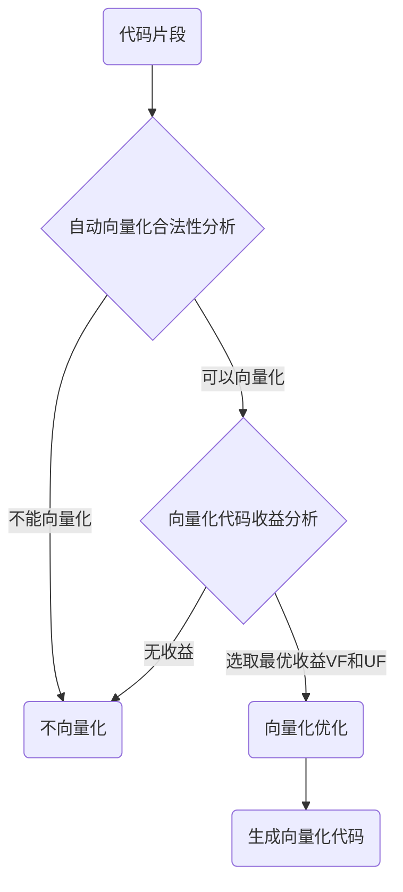

---
aliases:
- 编译器向量化
- 自动向量化
- GCC 自动向量化
- 编译器自动向量化
confidentiality: public
domain: computer-science
evidence:
- claim: LLVM 有两个向量化器：作用于循环的 Loop Vectorizer，以及 SLP Vectorizer（把散落的标量合并为向量）。
  claim_id: llvm-two-vectorizers
  support: direct
  supporting_quotes:
  - evidence_id: evidence-878e7e0d7d13
    exact: 'LLVM has two vectorizers: The Loop Vectorizer, which operates on Loops,
      and the SLP Vectorizer'
  - evidence_id: evidence-41839e947a4e
    exact: The SLP vectorizer merges multiple scalars that are found in the code into
      vectors
  targets:
  - evidence_id: evidence-878e7e0d7d13
    source_id: llvm-auto-vectorization
  - evidence_id: evidence-41839e947a4e
    source_id: llvm-auto-vectorization
- claim: Loop Vectorizer 与 SLP Vectorizer 默认均启用。
  claim_id: llvm-both-default
  support: direct
  supporting_quotes:
  - evidence_id: evidence-f6d60969c183
    exact: Both the Loop Vectorizer and the SLP Vectorizer are enabled by default.
  targets:
  - evidence_id: evidence-f6d60969c183
    source_id: llvm-auto-vectorization
- claim: Loop Vectorizer 默认启用，但可通过 clang 命令行标志关闭。
  claim_id: llvm-loopvec-disable
  support: direct
  supporting_quotes:
  - evidence_id: evidence-acbdf3a5d0f7
    exact: 'The Loop Vectorizer is enabled by default, but it can be disabled through
      clang using the command line flag:'
  targets:
  - evidence_id: evidence-acbdf3a5d0f7
    source_id: llvm-auto-vectorization
- claim: SLP Vectorizer 默认启用，但可通过 clang 命令行标志关闭。
  claim_id: llvm-slp-disable
  support: direct
  supporting_quotes:
  - evidence_id: evidence-b73fecc37bed
    exact: 'The SLP Vectorizer is enabled by default, but it can be disabled through
      clang using the command line flag:'
  targets:
  - evidence_id: evidence-b73fecc37bed
    source_id: llvm-auto-vectorization
- claim: 向量化 SIMD 宽度可用 -force-vector-width 命令行标志控制。
  claim_id: llvm-force-width
  support: direct
  supporting_quotes:
  - evidence_id: evidence-b37af9d946eb
    exact: Users can control the vectorization SIMD width using the command line flag
      “-force-vector-width”
  targets:
  - evidence_id: evidence-b37af9d946eb
    source_id: llvm-auto-vectorization
- claim: unroll 因子可用 -force-vector-interleave 命令行标志控制。
  claim_id: llvm-force-interleave
  support: direct
  supporting_quotes:
  - evidence_id: evidence-0b6bd80cc315
    exact: Users can control the unroll factor using the command line flag “-force-vector-interleave”
  targets:
  - evidence_id: evidence-0b6bd80cc315
    source_id: llvm-auto-vectorization
- claim: '#pragma clang loop 指令可对后续 for/while/do-while 循环指定向量化提示。'
  claim_id: llvm-pragma
  support: direct
  supporting_quotes:
  - evidence_id: evidence-fa72e0bfaddc
    exact: 'The #pragma clang loop directive allows loop vectorization hints to be

      specified for the subsequent for, while, do-while, or c++11 range-based for

      loop.'
  targets:
  - evidence_id: evidence-fa72e0bfaddc
    source_id: llvm-auto-vectorization
- claim: LLVM 用 -Rpass=loop-vectorize、-Rpass-missed=loop-vectorize、-Rpass-analysis=loop-vectorize
    三类优化 remark 诊断向量化成功/失败/原因。
  claim_id: llvm-rpass
  support: direct
  supporting_quotes:
  - evidence_id: evidence-03d1de17ae44
    exact: -Rpass=loop-vectorize identifies loops that were successfully vectorized.
  - evidence_id: evidence-fdd7b1718c11
    exact: -Rpass-missed=loop-vectorize identifies loops that failed vectorization
  - evidence_id: evidence-0faa375b91ea
    exact: '-Rpass-analysis=loop-vectorize identifies the statements that caused

      vectorization to fail.'
  targets:
  - evidence_id: evidence-03d1de17ae44
    source_id: llvm-auto-vectorization
  - evidence_id: evidence-fdd7b1718c11
    source_id: llvm-auto-vectorization
  - evidence_id: evidence-0faa375b91ea
    source_id: llvm-auto-vectorization
- claim: Loop Vectorizer 支持迭代次数未知的循环。
  claim_id: llvm-unknown-trip
  support: direct
  supporting_quotes:
  - evidence_id: evidence-83cd6b02e7df
    exact: The Loop Vectorizer supports loops with an unknown trip count.
  targets:
  - evidence_id: evidence-83cd6b02e7df
    source_id: llvm-auto-vectorization
- claim: Loop Vectorizer 可向量化混合类型程序。
  claim_id: llvm-mixed-types
  support: direct
  supporting_quotes:
  - evidence_id: evidence-97b92953540f
    exact: The Loop Vectorizer can vectorize programs with mixed types.
  targets:
  - evidence_id: evidence-97b92953540f
    source_id: llvm-auto-vectorization
- claim: Loop Vectorizer 可向量化内建数学函数调用。
  claim_id: llvm-fn-calls
  support: direct
  supporting_quotes:
  - evidence_id: evidence-f6ff3239ca00
    exact: The Loop Vectorizer can vectorize intrinsic math functions.
  targets:
  - evidence_id: evidence-f6ff3239ca00
    source_id: llvm-auto-vectorization
- claim: 数学函数向量化由 -fveclib 指定的目标向量库提供（如 Accelerate/libmvec/MASSV/SVML 等）。
  claim_id: llvm-fveclib
  support: direct
  supporting_quotes:
  - evidence_id: evidence-eca4e264cf4d
    exact: 'Using clang, this is handled by the “-fveclib” command line option with
      one of the following vector libraries: “Accelerate,libmvec,MASSV,SVML,SLEEF,Darwin_libsystem_m,ArmPL,AMDLIBM”'
  targets:
  - evidence_id: evidence-eca4e264cf4d
    source_id: llvm-auto-vectorization
- claim: Loop Vectorizer 通过对循环做部分展开来提升指令级并行（ILP）。
  claim_id: llvm-partial-unroll
  support: direct
  supporting_quotes:
  - evidence_id: evidence-dc8a5899f4a1
    exact: The Loop Vectorizer increases the instruction level parallelism (ILP) by
      performing partial-unrolling of loops.
  targets:
  - evidence_id: evidence-dc8a5899f4a1
    source_id: llvm-auto-vectorization
- claim: SLP 向量化（超字级并行）的目标是把相似的独立指令合并为向量指令。
  claim_id: llvm-slp-def
  support: direct
  supporting_quotes:
  - evidence_id: evidence-1e8de6a08cea
    exact: The goal of SLP vectorization (a.k.a. superword-level parallelism) is to
      combine similar independent instructions into vector instructions.
  targets:
  - evidence_id: evidence-1e8de6a08cea
    source_id: llvm-auto-vectorization
- claim: GCC 用 -ftree-vectorize 开启自动向量化，默认在 -O3。
  claim_id: gcc-ftree-vectorize
  support: direct
  supporting_quotes:
  - evidence_id: evidence-e15d32c63ae2
    exact: "    Vectorization is enabled by the flag\n    -ftree-vectorize and by
      default\n    at -O3."
  targets:
  - evidence_id: evidence-e15d32c63ae2
    source_id: gcc-auto-vectorization
- claim: GCC 用 -ffast-math 或 -fassociative-math 开启浮点归约的向量化。
  claim_id: gcc-ffast-math
  support: direct
  supporting_quotes:
  - evidence_id: evidence-b44e2c328ac6
    exact: "    x86_64 platforms use -msse/-msse2. To enable vectorization\n    of
      floating point reductions use -ffast-math or \n    -fassociative-math."
  targets:
  - evidence_id: evidence-b44e2c328ac6
    source_id: gcc-auto-vectorization
- claim: GCC 的 SLP 由 -ftree-slp-vectorize 开启，默认在 -O3，且当 -ftree-vectorize 开启时也生效。
  claim_id: gcc-slp
  support: direct
  supporting_quotes:
  - evidence_id: evidence-0784aafedc2e
    exact: "    Basic block vectorization, aka SLP, is enabled by the flag \n    -ftree-slp-vectorize,
      and requires the same platform dependent flags \n    as loop vectorization.
      Basic block SLP is enabled by default at -O3\n    and when -ftree-vectorize
      is enabled."
  targets:
  - evidence_id: evidence-0784aafedc2e
    source_id: gcc-auto-vectorization
- claim: GCC 用 -ftree-vectorizer-verbose 查看哪些循环被/未被向量化及原因。
  claim_id: gcc-verbose
  support: direct
  supporting_quotes:
  - evidence_id: evidence-978b9fdc3358
    exact: "    loops were or were not vectorized and why, can be obtained\n    using
      the flag -ftree-vectorizer-verbose."
  targets:
  - evidence_id: evidence-978b9fdc3358
    source_id: gcc-auto-vectorization
id: compiler-vectorization
kind: knowledge
publication_scope: public
related:
- llvm-auto-vectorization
sources:
- gcc-auto-vectorization
- llvm-auto-vectorization
status: published
tags:
- compiler
- vectorization
- simd
- gcc
- llvm
- neon
title: 编译器向量化指南
updated_at: '2026-09-02'
---
# 编译器向量化指南

> 版本基线（联网核对日期：2026-09-02）：GCC 16.2、LLVM/Clang 23.1.0、QEMU 11.1.1。版本会持续变化，复现实验时必须同时记录 `gcc --version`、`clang++ --version`、`qemu-aarch64 --version`、目标三元组、CPU 型号和完整编译参数；“最新版本”不应替代这些具体记录。
>
> 本文的编译器诊断可以证明编译器是否生成了向量化代码，不能单独证明程序正确或性能提升。正确性需要标量基线、边界/别名/未对齐输入和 Sanitizer 对照；性能需要真实目标机上的重复基准测试。QEMU 适合验证 AArch64/NEON 指令能否执行及结果是否正确，不适合推断真实 NEON 微架构的吞吐、延迟、缓存或功耗。

## 一句话结论

编译器自动向量化把标量程序改写为 SIMD 向量程序，让一条指令同时处理多个元素；GCC 与 LLVM 都默认提供自动向量化（循环向量化 + SLP 向量化），可通过编译选项开启/关闭、用诊断选项查看优化情况，对编译器无法自动优化的热点，可改用 `#pragma clang loop` 标记、SIMD intrinsic 或内嵌汇编接管。

## 核心概念

- **向量化（SIMD）**：一条向量指令同时运行多个相同类型的操作，发挥单指令多数据并行。
- **自动向量化**：编译器在编译期识别可向量化片段并改写为向量代码，无需修改业务代码。
- **循环向量化（Loop vectorization）**：针对 for/while 循环，把一次处理一个元素改写为一次处理多个元素。
- **SLP（超字级并行，又称 Basic block vectorization）**：把直线代码中相似的多个标量运算合并为一次向量运算。
- **标记向量化**：用 `#pragma clang loop` 指示编译器对指定循环执行向量化。
- **手动/汇编向量化**：用 SIMD intrinsic 或内嵌汇编重写热点片段，约束少但可移植性差。

## 工作机制

自动向量化的核心流程：编译器识别代码特征 → 向量器做合法性分析 → 对合法片段用代价模型评估收益 → 有收益则选取向量宽度（VF）与展开因子（UF）执行向量化。

- **常见阻碍因素**：循环次数无法确定、循环中有跳转指令、含有复杂分支、包含函数调用等。
- **LLVM**：由 Loop Vectorizer（循环）与 SLP Vectorizer（直线代码）两个独立向量化器承担，默认均启用；SIMD 宽度与 unroll 因子可用 `-force-vector-width` / `-force-vector-interleave` 显式控制。
- **GCC**：循环向量化由 `-ftree-vectorize` 开启，SLP 由 `-ftree-slp-vectorize` 开启。
- **诊断**：LLVM 用 `-Rpass=loop-vectorize` 系列优化 remark；GCC 用 `-ftree-vectorizer-verbose` / `-fopt-info-vec-*`。
- **手动手段**：`#pragma clang loop vectorize(enable)`、ARM NEON intrinsic（`vld1q_f32`/`vaddq_f32`/`vst1q_f32`）、内嵌汇编。

## 示例或代码

自动向量化（GCC/LLVM 均可自动处理的特征循环）：

```c++
void Add(float *input1, float *input2, float *output, int size)
{
    for (int i = 0; i < size; i++) {
        output[i] = input1[i] + input2[i];
    }
}
```

标记向量化（`#pragma clang loop` 辅助编译器）：

```c++
void Add(float *input1, float *input2, float *output, int size)
{
#pragma clang loop vectorize(enable)
    for (int i = 0; i < size; i++) {
        output[i] = input1[i] + input2[i];
    }
}
```

手动向量化（ARM NEON intrinsic）：

```c++
void Add(float *input1, float *input2, float *output, int size)
{
    int i = 0;
#ifdef __ARM_NEON
    for (; i < size - 3; i += 4) {
        float32x4_t v1 = vld1q_f32(input1 + i);
        float32x4_t v2 = vld1q_f32(input2 + i);
        float32x4_t v3 = vaddq_f32(v1, v2);
        vst1q_f32(output + i, v3);
    }
#endif
    for (; i < size; i++) {
        output[i] = input1[i] + input2[i];
    }
}
```

汇编向量化（ARM AArch64 内嵌汇编，主循环 + 尾部标量；asm 用后增量移动指针，尾部从剩余段起点继续）：

```c++
void Add(float *input1, float *input2, float *output, int size)
{
#ifdef __ARM_NEON
    if (size <= 0) {
        return;
    }
    int vecSize = size & (~0x3);
    int tail = size - vecSize;
    const float *vecInput1 = input1;
    const float *vecInput2 = input2;
    float *vecOutput = output;
    if (vecSize > 0) {
        asm volatile(
            "1: \n"
            "ld1 {v0.4s}, [%[input1]], #16 \n"
            "ld1 {v1.4s}, [%[input2]], #16 \n"
            "fadd v0.4s, v0.4s, v1.4s \n"
            "subs %w[vecSize], %w[vecSize], #4 \n"
            "st1 {v0.4s}, [%[output]], #16 \n"
            "bgt 1b \n"
            : [input1] "+r"(vecInput1), [input2] "+r"(vecInput2),
              [output] "+r"(vecOutput), [vecSize] "+r"(vecSize)
            :
            : "memory", "v0", "v1"
        );
    }
    /* 尾部标量处理：vecSize 已被 asm 改写为 0，须用已后移的 vecInput/vecOutput */
    for (int i = 0; i < tail; i++) {
        vecOutput[i] = vecInput1[i] + vecInput2[i];
    }
#else
    for (int i = 0; i < size; i++) {
        output[i] = input1[i] + input2[i];
    }
#endif
}
```

## 常见误区

- **以为只有循环能向量化**：直线代码里的多个标量运算由 SLP Vectorizer 合并，不是"没有循环就没有向量化"。
- **以为向量化一定更快**：向量化由代价模型评估收益，无收益或开销过大的片段会被放弃，不强制执行。
- **以为 `#pragma` 是强制指令**：`#pragma clang loop` 是指示性标记，编译器发现向量化存在风险时仍会放弃。
- **以为数据对齐到某个字节数最佳**：AArch64 的 `ld1`/`st1` 支持非对齐地址，16 字节对齐不是正确性要求；cache line 大小因核而异（如 Cortex-A9 32 字节、Cortex-A8/A53 64 字节），不能把 32/64 字节写成 NEON 通用最佳值，实际代价需在目标 CPU 上测量。

## 证据映射

- `llvm-two-vectorizers` / `llvm-both-default` / `llvm-loopvec-disable` / `llvm-slp-disable`：LLVM 向量化器的构成与默认开关，由 `llvm-auto-vectorization`（LLVM 官方 `https://llvm.org/docs/Vectorizers.html`）逐字支撑。
- `llvm-force-width` / `llvm-force-interleave` / `llvm-pragma` / `llvm-rpass`：LLVM 的宽度/unroll 控制、`#pragma clang loop` 与诊断选项，同上来源。
- `llvm-unknown-trip` / `llvm-mixed-types` / `llvm-fn-calls` / `llvm-fveclib` / `llvm-partial-unroll` / `llvm-slp-def`：LLVM Loop Vectorizer 支持的特性与向量库，同上来源。
- `gcc-ftree-vectorize` / `gcc-ffast-math` / `gcc-slp` / `gcc-verbose`：GCC 的开启选项、浮点归约、SLP 与诊断，由 `gcc-auto-vectorization`（GCC 官方 `https://gcc.gnu.org/projects/tree-ssa/vectorization.html`）逐字支撑。
- claim 表述严格不超出引文字面；正文中的推论性内容（编程建议、误区、示例）留在正文，不上升为 claim。

## 待验证项

- [ ] NEON 数据对齐的性能差异：本机 Apple M3 已实测（未对齐 92-97 / 16B 109 / 64B 123 GB/s，结论已入正文"数据对齐"节），但 M3 微架构 ≠ Cortex 系列，**目标核（Cortex）真机基准仍待补**。
## 关联知识

- [LLVM 自动向量化](wiki/computer-science/llvm-auto-vectorization.md)：LLVM 向量化器的两个组成与宽度控制。
- 循环优化与编译器优化选项
- SIMD 指令集与数据并行
- 程序性能的分析和测量


## 详细章节（working 指南原文，零删减）
### 向量化概述

向量化又称为矢量化。相对于标量一条指令运行一个操作，一条向量指令可以运行多个相同类型的操作。向量化是将标量程序转换为矢量程序，发挥程序SIMD（Single Instruction, Multiple Data）并行化的优化技术。
向量化技术需要在特定环境平台支持，如具有NEON扩展的ARM方案。向量化技术需要依赖编译工具链协助，常见的编译工具链如LLVM和GCC均有支持。常见的使用向量优化技术方法如下表：

| 方法       | 说明                                                         |
| ---------- | ------------------------------------------------------------ |
| 自动向量化 | 如LLVM的`-fvectorize`、`-fslp-vectorize`编译选项；使用简单，开发者使用编译选项开启优化获取收益，无需修改代码有益于代码移植与维护。 |
| 标记向量化 | `#pragma clang loop`标记：使用方便，开发者通过`#pragma clang loop` 编译指示辅助编译器更有效的执行优化获取收益。 |
| 手动向量化 | SIMD intrinsic：开发者基于SIMD intrinsic 提供的矢量接口重写替换标量程序，约束较少使用灵活。 |
| 汇编向量化 | asm vector inst：开发者基于矢量指令集，便携内嵌的汇编代码，向量化收益较好。 |

“自动向量化”优化编译器在编译阶段自动解析代码特征对适宜片段实施矢量转换优化，使用最简单。由于业务代码特征多样，对于编译器无法向量化优化的热点片段，使用标记向量化辅助编译器进行优化，对于无法优化的热点片段使用手动向量化重写替换标量程序可充分发挥并行性。


#### 自动向量化

自动向量化优化主要包括两类：

* 循环向量化 （Loop vectorization）
  * 针对特定形式的循环片段，编译器优化处理流程的基本原理如下图所示，首先尝试对循环片段做unroll展开寻找矢量化机会，然后尝试使用矢量指令替代标量指令以并行运算。
* 超字并行向量 (SLP，Superword-Level Parallelism vectorization，又称Basic block vectorization)
  * 针对特定形式的标量片段，编译器优化处理流程的基本原理如下图所示，编译器将多个标量运算绑定到一起，使其成为向量运算。如下图将四次标量运算替换为一次向量运算。

编译器支持自动向量化优化，根据编译器以及版本差异在`-O2`或`-O3`优化选项时默认会开启该优化。该技术只有在拥有SIMD扩展的架构处理器上生效，如拥有NEON扩展的Armv7和Armv8处理器。


自动向量化优化流程：

编译器自动向量化优化由矢量器控制完成。编译器识别代码特征，矢量器分析代码特征，对于向量化合法的代码片段采用预设模型评估收益，对于矢量化有收益的代码片段执行向量化优化，对于无法向量化或能够向量化却无正向收益的代码不执行向量化优化。



* 循环是否满足向量化约束。以下是常见影响因素，不是绝对禁止条件：
  * 控制流结构；LLVM 可通过 if-conversion 处理部分 `if`/`else`，复杂控制流仍可能增加成本。
  * 循环次数；未知 trip count 可以通过运行时检查、标量尾部或尾循环向量化处理。
  * 指令可向量化（矢量指令）
  * 循环携带的数据依赖（无依赖通常更容易向量化）
* 向量化代码收益分析（向量化优化是否有收益）
  * 最大向量化长度计算，vectorization factor候选
  * 指令开销估算（芯片实际开销）
  * 存储开销策略（标量、聚合、跨幅方法代价调优）
  * 候选VF估算代价开销，VF优选
  * 平台寄存器数量，unroll factor优选


自动向量化优化含有约束条件：

编译器自动向量化优化只能对适宜的代码片段进行优化转换，对于含有约束特征的片段不优化处理。

常见的约束条件或阻碍向量化优化的原因包括：

* 循环次数无法确定;
* 循环中有无法转换的跳转指令;
* 含有复杂或代价过高的分支;
* 包含函数调用等。

即只有特定特征的代码才能够被编译器识别执行优化。对于能够向量化优化的片段还需要评估开销与收益，如SIMD的寄存器开销，评估矢量优化能够获取的收益，只有开销合理和有收益的片段才会被矢量化器执行向量化优化。


自动向量化编程建议：

自动向量化优化的约束条件较多。如需要发挥并行性优化能力，针对业务特征合理的规避约束条件，采用易于向量化的编程方法设计程序将有助于程序向量化优化。


自动向量化编程举例：

如下特征循环编译器将分析并尝试执行向量化优化。

```c++
void Add(float *input1, float *input2, float *output, int size)
{
    for (int i = 0; i < size; i++) {
        output[i] = input1[i] + input2[i];
    }
}
```


#### 标记向量化

标记向量化使用举例：例如，LLVM编译器在如下特征循环在循环上部标记`#pragma`指示，辅助编译器执行向量化优化。注意`#pragma`的标记是一种指示，如果编译器在分析循环时发现向量化存在风险时仍然会放弃实施向量化优化。

```c++
void Add(float *input1, float *input2, float *output, int size)
{
#pragma clang loop vectorize(enable)
    for (int i = 0; i < size; i++) {
        output[i] = input1[i] + input2[i];
    }
}
```


#### 手动向量化

手动向量化使用举例：相对于自动向量化优化无需开发者修改程序代码，手动向量化优化主要面向无法进行自动向量化优化的热点片段，手动使用矢量的`intrinsic`接口编写程序。如下代码片段指示了ARM平台使用方法，代码引用`arm_neon.h`头文件，头文件中定义了矢量类与矢量接口，Add函数完成两个浮点数组的加法操作。

```c++
#if defined(__ARM_NEON)
#include <arm_neon.h>
#endif

void Add(float *input1, float *input2, float *output, int size)
{
    int i = 0;
#ifdef __ARM_NEON
    for (; i < size - 3; i += 4) {
        float32x4_t v1 = vld1q_f32(input1 + i);
        float32x4_t v2 = vld1q_f32(input2 + i);
        float32x4_t v3 = vaddq_f32(v1, v2);
        vst1q_f32(output + i, v3);
    }
#endif
    for (; i < size; i++) {
        output[i] = input1[i] + input2[i];
    }
}
```


#### 汇编向量化

汇编向量化使用举例：对于热点片段，使用汇编向量化可有效的提高程序性能，如下示例显示了Add函数完成两个浮点数组的加法操作。

```c++
void Add(float *input1, float *input2, float *output, int size)
{
#ifdef __ARM_NEON
    if (size <= 0) {
        return;
    }
    int vecSize = size & (~0x3);
    int tail = size - vecSize;
    const float *vecInput1 = input1;
    const float *vecInput2 = input2;
    float *vecOutput = output;
    if (vecSize > 0) {
        asm volatile(
            "1: \n"
            "ld1 {v0.4s}, [%[input1]], #16 \n"
            "ld1 {v1.4s}, [%[input2]], #16 \n"
            "fadd v0.4s, v0.4s, v1.4s \n"
            "subs %w[vecSize], %w[vecSize], #4 \n"
            "st1 {v0.4s}, [%[output]], #16 \n"
            "bgt 1b \n"
            : [input1] "+r"(vecInput1), [input2] "+r"(vecInput2),
              [output] "+r"(vecOutput), [vecSize] "+r"(vecSize)
            :
            : "memory", "v0", "v1"
        );
    }
    /* 尾部标量处理：asm 已用后增量把 vecInput/vecOutput 移到剩余段起点，
       vecSize 已被 asm 改写为 0，不能再当偏移量用 */
    for (int i = 0; i < tail; i++) {
        vecOutput[i] = vecInput1[i] + vecInput2[i];
    }
#else
    for (int i = 0; i < size; i++) {
        output[i] = input1[i] + input2[i];
    }
#endif
}
```


### GCC自动向量化

#### 自动向量化编译选项

自动向量化优化技术可以通过编译选项开启使用或通过`-O2`、`-O3`等优化级别使能。常用的优化选项有`-ftree-vectorize`，`-ftree-loop-vectorize`等。
GCC编译器自动向量化优化技术还提供了一些较为灵活的优化选项，如向量化循环的循环次数阈值设置`--param min-vect-loop-bound=N`，向量化优化代价模型设置
`-fvect-cost-model=model`等，更为详细的可通过编译器帮助手册查阅使用。

##### `-ftree-vectorize`

自动向量化优化开启选项，选项隐含开启了`-ftree-loop-vectorize`和`-ftree-slp-vectorize`两个选项。对for和while循环类型以及合理的基本块进行自动向量化优化。具体默认级别以目标版本和目标架构为准；GCC 12+ 在 `-O2` 默认启用这两个向量化 pass，但 **pass 启用不等于实际向量化**——实测（GCC 12.3, arm64）`-O2` 编译简单循环并不向量化，`-O3` 或显式 `-ftree-vectorize` 才触发，说明 `-O2` 成本模型更保守。可用 `gcc -Q --help=optimizers` 核对 pass 状态、用 `-fopt-info-vec-optimized` 核对实际向量化结果。


##### `-ftree-loop-vectorize`

循环自动向量化优化开启选项。对for和while类型的循环进行自动向量化优化。


##### `-ftree-slp-vectorize`

超字并行自动向量化优化开启选项。对合适的基本块类型的代码片段进行自动向量化优化。


##### `-ffast-math`

浮点数优化选项，`-ffast-math`是一个群组选项，包含`-fno-math-errno`等六个优化选项。由于浮点数在归纳运算场景的矢量化运算时不完全符合IEEE标准，将阻碍向量化优化，在一定精度的条件下为了更充分的发挥向量化优化可启用 `-ffast-math`提升运算效率。


#### 自动向量化诊断

> 诊断接口验证（2026-09-03, gcc-12.3 实测）：`-ftree-vectorizer-verbose` 在现代 GCC 中显示 "Does nothing. Preserved for backward compat"（旧接口，仅向后兼容保留），现代诊断统一走 `-fopt-info` 框架（`-fopt-info-vec-optimized` / `-fopt-info-vec-missed` / `-fopt-info-note-vec` 等）。

##### `-fopt-info-vec-optimized`

诊断标识向量化优化成功的循环。编译阶段对成功向量化优化的循环片段进行报告。


##### `-fopt-info-vec-missed`

诊断标识向量化优化失败的循环。编译阶段对未成功向量化的循环片段进行报告。


##### `-fopt-info-vec-note`

诊断向量化优化信息。编译阶段对未成功向量化优化的循环片段进行分析，报告阻碍向量化的语句和原因。


#### 自动向量化特性

##### 支持循环次数为常量

```c++
int a[256], b[256], c[256];
foo () {
    int i;

    for (i=0; i<256; i++){
    	a[i] = b[i] + c[i];
    }
}
```


##### 支持循环次数为变量

```c++
int a[256], b[256], c[256];
foo (int n, int x) {
    int i;

    /* feature: support for unknown loop bound  */
    /* feature: support for loop invariants  */
    for (i=0; i<n; i++)
		b[i] = x;

    /* feature: general loop exit condition  */
    /* feature: support for bitwise operations  */
    i = 0;
    while (i < n){
		a[i] = b[i]&c[i]; i++;
    }
}
```


##### 支持位操作

```c++
void foo (int *a, const int *b, const int *c, int n)
{
    for (int i = 0; i < n; i++)
        a[i] = b[i] & c[i];
}
```


##### 支持对齐指针访问

```c++
typedef int aint __attribute__ ((__aligned__(16)));
foo (int n, aint * __restrict__ p, aint * __restrict q) {

   /* feature: support for (aligned) pointer accesses.  */
   while (n--){
      *p++ = *q++;
   }
}
```


##### 支持常量运算

```c++
while (n--) {
    *p++ = *q++ + 5;
}
```


##### 支持编译时可知的未对齐访问

```c++
/* feature: support for read accesses with a compile time known misalignment.  */
for (i = 0; i < n; i++) {
    a[i] = b[i + 1] + c[i + 3];
}
```


##### 支持简单条件

```c++
/* feature: support for if-conversion.  */
for (i = 0; i < n; i++) {
    j = a[i];
    b[i] = (j > MAX ? MAX : 0);
}
```


##### 支持结构体地址对齐访问

```c++
struct a {
	int ca[N];
} s;
void foo (void)
{
    for (int i = 0; i < N; i++)
    {
        /* feature: support for alignable struct access  */
        s.ca[i] = 5;
    }
}
```


##### 支持编译时未知的未对齐访问

```c++
int a[256], b[256];
foo (int x) {
   int i;

   /* feature: support for read accesses with an unknown misalignment  */
   for (i=0; i<N; i++){
      a[i] = b[i+x];
   }
}
```


##### 支持多维数组

```c++
int a[M][N];
foo (int x) {
   int i,j;

   /* feature: support for multidimensional arrays  */
   for (i=0; i<M; i++) {
        for (j=0; j<N; j++) {
        	a[i][j] = x;
        }
   }
}
```


##### 支持reduction

```c++
unsigned int ub[N], uc[N];
foo () {
    int i;

    /* feature: support summation reduction.
     note: in case of floats use -funsafe-math-optimizations  */
    unsigned int diff = 0;
    for (i = 0; i < N; i++) {
    	diff += (ub[i] - uc[i]);
    }
}
```


##### 支持不同类型远算

```c++
/* feature: support data-types of different sizes.
   Currently only a single vector-size per target is supported; 
   it can accommodate n elements such that n = vector-size/element-size 
   (e.g, 4 ints, 8 shorts, or 16 chars for a vector of size 16 bytes). 
   A combination of data-types of different sizes in the same loop 
   requires special handling. This support is now present in mainline,
   and also includes support for type conversions.  */

short *sa, *sb, *sc;
int *ia, *ib, *ic;
for (i = 0; i < N; i++) {
	ia[i] = ib[i] + ic[i];
	sa[i] = sb[i] + sc[i];
}

for (i = 0; i < N; i++) {
	ia[i] = (int) sb[i];
}
```


##### 支持跨步访问

```c++
/* feature: support strided accesses - the data elements
   that are to be operated upon in parallel are not consecutive - they
   are accessed with a stride > 1 (in the example, the stride is 2):  */

for (i = 0; i < N/2; i++){
    a[i] = b[2*i+1] * c[2*i+1] - b[2*i] * c[2*i];
    d[i] = b[2*i] * c[2*i+1] + b[2*i+1] * c[2*i];
}
```


##### 支持Induction

```c++
for (i = 0; i < N; i++) {
	a[i] = i;
}
```


##### 支持外层循环向量化

```c++
for (i = 0; i < M; i++) {
    diff = 0;
    for (j = 0; j < N; j+=8) {
		diff += (a[i][j] - b[i][j]);
    }
    out[i] = diff;
}
```


##### 支持Double reduction

```c++
for (k = 0; k < K; k++) {
    sum = 0;
    for (j = 0; j < M; j++)
        for (i = 0; i < N; i++)
        	sum += in[i+k][j] * coeff[i][j];

    out[k] = sum;
}
```


##### 支持嵌套循环条件

```c++
for (j = 0; j < M; j++)
{
    x = x_in[j];
    curr_a = a[0];

    for (i = 0; i < N; i++) {
        next_a = a[i+1];
        curr_a = x > c[i] ? curr_a : next_a;
    }

    x_out[j] = curr_a;
}
```


##### 支持Load permutation in loop-aware slp

```c++
for (i = 0; i < N; i++)
{
    a = *pInput++;
    b = *pInput++;
    c = *pInput++;

    *pOutput++ = M00 * a + M01 * b + M02 * c;
    *pOutput++ = M10 * a + M11 * b + M12 * c;
    *pOutput++ = M20 * a + M21 * b + M22 * c;
}
```


##### 支持基本块向量化

```c++
void foo ()
{
    unsigned int *pin = &in[0];
    unsigned int *pout = &out[0];

    *pout++ = *pin++;
    *pout++ = *pin++;
    *pout++ = *pin++;
    *pout++ = *pin++;
}
```


##### 支持基本块简单reduction

```c++
int sum1;
int sum2;
int a[128];
void foo (void)
{
    int i;

    for (i = 0; i < 64; i++) {
        sum1 += a[2*i];
        sum2 += a[2*i+1];
    }
}
```


##### 支持基本块Reduction 

```c++
int sum;
int a[128];
void foo (void)
{
    int i;

    for (i = 0; i < 64; i++) {
        sum += a[2*i];
        sum += a[2*i+1];
    }
}
```


##### 支持Basic block SLP with multiple types, loads with different offsets, misaligned load and not-affine access

```c++
void foo (int * __restrict__ dst, short * __restrict__ src,
          int h, int stride, short A, short B)
{
    int i;
    for (i = 0; i < h; i++) {
        dst[0] += A*src[0] + B*src[1];
        dst[1] += A*src[1] + B*src[2];
        dst[2] += A*src[2] + B*src[3];
        dst[3] += A*src[3] + B*src[4];
        dst[4] += A*src[4] + B*src[5];
        dst[5] += A*src[5] + B*src[6];
        dst[6] += A*src[6] + B*src[7];
        dst[7] += A*src[7] + B*src[8];
        dst += stride;
        src += stride;
    }
}
```


##### 支持后向遍历

```c++
int foo (int *b, int n)
{
    int i, a = 0;

    for (i = n-1; i >= 0; i--)
    	a += b[i];

    return a;
}
```


##### 支持对齐提示

```c++
void foo (int *out1, int *in1, int *in2, int n)
{
    int i;

    out1 = (int *)__builtin_assume_aligned (out1, 32, 16);
    in1 = (int *)__builtin_assume_aligned (in1, 32, 16);
    in2 = (int *)__builtin_assume_aligned (in2, 32, 0);

    for (i = 0; i < n; i++)
    	out1[i] = in1[i] * in2[i];
}
```


##### 支持移位向更宽的类型

```c++
void foo (unsigned short *src, unsigned int *dst)
{
    int i;

    for (i = 0; i < 256; i++)
        *dst++ = *src++ << 7;
}
```


##### 支持条件混合类型运算

```c++
#define N 1024
float a[N], b[N];
int c[N];

void foo (short x, short y)
{
    int i;
    for (i = 0; i < N; i++)
    	c[i] = a[i] < b[i] ? x : y;
}
```


##### 支持bool类型

```c++
#define N 1024
float a[N], b[N], c[N], d[N];
int j[N];

void foo (void)
{
    int i;
    _Bool x, y;
    for (i = 0; i < N; i++)
    {
        x = (a[i] < b[i]);
        y = (c[i] < d[i]);
        j[i] = x & y;
    }
}
```


### LLVM自动向量化

#### 自动向量化编译选项

自动向量化优化技术可以通过编译选项开启使用，常用的优化选项有`-fvectorize`，`-fslp-vectorize` 等。LLVM编译器自动向量化优化还提供了尾循环向量化、外层循环向量化、最小 trip count 和成本模型等选项；不同 LLVM 版本的隐藏参数可能变化，应以 `clang -cc1 -mllvm --help-hidden` 的实际输出为准，不建议把隐藏参数当作稳定接口。

> LLVM 特性默认级别实测（2026-09-03, Apple clang 21.0 ≈ 基线 Clang 23.1.0, arm64）：本文档 LLVM 特性清单的全部 11 个示例（unknown trip count / runtime pointer checks / reduction / induction / if-conversion / pointer induction / reverse / scatter-gather / mixed types / fn calls / unroll）在 `-O2` 与 `-O3` 均默认向量化（10 条宽度 4 + 1 条宽度 16，两级别结果一致）。

##### `-fvectorize`

循环自动向量化优化开启选项。对for和while类型的循环进行自动向量化优化；嵌套循环的具体选择由当前 LLVM pass 和成本模型决定。该选项需要目标架构具有相应的 SIMD 指令集，如 AArch32 的 NEON 可用 `-mfpu=neon` 选择，AArch64 的 Advanced SIMD/NEON 属于架构能力，仍应通过目标三元组和 CPU 参数确认。

* LLVM/Clang 23.1.0 在 `-O2`、`-O3` 和 `-Ofast` 优化级别默认启用 Loop Vectorizer 与 SLP Vectorizer；`-O4` 不是可移植的优化级别，不应作为版本基线。
* GCC 12+ 在 `-O2` 默认启用 loop/SLP vectorization pass，但实测（GCC 12.3, arm64）`-O2` 成本模型对简单循环仍不实际向量化，`-O3` 或显式 `-ftree-vectorize` 才触发；以 `gcc -Q --help=optimizers` 核对 pass 状态、`-fopt-info-vec-*` 核对实际结果为准。


##### `-fslp-vectorize`

超字并行自动向量化优化开启选项。Clang 的对应选项是 `-fslp-vectorize`，不是 `-fvectorize-slp`。同`-fvectorize`类似，需要目标架构具有可用的 SIMD 指令集。


##### `-fno-vectorize`

循环自动向量化优化关闭选项。禁用对循环进行自动向量化的优化。


##### `-fno-slp-vectorize`

超字并行自动向量化优化关闭选项。禁用对超字并行自动向量化优化。


##### `-fveclib=<value>`

使用矢量数学库。可用值与目标平台、Clang 构建版本有关，应先运行 `clang --help` 或 `clang -###` 确认；例如 `libmvec` 依赖 glibc，`Accelerate`/`Darwin_libsystem_m` 面向 Darwin，SVML 主要面向 Intel 目标。
注：`-fveclib` 只选择向量数学库，是否需要额外链接库以及库名由平台决定，不能统一写成 `-lmvec`。
在支持 libmvec 的 glibc 环境中才可使用类似 `-fveclib=libmvec -lmvec` 的组合，其他平台不能照搬。


##### `-ffast-math`

浮点数优化选项，`-ffast-math`是一个群组选项，包含`-fno-math-errno`等六个优化选项。由于浮点数在归纳运算场景的向量化运算时不完全符合IEEE标准，将阻碍向量化优化，在一定精度的条件下为了更充分的发挥向量化优化可启用`-ffast-math`提升运算效率。


#### 自动向量化诊断

SIMD 技术适合在计算密集型场景，不合适业务控制类场景。在许多循环无法自动向量化，比如循环中包含有复杂控制流、不可向量化的类型、不可向量化的函数调用等。
自动向量化优化模块具有诊断信息在编译阶段提示具体片段优化是否成功以及失败的原因。

##### `-Rpass=loop-vectorize`

诊断标识向量化优化成功的循环。编译阶段对成功向量化优化的循环片段进行报告。


##### `-Rpass-missed=loop-vectorize`

诊断标识向量化优化失败的循环。编译阶段对未成功向量化的循环片段进行报告。


##### `-Rpass-analysis=loop-vectorize`

诊断标识向量化优化分析。编译阶段对未成功向量化优化的循环片段进行分析，报告阻碍向量化的语句和原因。


#### 自动向量化特性

##### [Loops with unknown trip count](https://llvm.org/docs/Vectorizers.html#loops-with-unknown-trip-count)

```c++
void bar(float *A, float* B, float K, int start, int end) {
    for (int i = start; i < end; ++i)
    	A[i] *= B[i] + K;
}
```


##### [Runtime Checks of Pointers](https://llvm.org/docs/Vectorizers.html#runtime-checks-of-pointers)

```c++
void bar(float *A, float* B, float K, int n) {
    for (int i = 0; i < n; ++i)
  		A[i] *= B[i] + K;
}
```


##### [Reductions](https://llvm.org/docs/Vectorizers.html#reductions)

```c++
int foo(int *A, int n) {
    unsigned sum = 0;
    for (int i = 0; i < n; ++i)
    	sum += A[i] + 5;
    return sum;
}
```


##### [Inductions](https://llvm.org/docs/Vectorizers.html#inductions)

```c++
void bar(float *A, int n) {
    for (int i = 0; i < n; ++i)
    	A[i] = i;
}
```


##### [If Conversion](https://llvm.org/docs/Vectorizers.html#if-conversion)

```c++
int foo(int *A, int *B, int n) {
    unsigned sum = 0;
    for (int i = 0; i < n; ++i)
    	if (A[i] > B[i])
    		sum += A[i] + 5;
    return sum;
}
```


##### [Pointer Induction Variables](https://llvm.org/docs/Vectorizers.html#pointer-induction-variables)

```c++
#include <numeric>

int baz(int *A, int n) {
	return std::accumulate(A, A + n, 0);
}
```


##### [Reverse Iterators](https://llvm.org/docs/Vectorizers.html#reverse-iterators)

```c++
void foo(int *A, int n) {
    for (int i = n - 1; i >= 0; --i)
	    A[i] +=1;
}
```


##### [Scatter / Gather](https://llvm.org/docs/Vectorizers.html#scatter-gather)

```c++
#include <cstdint>

void foo(int * A, int * B, int n) {
  for (intptr_t i = 0; i < n; ++i)
      A[i] += B[i * 4];
}
```


##### [Vectorization of Mixed Types](https://llvm.org/docs/Vectorizers.html#vectorization-of-mixed-types)

```c++
void foo(int *A, char *B, int n) {
    for (int i = 0; i < n; ++i)
    	A[i] += 4 * B[i];
}
```


##### [Global Structures Alias Analysis](https://llvm.org/docs/Vectorizers.html#global-structures-alias-analysis)

```c++
struct { int A[100], K, B[100]; } Foo;

void foo() {
    for (int i = 0; i < 100; ++i)
    	Foo.A[i] = Foo.B[i] + 100;
}
```


##### [Vectorization of function calls](https://llvm.org/docs/Vectorizers.html#vectorization-of-function-calls)

```c++
#include <cmath>

void foo(float *f) {
    for (int i = 0; i != 1024; ++i)
	    f[i] = std::floor(f[i]);
}
```


##### [Partial unrolling during vectorization](https://llvm.org/docs/Vectorizers.html#partial-unrolling-during-vectorization)

```c++
int foo(int *A, int n) {
    unsigned sum = 0;
    for (int i = 0; i < n; ++i)
		sum += A[i];
    return sum;
}
```


##### [Epilogue Vectorization](https://llvm.org/docs/Vectorizers.html#epilogue-vectorization)


### 向量化编程

编译器自动向量化优化模块具有能力可以对一些复杂形式的循环进行优化，然而循环代码特征多样，加之编译器分析能力有限导致一些循环无法自动向量化优化。通过诊断信息可以看到阻碍向量化的原因，根据业务特征可适当调整代码形式实现向量化优化。根据向量化优化的原理以及约束特征，采用易于向量化的编程方法设计程序对向量化很有帮助，通常这些方法在GCC和LLVM等编译器上都适用。


#### pragma标记gcc

对循环标记 ivdep用于提示编译器循环中数据不存在内存依赖，即数组a和数组b不重叠，此时编译器可不用考虑数据内存依赖约束尽力的执行向量化优化。

```c++
void foo(int n,int *a,int *b,int *c)
{
    int i, j;
#pragma GCC ivdep
    for (i = 0; i < n; ++i) {
    	a[i] = b[i] + c[i];
    }
}
```


#### pragma标记llvm

编译器通常采用较为保守的方法进行优化，如果一些循环片段实际可以优化，当编译器无法确定优化的安全性通常会放弃优化。编译器提供了`#pragma clang loop`语法供开发者使用，用于指导编译器按照开发者的意图去进行优化。Pragma 导语标记是一种指示性语言，编译器还会根据自身的判断，如果循环优化会产生安全性风险仍然会放弃执行优化。


##### 标记分类

* vectorize(enable) 
    * 开启自动向量化优化。
* vectorize(disable) 
    * 关闭自动向量化优化。
* vectorize(assume_safety) 
    * 不校验正确性执行向量化优化。
* vectorize_width(N) 
    * 提示向量宽度 N；N 为正整数，最终宽度仍由目标和成本模型决定。
* interleave(enable) 
    * 开启循环 interleaving。
* interleave(disable) 
    * 关闭循环 interleaving。
* interleave_count(N) 
    * 使用 N 作为循环 interleaving 数量。


##### vectorize(enable)

指示编译器强制对指示循环语句实施向量化优化，如果编译器解析到循环片段有明确的阻碍向量化的原因（如跳转、未知的循环次数等）仍然会放弃向量化优化。由于编译器解析能力有限通常采用较为保守的优化策略，一些循环实际上有矢量收益可能性或被编译器放弃优化，通过"#pragma clang loop vectorize（enable）"标记可以指导编译器执行向量化优化，对于业务场景的热点函数的优化有辅助作用。


##### vectorize(disable)

指示编译器禁止对指示循环语句向量化优化。它用于控制代码生成或定位问题，不应作为修复结果异常的手段；定义良好的程序必须由标量和向量版本得到一致的语言级结果，结果异常通常说明存在未定义行为、浮点重排假设不成立或编译器缺陷。


##### vectorize(assume_safety)

指示编译器对循环向量化优化是安全的。

如果编译器无法分析指针识别指针是否存在别名或者重叠情况，向量化器通常需要插入运行时检查指令判断指针情况。当开发者确认指针不存在重叠时，可以通过"#pragma clang loop vectorize（assume_safety）"指示编译器指针不存在別名和重叠，编译器优化时会删除对指针进行检查，这样可减少冗余指令同时有助于效率提升。

对于存在数据依赖场景，编译器通常会插入运行时检查指令，判断依赖距离和矢量宽度的关系。如果依赖距离大于矢量宽度，那么数据的读写不会有实际的依赖从而可以使用矢量片段否则只能进行标量运算。如果开发者能够确认 m 的数值大于矢量宽度可通过 "#pragma clang loop vectorize （assume_safety）"指示编译器不存在依赖，编译器优化时会删除对依赖进行检查，这样可减少冗余指令同时有助于效率提升。


##### vectorize_width(N)

指示编译器使用 N作为矢量参数。

矢量参数 VF 确定向量化并行处理的数量，可通过 `vectorize_width(N)` 提示。`N` 是正整数，不要求为 2 的幂；目标、成本模型或可用向量类型可能选择其他宽度。设置为 1 等效于关闭向量化。向量宽度与 interleave/unroll 是不同参数，不应混为一谈。


##### interleave(enable)

指示编译器使能循环 interleaving，数量由编译器根据成本模型、寄存器压力和代码大小择优确定；它不是 `unroll(enable)` 的同义词。


##### interleave(disable)

指示编译器禁止循环 interleaving。


##### interleave_count(N)

指示编译器采用指定数量执行循环 interleaving，语法是 `interleave_count(N)`，不是 `interleave(N)`。

unroll优化可充分利用了现代处理器架构的ILP特性，如多执行单元和乱序执行等，在展平优化时矢量器会评估性能收益，寄存器限制，codesize等因素选择合理的参数。


#### restrict修饰

在向量化优化中阻碍优化的一大因素是指针别名（Aliasing）问题。当多个指针指向同一个对象时，它们互相成为其他指针的“别名”。指针别名会对编译器的优化带来很大的困扰。如下用例如果A和 B 完全不重叠则无论何种顺序执行结果都一样，如果A和B指向同一块内存那么A和B会是指针别名如果编译器进行读写合并或向量化优化将会导致结果异常。通常向量化器优化时会加入判断指令以检查A和B执行的内存是否发生重叠，当重叠时执行标量版本，当不重叠时执行矢量版本，这会增加指令条数同时在运行时产生性能开销。

```c++
void add_maybe_alias(int *a, const int *b, int n)
{
    for (int i = 0; i < n; ++i)
        a[i] = b[i] + 1;
}
```


编译器在分析指针关系时不能跨越编译单元（通常是一个.c文件），当编译器无法确定指针是否重叠时通常按照可能重叠的保守方法处理。从C99开始引入的 `restrict`修饰符正是为了弥补编译器自动分析的局限。程序员可以通过对指针添加`restrict`修饰告诉编译器：在其作用域内，该指针是访问其所指内存对象唯一。添加`restrict`修饰的结果是编译器会按照两个指针不存在别名的情况来尽量优化，而其结果的正确性依赖于人对`restrict`修饰指针的承诺。
如下用例如果 A,B,C 数组不存在重叠时使用`restrict`修饰指针，编译器优化将明显減少冗余指令执行效率也有提升。

```c++
void add_no_alias(int *__restrict__ a, const int *__restrict__ b, int n)
{
    for (int i = 0; i < n; ++i)
        a[i] = b[i] + 1;
}
```


#### 循环次数在循环执行前确定

循环次数可以是常量，也可以是循环运行前确定的变量。当为变量的时要求其数值运行前确定，同时不因循环的迭代执行而动态变化，即要求循环次数是一个不变的数值。
如果循环次数为常数尽量使用常数。以下用例无法确定循环次数无法向量化

```c++
void unknown_trip_count(const int *p, int *q)
{
    while (*p != 0)
        *q++ = *p++;
}
```


#### 数据对齐

创建数据对象在特定字节边界对齐，可能有助于处理器的数据访问效率。AArch64 的 NEON/Advanced SIMD `ld1`/`st1` 支持非对齐地址，因此 16 字节对齐不是这些指令的正确性要求；实际代价必须在目标 CPU 上测量。cache line 大小也随核而异，不能把 32 字节或 64 字节写成 NEON 的通用最佳值。`__builtin_assume_aligned` 是对编译器的承诺，地址不满足承诺时可能产生未定义行为或错误代码；使用前必须保证分配器和调用方满足该约束。

对齐影响实测（2026-09-03, Apple M3, clang -O2, 1M 元素 NEON vld1q 加法律）：未对齐（4/8/12B）92-97 GB/s、16B 对齐 109 GB/s、64B 对齐 123 GB/s——**对齐确实影响性能，16B（向量宽度）已显著优于未对齐**；但绝对数值仅代表本机微架构（M3），不适用于 Cortex 系列，目标核真机基准仍待补。


#### 避免跳转

`break`、`continue`、`return` 和复杂控制流可能降低向量化机会或增加尾部处理成本，但不是绝对禁止条件。LLVM 可以对部分控制流执行 if-conversion；以下示例通常需要重点查看诊断信息。

```c++
void avoid_break(int *a, int n)
{
    for (int i = 0; i < n; ++i) {
        if (a[i] < 0)
            break;
        a[i] += 1;
    }
}
```


#### 避免函数调用

避免函数调用，除非一些简单的能被完全内联的内联函数或者编译器适配的一些矢量数学函数库调用。以下用例包含 bar() 的函数调用，如果 bar 不能内联将会阻碍向量化优化。

```c++
int bar(int x);

void call_in_loop(int *a, int n)
{
    for (int i = 0; i < n; ++i)
        a[i] = bar(a[i]);
}
```


#### 避免数据依赖

向量化技术的SIMD 指令同时对多个元素同时操作，通常矢量器需改变操作顺序，只有在顺序调整结果不变的情况下向量化优化才有意义。如无数据依赖的循环其迭代间无依赖即无论按照任何顺序或并行执行结果不变。如果需要向量化优化的计算型循环建议避免数据依赖。
数据的读写在循环迭代之间无依赖关系将有助于向量化优化，如果数据存在依赖将会阻碍向量化优化，常见的数据依赖包括以下情况。

##### 读后读依赖

并非真正的依赖，向量化优化是安全的。

```c++
void read_read(int *a, const int *b, const int *c, int n)
{
    for (int i = 0; i < n; ++i)
        a[i] = b[i] + c[i];
}
```


##### 先与后读依赖

本次的内存读取依赖上一次迭代运算的写入会造成并行运算产生风险。若矢量化优化，如前4次运算使用矢量指令进行并行运算，那么由于第2次的迭代读取 A[]依赖第1次的选代写入A[1]未正确执行，读取了错误的数据导致结果异常。矢量器会检测并停止该场景的向量化优化。

```c++
void write_after_read(int *a, int n)
{
    for (int i = 1; i < n; ++i)
        a[i] = a[i - 1] + 1;
}
```


##### 先读后写依赖

本次的内存读取在下一次迭代中会被改写。并行优化可能会产生安全风险。如下循环示例并行化会产生安全风险，若矢量化优化则A数组的元素在第二条矢量指令之前会被第一条矢量指令覆盖，引发读取A数据异常。

```c++
void read_after_write(int *a, int n)
{
    for (int i = 0; i + 1 < n; ++i)
        a[i] = a[i + 1] + 1;
}
```


##### 潜在依赖

存在安全风险。编译器有时难以确定指针A，B指向的内存位置是否有重叠，可能存在依赖的可能，建议分析A，B指针对于不重叠的情况使用`restrict`修饰。

```c++
void possible_alias(int *a, const int *b, int n)
{
    for (int i = 0; i < n; ++i)
        a[i] = b[i] + 1;
}
```


#### 避免混合类型运算

尽量避免混合类型运算，混合类型转换需要矢量化器进行转化通常会产生转化代价影响收益，有些场景无法进行类型转化会放弃向量化优化。


#### 尽量连续内存访问

连续的内存访问有助于向量化优化以及向量化运行效率提升。不连续的内存访问需要向量化器插入特定的指令对非连续的数据进行整理通常会影响向量化收益，甚至无法向量化。如下片段示例的不连续内存访问会影响自动向量化优化建议尽量避免。

```c++
for (int i = 0; i < n; i += 2) {
    a[i] = b[i] + 1; // with stride 2
}

for (int i = 0; i < n; i++) {
    for (int j = 0; j < m; j++) {
    	a[i] += b[i][j] + c[j]; // with stride n
    }
}

for (int i = 0; i < n; i++) {
    a[i] = b[table[i]]; // indirect addressing of b
}
```


#### 尽量直线型代码

向量化的循环需要单个入口单个出口（如避免`break`、`return`等出口），循环体尽量是简单的直线型結构，避免复杂的跳转和控制语句（如`switch`、`if-else`、`goto`）。简单的代码流程更易于向量化优化，复杂的控制流矢量器需要花费代价进行优化转化甚至无法优化。


#### 尽量使用数组类型

循环体中的数据尽量使用数组类型，通常标量数据需要矢量器进行针对性的矢量转化才能够进行并行化运算。


#### 尽量循环变量作为下标

尽量使用迭代变量作为数组下标，而不建议使用单独的计数变量作为下标，尽可能的连续内存访问，不建议无规律的数组内存访问。


#### 尽量使用数组下标访问形式

数组下标和指针归纳变量都可能被编译器识别；优先选择语义清晰、边界和别名关系明确的写法。指针形式本身不是阻碍，关键是边界、别名和步长能否被证明。


#### 尽量小的数据类型

向量寄存器宽度有限，较小元素类型通常能在一个向量中容纳更多元素；例如 128 位 NEON 向量可容纳 16 个 8 位元素或 4 个 32 位元素。但类型变窄可能引入转换、提升、溢出语义或带宽变化，不能仅凭元素大小推断性能。


#### 尽量基本数据类型

基础类型通常更容易分析，但结构体或类也可能通过 SLP、interleaved load/store 或字段拆分实现向量化；应以诊断和汇编为准。


#### 尽量SOA而非AOS

SOA（structure of arrays）通常能提供连续的同类型访问，便于向量化；AOS（array of structures）也可能通过 SLP 或 interleaved load/store 向量化，最终取决于字段访问模式、目标指令集和成本模型。非连续访问可能增加成本，但不是必然失败。

```c++
// structure of arrays
struct Points3D {
    float x[N];
    float y[N];
    float z[N];
};
struct Points3D points;

// array of structures
struct Point3D {
    float x;
    float y;
    float z;
};
struct Point3D points[N];
```


#### 编写简单形式的代码

使用简单的循环语法形式设计程序，如`for`、`while`循环语句，使用简单语句设计程序，避免使用`goto`等复杂形式构造循环，编译器更容易理解代码意图从而更好的进行向量化优化。循环代码规模合理有利于充分发挥并行性，超大循环可能会超出硬件矢量寄存器开销约束导致无法向量化。


#### 循环迭代次数调整

如果迭代次数为常量建议优选使用常量，编译器在优化时可理解迭代次数决定是否保留标量部分。更多的场景循环迭代次数为变量，如果已知迭代次数为4的倍数可以使用以下示例方法，编译器可理解更充分的优化去除冗余的标量尾部指令。

```c++
void foo(float *__restrict__ a, float *__restrict__ b, float *__restrict__ c, int n)
{
    for (int i = 0; i < (n & ~3); i++) {
        c[i] = a[i] + b[i];
    }
}
```


### 验证方法

#### 只查看汇编

汇编检查适合确认编译器是否采用了预期的向量化路径，但不能证明边界、别名承诺和浮点结果一定正确，也不能代表真实 CPU 的性能。为了避免函数被内联或删除，测试函数应保持可见并由调用方使用结果。

```bash
# Clang/LLVM：输出优化诊断和 AArch64 汇编
clang++ --target=aarch64-linux-gnu -O3 -march=armv8-a+simd \
  -Rpass=loop-vectorize \
  -Rpass-missed=loop-vectorize \
  -Rpass-analysis=loop-vectorize \
  -S vector_test.cpp -o vector_test.s

# GCC：输出向量化诊断和汇编；交叉编译器名称按发行版调整
aarch64-linux-gnu-g++ -O3 -march=armv8-a+simd \
  -fopt-info-vec-optimized -fopt-info-vec-missed \
  -S vector_test.cpp -o vector_test.s

# 查看 AArch64 NEON/Advanced SIMD 指令
rg -n '\b(ld1|st1|ldr|str|fadd|fmla|addp|saddv|umull|dup|ext)\b' vector_test.s
```

诊断中的 `vectorized loop` 证明向量化 pass 接受了该循环；汇编中的 `ld1`、`st1`、`fadd` 等只能证明最终代码包含对应指令。若只看到标量 `ldr`/`str`/`fadd`，应进一步检查成本模型、别名检查、目标 CPU 和尾循环，而不是直接断定编译器不支持 NEON。

#### 原生执行验证（arm64 主机，无需 QEMU）

若主机本身是 arm64（Apple Silicon Mac、ARM 服务器等），可直接本机编译并运行 NEON 程序——比 QEMU 更直接，且跑在真实 NEON 硬件上（正确性验证与真机一致；性能数据仍受本机微架构限制，不能外推到目标核）。本指南的汇编/手动/NEON 示例即用此法验证（Apple M3, clang++ -O2, 全尺寸/非对齐/size≤0 全部通过）。

```bash
# Apple Silicon 直接本机编译运行（NEON 默认可用）
clang++ -O2 -std=c++17 neon_test.cpp -o neon_test && ./neon_test

# 检查是否真的生成了 NEON 指令
otool -tv neon_test | rg -n '\b(ld1|st1|fadd)\b'   # macOS
# objdump -d neon_test | rg ...                      # Linux
```

本机实测数据的边界：**对齐/性能数值只代表本机微架构**（如 Apple M3 上 16B 对齐显著优于未对齐，但绝对 GB/s 不适用于 Cortex 系列），目标核性能仍须在目标真机基准。

#### QEMU 执行验证

QEMU 有两种用途：`qemu-aarch64` 用户态模拟只运行一个 AArch64 Linux ELF，适合执行 NEON 单元测试；`qemu-system-aarch64` 模拟完整 ARM 虚拟机，适合验证系统镜像、动态库和启动环境。QEMU 可以验证指令能否执行及结果是否正确，但不能替代真实 NEON 硬件的吞吐、延迟、缓存、功耗和性能测试。**非 arm64 主机（如 x86）验证 AArch64 代码时使用本节；arm64 主机优先用上面的原生路径。**

在 Linux 或带有 AArch64 Linux sysroot 的环境中，可使用静态程序避免动态库路径问题：

```bash
# 上游 QEMU 最新发布为 11.1.1；Linux 使用 qemu-user，macOS Homebrew 主要提供 qemu-system-aarch64
qemu-aarch64 --version

# 生成静态 AArch64 + NEON 程序
aarch64-linux-gnu-g++ -std=c++17 -O3 -march=armv8-a+simd \
  -static vector_test.cpp -o vector_test.aarch64

# -cpu max 暴露 QEMU 支持的最大 AArch64 CPU 特性
qemu-aarch64 -cpu max ./vector_test.aarch64
```

动态链接程序则需要与目标程序匹配的 sysroot，例如：

```bash
qemu-aarch64 -cpu max -L /usr/aarch64-linux-gnu ./vector_test.aarch64
```

macOS 的 Homebrew QEMU 公式可能不包含 `qemu-aarch64` 用户态可执行文件；本机应先用 `command -v qemu-aarch64` 检查。若只有 `qemu-system-aarch64`，需要 ARM64 Linux kernel/rootfs 才能使用系统模拟，不能把系统模拟器当作用户态 ELF 运行器。

也可以使用 Docker Desktop 的跨架构能力：

```bash
docker run --rm --platform linux/arm64 \
  -v "$PWD":/src -w /src ubuntu:24.04 \
  bash -lc 'uname -m; ./vector_test.aarch64'
```

该 Docker 命令依赖 Docker Desktop/宿主机已注册 QEMU `binfmt`；它不是性能测试。若需要模拟完整 ARM Linux，应改用 `qemu-system-aarch64 -M virt -cpu max`，并提供匹配的 ARM64 kernel、rootfs 和设备树。

### 参考

* https://gcc.gnu.org/projects/tree-ssa/vectorization.html
* https://gcc.gnu.org/onlinedocs/gcc/Optimize-Options.html
* https://gcc.gnu.org/onlinedocs/gcc/Developer-Options.html
* https://gcc.gnu.org/onlinedocs/gcc/Other-Builtins.html
* https://llvm.org/docs/Vectorizers.html
* https://clang.llvm.org/docs/LanguageExtensions.html#extensions-for-loop-hint-optimizations
* https://gcc.gnu.org/releases.html
* https://releases.llvm.org/
* https://www.qemu.org/download/
* https://www.qemu.org/docs/master/user/main.html
* https://www.qemu.org/docs/master/system/target-arm.html
