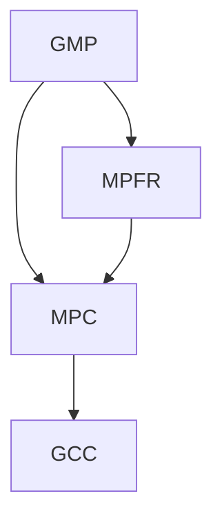
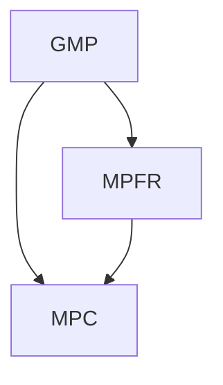

---
aliases:
- Linux 的编译器
- GCC 源码构建
- Linux 下从源码编译 GCC
confidentiality: public
domain: computer-science
evidence:
- claim: GCC 官方安装文档将安装过程分为五步。
  claim_id: install-five-steps
  support: direct
  supporting_quotes:
  - evidence_id: evidence-75cbde47441e
    exact: The installation procedure itself is broken into five steps.
  targets:
  - evidence_id: evidence-75cbde47441e
    source_id: gcc-install-guide
- claim: GCC 不支持 make uninstall，官方建议安装到独立目录，不需要时直接删除该目录。
  claim_id: own-directory
  support: direct
  supporting_quotes:
  - evidence_id: evidence-84712bc48f88
    exact: Please note that GCC does not support ‘make uninstall’ and probably won’t
      do so in the near future as this would open a can of worms. Instead, we suggest
      that you install GCC into a directory of its own and simply remove that directory
      when you do not need that specific version of GCC any longer
  targets:
  - evidence_id: evidence-84712bc48f88
    source_id: gcc-install-guide
- claim: GMP 是构建 GCC 的必要支持库，可从官方地址下载。
  claim_id: deps-gmp
  support: direct
  supporting_quotes:
  - evidence_id: evidence-0df0f0181d75
    exact: Necessary to build GCC. It can be downloaded from https://gmplib.org/.
  targets:
  - evidence_id: evidence-0df0f0181d75
    source_id: gcc-prerequisites
- claim: MPFR 是构建 GCC 的必要支持库，可从官方地址下载。
  claim_id: deps-mpfr
  support: direct
  supporting_quotes:
  - evidence_id: evidence-afe64130d587
    exact: Necessary to build GCC. It can be downloaded from https://www.mpfr.org.
  targets:
  - evidence_id: evidence-afe64130d587
    source_id: gcc-prerequisites
- claim: MPC 是构建 GCC 的必要支持库，可从官方地址下载。
  claim_id: deps-mpc
  support: direct
  supporting_quotes:
  - evidence_id: evidence-60b61915a72e
    exact: Necessary to build GCC. It can be downloaded from https://www.multiprecision.org/mpc/.
  targets:
  - evidence_id: evidence-60b61915a72e
    source_id: gcc-prerequisites
- claim: MPFR 是基于 GMP 的多精度浮点计算库。
  claim_id: mpfr-role
  support: direct
  supporting_quotes:
  - evidence_id: evidence-6c9248d75616
    exact: The MPFR library is a C library for multiple-precision floating-point computations
      with correct rounding. MPFR has continuously been supported by the INRIA and
      the current main authors come from the Caramba and Pascaline project-teams at
      Loria (Nancy, France) and LIP (Lyon, France) respectively; see more on the credit
      page. MPFR is based on the GMP multiple-precision library
  targets:
  - evidence_id: evidence-6c9248d75616
    source_id: mpfr-official
- claim: MPC 是遵循 MPFR 原理构建的高精度复数计算库。
  claim_id: mpc-role
  support: direct
  supporting_quotes:
  - evidence_id: evidence-949c1e14484a
    exact: 'GNU MPC is a C library for the arithmetic of complex numbers with arbitrarily
      high precision and correct rounding of the result. It extends the principles
      of the IEEE-754 standard for fixed precision real floating point numbers to
      complex numbers, providing well-defined semantics for every operation. At the
      same time, speed of operation at high precision is a major design goal.

      The library is built upon and follows the same principles as GNU MPFR'
  targets:
  - evidence_id: evidence-949c1e14484a
    source_id: mpc-official
- claim: GCC 的 configure 用 --enable-languages 指定只构建哪些语言的编译器子集。
  claim_id: configure-languages
  support: direct
  supporting_quotes:
  - evidence_id: evidence-052a9cc37b85
    exact: '--enable-languages=[^]lang1,[^]lang2,…

      Specify that only a particular subset of compilers and

      their runtime libraries should be built'
  targets:
  - evidence_id: evidence-052a9cc37b85
    source_id: gcc-configure-options
- claim: GCC 的 configure 用 --disable-multilib 关闭针对不同目标变体的多目标库构建。
  claim_id: configure-multilib
  support: direct
  supporting_quotes:
  - evidence_id: evidence-fb605de0897a
    exact: '--disable-multilib

      Specify that multiple target libraries to support different target variants,
      calling conventions, etc. should not be built'
  targets:
  - evidence_id: evidence-fb605de0897a
    source_id: gcc-configure-options
- claim: 当 GMP/MPFR/MPC 未装在标准位置时，用 --with-gmp/--with-mpfr/--with-mpc 显式指定其安装目录。
  claim_id: configure-with-deps
  support: direct
  supporting_quotes:
  - evidence_id: evidence-bd395148b2f9
    exact: 'If you want to build GCC but do not have the GMP library, the MPFR

      library and/or the MPC library installed in a standard location and

      do not have their sources present in the GCC source tree then you

      can explicitly specify the directory where they are installed

      (''--with-gmp=gmpinstalldir'',

      ''--with-mpfr=mpfrinstalldir'',

      ''--with-mpc=mpcinstalldir'').'
  targets:
  - evidence_id: evidence-bd395148b2f9
    source_id: gcc-configure-options
- claim: GCC 官方强烈建议 --prefix 安装目录不要与构建目录相同或互为子目录。
  claim_id: prefix-separate
  support: direct
  supporting_quotes:
  - evidence_id: evidence-1ddd3b797392
    exact: '--prefix=dirname

      Specify the toplevel installation directory. This is the recommended way to
      install the tools into a directory other than the default. The toplevel installation
      directory defaults to /usr/local.

      We highly recommend against dirname being the same or a

      subdirectory of objdir or vice versa'
  targets:
  - evidence_id: evidence-1ddd3b797392
    source_id: gcc-configure-options
id: compilers-on-linux
kind: knowledge
publication_scope: public
related: []
sources:
- gcc-install-guide
- gcc-prerequisites
- gcc-configure-options
- mpfr-official
- mpc-official
status: published
tags:
- compiler
- gcc
- linux
- build
title: Linux 下从源码构建 GCC：依赖链、配置与版本切换
updated_at: '2026-09-03'
---

# Linux 下从源码构建 GCC：依赖链、配置与版本切换

## 一句话结论

在 Linux 上从源码构建 GCC（GNU Compiler Collection）需要先编译三个支持库（GMP → MPFR → MPC），再用 `configure`/`make`/`make install` 安装到独立目录；安装完成后可通过 `update-alternatives` 在系统编译器与自定义版本之间切换。以 2026-09 的最新版本为准，构建链为 **GMP 6.3.0 → MPFR 4.2.2 → MPC 1.4.1 → GCC 16.2**；依赖库与 GCC 16.2 的构建已在 Docker 的 Ubuntu 22.04 容器中实测通过，运行新 GCC 编译的程序需 `LD_LIBRARY_PATH` 指向新装的 libstdc++（见「常见误区」）。

## 核心概念



- **GCC（GNU Compiler Collection）**：GNU 的多语言编译器套件。官方把安装过程明确分为五步（下载源码 → 配置 → 构建 → 测试 → 安装），并从源码构建需要 GMP、MPFR、MPC 三个支持库。
- **依赖链 GMP → MPFR → MPC**：GMP 提供多精度整数/浮点算术；MPFR 基于 GMP，提供带正确舍入的多精度浮点计算；MPC 遵循 MPFR 的原理，把高精度复数运算带上。三者都是构建 GCC 的必要前置（见「工作机制」）。
- **configure 的三个关键维度**：`--prefix`（安装位置）、`--enable-languages`（构建哪些语言的编译器）、`--with-gmp/--with-mpfr/--with-mpc`（依赖库不在标准位置时显式指路）。
- **update-alternatives**：Debian/Ubuntu 管理多版本命令的机制，通过符号链接把 `/usr/bin/gcc` 指向所选版本，无需改 PATH。
- **同类场景：ARM 交叉工具链**：为 ARM 目标交叉编译时使用独立的 ARM GNU 工具链，下载与版本见详细章节「ARM 工具链」。

## 工作机制

从源码构建 GCC 的完整链路：

1. **安装系统构建工具**：`build-essential`、`m4`（GMP 需要）、`curl`、`xz-utils`。
2. **编译三个支持库**（顺序有硬依赖）：GMP → MPFR（`--with-gmp`）→ MPC（`--with-gmp --with-mpfr`），都 `--prefix=/usr/local`。
3. **配置 GCC**：`configure --prefix=/opt/gcc-16.2.0 --enable-languages=c,c++,fortran --disable-multilib --with-gmp=/usr/local --with-mpfr=/usr/local --with-mpc=/usr/local`（独立构建目录、out-of-tree）。
4. **构建并安装**：`make -j$(nproc)` → `make install`。
5. **版本切换**：`update-alternatives --install /usr/bin/gcc gcc /opt/gcc-16.2.0/bin/gcc <优先级> --slave ...` 注册后 `--config gcc` 选择。

依赖库之间是严格的前置关系——MPFR 需要 GMP 已装好，MPC 需要 GMP 和 MPFR 都装好，GCC 的 configure 阶段会检测三者是否存在。

## 示例或代码

以最新版本为例（Docker 实测可复现；以下为最小可复制链，省略了 `make check` 与 `sudo ldconfig` 等步骤，带注释的完整分步见「详细章节」）：

```bash
# 依赖库：GMP → MPFR → MPC（按序，各自 configure/make/make install）
wget https://ftp.gnu.org/gnu/gmp/gmp-6.3.0.tar.xz && tar xf gmp-6.3.0.tar.xz && cd gmp-6.3.0
./configure --prefix=/usr/local --enable-cxx && make -j$(nproc) && sudo make install

wget https://ftp.gnu.org/gnu/mpfr/mpfr-4.2.2.tar.xz && tar xf mpfr-4.2.2.tar.xz && cd mpfr-4.2.2
./configure --prefix=/usr/local --with-gmp=/usr/local && make -j$(nproc) && sudo make install

# 注意：MPC 1.4.1 发布为 .tar.xz（不是旧文档的 .tar.gz）
wget https://ftp.gnu.org/gnu/mpc/mpc-1.4.1.tar.xz && tar xf mpc-1.4.1.tar.xz && cd mpc-1.4.1
./configure --prefix=/usr/local --with-gmp=/usr/local --with-mpfr=/usr/local && make -j$(nproc) && sudo make install

# GCC 16.2（out-of-tree 独立构建目录）
wget https://ftp.gnu.org/gnu/gcc/gcc-16.2.0/gcc-16.2.0.tar.xz && tar xf gcc-16.2.0.tar.xz
mkdir build && cd build
export LD_LIBRARY_PATH=/usr/local/lib CPATH=/usr/local/include
../gcc-16.2.0/configure --prefix=/opt/gcc-16.2.0 \
  --enable-languages=c,c++,fortran --disable-multilib \
  --with-gmp=/usr/local --with-mpfr=/usr/local --with-mpc=/usr/local
make -j$(nproc) && sudo make install

# 版本切换（update-alternatives）
sudo update-alternatives --install /usr/bin/gcc gcc /opt/gcc-16.2.0/bin/gcc 162 \
  --slave /usr/bin/g++ g++ /opt/gcc-16.2.0/bin/g++ \
  --slave /usr/bin/gfortran gfortran /opt/gcc-16.2.0/bin/gfortran
sudo update-alternatives --config gcc
```

## 常见误区

- **MPC 的下载格式变了**：MPC 1.4.1 发布为 `mpc-1.4.1.tar.xz`，不是旧版本（如 1.2.1）的 `.tar.gz`。沿用旧 URL `mpc-1.4.1.tar.gz` 会下载到 404/HTML 页导致解压失败。
- **GCC 不支持 `make uninstall`**：官方明确说明不支持，卸载 = 删除安装目录；所以安装时务必用 `--prefix` 装进独立目录。
- **`--prefix` 不要与构建目录嵌套**：官方强烈建议 `--prefix` 目录不要与 `objdir`（构建目录）相同或互为子目录，否则会有路径冲突。
- **依赖库顺序不能乱**：MPFR 的 configure 需要 GMP 已安装（`--with-gmp`），MPC 需要 GMP+MPFR 都已安装；GCC 的 configure 会检测三者，缺一即失败。
- **`LD_LIBRARY_PATH` 两处都要设**（构建期 + 运行期，实测 2026-09-03）：
  - **构建期**：依赖库装在 `/usr/local`（非系统默认搜索路径）时，configure/make 阶段需 `export LD_LIBRARY_PATH=/usr/local/lib CPATH=/usr/local/include`，否则编译器找不到 GMP/MPFR/MPC 头文件与库；
  - **运行期**：GCC 16.2 自带 libstdc++ 的 GLIBCXX 版本到 3.4.36，而 ubuntu 22.04 系统只有 3.4.30 —— 不加 `LD_LIBRARY_PATH=/opt/gcc-16.2.0/lib64` 直接运行会报 `GLIBCXX_3.4.32 not found`。运行新 GCC 编译的程序时需指向新版 libstdc++（或用 rpath/ldconfig 固化）。

## 证据映射

| Claim | 来源 | 要点 |
| --- | --- | --- |
| install-five-steps | gcc-install-guide | 安装过程分为五步 |
| own-directory | gcc-install-guide | 不支持 uninstall，建议独立目录 |
| deps-gmp / deps-mpfr / deps-mpc | gcc-prerequisites | 三个库都是构建 GCC 的必要前置 |
| mpfr-role | mpfr-official | MPFR 基于 GMP |
| mpc-role | mpc-official | MPC 遵循 MPFR 原理 |
| configure-languages / -multilib / -with-deps / prefix-separate | gcc-configure-options | configure 各选项语义 |

## 待验证项

无。

## 关联知识

- [[compiler-vectorization]] —— GCC 向量化与 `-O2`/`-O3` 的实测行为（同一 GCC 工具链的上层话题）。
- [[program-performance-analysis]] —— 性能分析工具链，GCC 是常用的编译后端。

## 详细章节

### GNU Compiler Collection - GCC

#### 下载链接

https://gcc.gnu.org/mirrors.html

```
wget https://ftp.gnu.org/gnu/gcc/gcc-16.2.0/gcc-16.2.0.tar.xz
```

#### ARM 工具链

- 下载页（Akamai 对本网络拦 403，但链接直达可用）：https://developer.arm.com/downloads/-/arm-gnu-toolchain-downloads
- 已验证最新版 14.3.rel1（2026-09-03，xz 校验通过；本机为 Apple M3，用 aarch64 主机变体实测）：

```
# x86_64 Linux 主机 / AArch64 Linux 目标 交叉工具链
wget https://developer.arm.com/-/media/Files/downloads/gnu/14.3.rel1/binrel/arm-gnu-toolchain-14.3.rel1-x86_64-aarch64-none-linux-gnu.tar.xz
# aarch64 主机 / ARM32 裸机目标（arm-none-eabi，本机实测）
wget https://developer.arm.com/-/media/Files/downloads/gnu/14.3.rel1/binrel/arm-gnu-toolchain-14.3.rel1-aarch64-arm-none-eabi.tar.xz
```

- **交叉编译实测**（容器内 arm-none-eabi 14.3.1，2026-09-03）：两种方式均产出合法 ARM32 ELF（`readelf -h` 显示 `ELF32 / EXEC / Machine: ARM`）：
  - freestanding（无 libc 依赖）：`arm-none-eabi-gcc -nostdlib -nostartfiles hello.c -o hello.elf`
  - semihosting（可跑 printf）：`arm-none-eabi-gcc --specs=rdimon.specs hello.c -o hello.elf -Wl,--start-group -lgcc -lc -lrdimon -Wl,--end-group`
- **裸机坑**：`arm-none-eabi` 是裸机目标（无 OS），直接用默认链接编含 `printf` 的程序会报缺 `_read/_write/_sbrk` 等 syscall stub（undefined reference）——需用 semihosting（`--specs=rdimon.specs`）或提供板级 BSP stub。

#### 安装依赖库

* GMP 是基础库，提供高精度整数和浮点运算。
* MPFR 基于 GMP，扩展了高精度浮点运算的严格性和功能。
* MPC 基于 GMP 和 MPFR，提供高精度复数运算。



##### GMP 安装

###### 安装依赖工具

确保系统已安装编译所需的工具和依赖库：

```
sudo apt update
sudo apt install build-essential m4
```

###### 下载源码

从[官方镜像](https://ftp.gnu.org/gnu/gmp/)下载 GMP 6.3.0 并验证完整性：

```
wget https://ftp.gnu.org/gnu/gmp/gmp-6.3.0.tar.xz
```

###### 安装步骤

```
# 1. 解压源码包
tar -xf gmp-6.3.0.tar.xz
cd gmp-6.3.0

# 2. 配置编译选项
# 运行 configure 脚本生成 Makefile，按需指定安装路径和选项
./configure --prefix=/usr/local --enable-cxx # --build=CPU架构  --enable-static --enable-shared

# 3. 使用多线程加速编译（根据 CPU 核心数调整 -j 后的数字）
make -j$(nproc)

# 4. 运行测试（可选），确保编译结果正确
make check

# 5. 安装到系统
sudo make install

# 6. 更新动态库缓存
sudo ldconfig
```

编译选项

- --enable-cxx: 启用 C++ 支持。
- --prefix=/path: 指定安装路径（默认 /usr/local）。
- --enable-static: 生成静态库。
- --enable-shared: 生成动态库（默认启用）。

##### MPFR 安装

###### 下载源码

从[官方镜像](https://ftp.gnu.org/gnu/mpfr/)下载 MPFR 4.2.2 并验证完整性：

```
wget https://ftp.gnu.org/gnu/mpfr/mpfr-4.2.2.tar.xz
```

###### 安装步骤

```
# 1. 解压源码包
tar -xf mpfr-4.2.2.tar.xz
cd mpfr-4.2.2

# 2. 配置编译选项
./configure --prefix=/usr/local --with-gmp=/usr/local

# 3. 使用多线程加速编译
make -j$(nproc)

# 4. 运行测试（可选）
make check

# 5. 安装到系统
sudo make install

# 6. 更新动态库缓存
sudo ldconfig
```

##### MPC 安装

###### 下载源码

从[官方镜像](https://ftp.gnu.org/gnu/mpc/)下载 MPC 1.4.1 并验证完整性：

```
wget https://ftp.gnu.org/gnu/mpc/mpc-1.4.1.tar.xz
```

###### 安装步骤

```
# 1. 解压源码包（注意：MPC 1.4.1 为 .tar.xz，不是旧版的 .tar.gz）
tar -xf mpc-1.4.1.tar.xz
cd mpc-1.4.1

# 2. 配置编译选项
./configure --prefix=/usr/local \
    --with-gmp=/usr/local \
    --with-mpfr=/usr/local

# 3. 使用多线程加速编译
make -j$(nproc)

# 4. 运行测试（可选）
make check

# 5. 安装到系统
sudo make install

# 6. 更新动态库缓存
sudo ldconfig
```

#### GCC 安装步骤

```
# 1. 解压源码包
tar -xf gcc-16.2.0.tar.xz
cd gcc-16.2.0

# 2. 创建独立构建目录（out-of-tree）
mkdir build && cd build

# 3. 配置编译选项
export LD_LIBRARY_PATH=/usr/local/lib CPATH=/usr/local/include
../gcc-16.2.0/configure \
    --prefix=/opt/gcc-16.2.0 \
    --enable-languages=c,c++,fortran \
    --disable-multilib \
    --with-gmp=/usr/local \
    --with-mpfr=/usr/local \
    --with-mpc=/usr/local

# 4. 使用多线程加速编译
make -j$(nproc)

# 5. 运行测试（可选）
make check

# 6. 安装到系统
sudo make install

# 7. 更新动态库缓存
sudo ldconfig
```

编译选项

- --prefix: 将 GCC 安装到独立目录（如 /opt/gcc-16.2.0），与系统默认的 /usr/bin/gcc 隔离。
- --with-*: 若依赖库安装在非默认路径（如 /opt/libs），需修改为对应路径。
- 若需要更多语言（如 Go、D），修改 --enable-languages。

#### 使用 update-alternatives 进行版本切换

##### 核心功能

- 作用：通过符号链接（symlink）管理系统中的多个软件版本（如 GCC、Python、Java）。
- 原理：将 /usr/bin/gcc 等命令链接到实际安装的版本路径，通过配置工具切换不同版本。
- 优势：无需手动修改环境变量，系统级管理版本切换。

##### 基本命令及功能

| 命令 | 功能 |
| --- | --- |
| sudo update-alternatives --install <链接路径> <名称> <实际路径> <优先级> | 注册一个新版本到备选列表 |
| sudo update-alternatives --config <名称> | 交互式切换版本 |
| sudo update-alternatives --list <名称> | 列出所有已注册的版本 |
| sudo update-alternatives --remove <名称> <实际路径> | 移除某个版本 |
| sudo update-alternatives --auto <名称> | 恢复默认优先级最高的版本 |

##### 步骤

```
# 0. 找到系统默认 GCC 的实际路径
ls -l /usr/bin/gcc

# 1. 注册自定义 GCC 版本（如 16.2.0）
sudo update-alternatives --install /usr/bin/gcc gcc /opt/gcc-16.2.0/bin/gcc 162 \
  --slave /usr/bin/g++ g++ /opt/gcc-16.2.0/bin/g++ \
  --slave /usr/bin/gfortran gfortran /opt/gcc-16.2.0/bin/gfortran

# 2. 切换 GCC 版本
sudo update-alternatives --config gcc

# 3. 验证切换结果
gcc --version
```

##### 注意事项

- 权限要求：所有操作需 sudo 权限。
- 路径有效性：注册前确保实际安装路径存在。
- 环境变量：若 PATH 中包含其他 GCC 路径（如 /opt/gcc-16.2.0/bin），需确保 /usr/bin 优先级更高，避免冲突。

#### 验证方法（Docker，2026-09-03）

在 Docker `ubuntu:22.04` 容器中完整实测最新版本构建链：

- **依赖库**：GMP 6.3.0 → MPFR 4.2.2 → MPC 1.4.1 依次 `configure && make -j$(nproc) && make install`，全部成功，`--with-gmp/--with-mpfr` 传参正确。
- **GCC 16.2**：`configure --prefix=/opt/gcc-16.2.0 --enable-languages=c,c++,fortran --disable-multilib --with-gmp=/usr/local --with-mpfr=/usr/local --with-mpc=/usr/local` + `make -j` + `make install` 成功，`/opt/gcc-16.2.0/bin/gcc --version` 正常。
- **update-alternatives**：注册 `/opt/gcc-16.2.0/bin/gcc` 为备选后，`update-alternatives --list gcc` 可列出、切换生效。
- **冒烟测试**：用新装的 `g++` 编译 Hello World 并运行，输出 `hello gcc-16.2`。**运行需加 `LD_LIBRARY_PATH=/opt/gcc-16.2.0/lib64`**（新 libstdc++ GLIBCXX 3.4.36 > 系统 3.4.30，否则报 `GLIBCXX_3.4.32 not found`，详见常见误区）。

首次运行曾因旧文档的 `mpc-1.4.1.tar.gz` URL（实际为 `.tar.xz`）失败，修正后全链一次通过——这正是"更新到最新版本"要修掉的坑。
