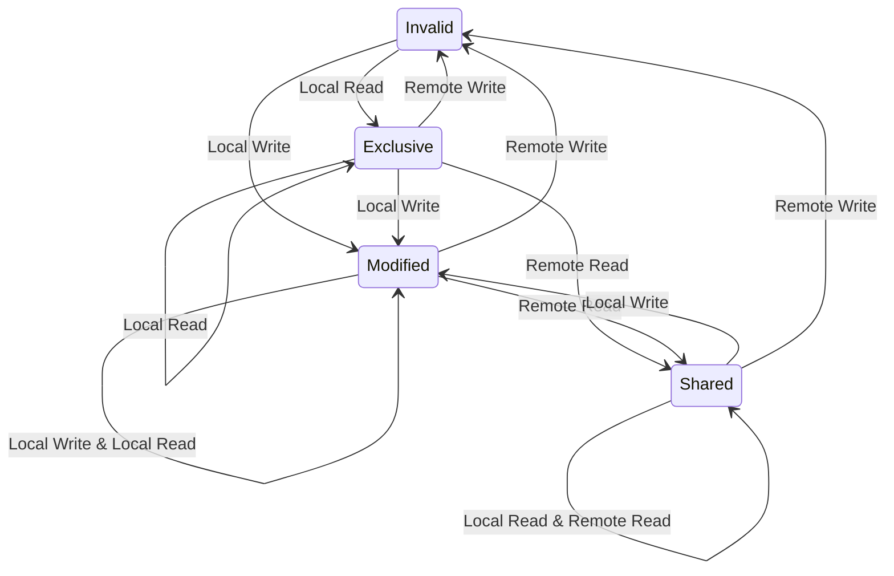

---
aliases:
- CPU 和内存
- 指令流水线
confidentiality: public
domain: computer-science
evidence:
- claim: 流水线主要改善整体工作负载吞吐，而不是单条指令的延迟。
  claim_id: pipeline-throughput
  support: direct
  supporting_quotes:
  - evidence_id: evidence-8b1491c048e8
    exact: Pipelining doesn’t help latency of single instruction
      it helps throughput of entire workload
  targets:
  - evidence_id: evidence-8b1491c048e8
    source_id: imperial-pipelines
- claim: 结构冒险发生在流水线中的指令需要另一条指令正在使用的资源时。
  claim_id: structural-hazard
  support: direct
  supporting_quotes:
  - evidence_id: evidence-c69b9407150e
    exact: |-
      Structural Hazards: An instruction in the pipeline needs a resource
      being used by another instruction in the pipeline
  targets:
  - evidence_id: evidence-c69b9407150e
    source_id: cornell-processor-microarchitecture
- claim: RAW 数据冒险发生在前序指令仍在流水线中产生结果，而后序指令依赖该结果时。
  claim_id: data-hazard
  support: direct
  supporting_quotes:
  - evidence_id: evidence-e8b610e81cbb
    exact: RAW data hazards occur when one instruction depends on a data value
      produced by a preceding instruction still in the pipeline.
  targets:
  - evidence_id: evidence-e8b610e81cbb
    source_id: cornell-processor-microarchitecture
- claim: 控制冒险发生在后续指令是否执行取决于前序指令作出的控制决策时。
  claim_id: control-hazard
  support: direct
  supporting_quotes:
  - evidence_id: evidence-2ccbb906f313
    exact: |-
      Control Hazards: Whether or not an instruction should be executed
      depends on a control decision made by an earlier instruction
  targets:
  - evidence_id: evidence-2ccbb906f313
    source_id: cornell-processor-microarchitecture
- claim: WAW 和 WAR 是名称冒险，分别涉及前序指令与后续指令对同一寄存器的写写或读写关系。
  claim_id: name-hazards
  support: direct
  supporting_quotes:
  - evidence_id: evidence-6438b00733d1
    exact: |-
      WAW and WAR Name Hazards: An instruction in the pipeline is
      writing a register that an earlier instruction in the pipeline is either
      writing or reading
  targets:
  - evidence_id: evidence-6438b00733d1
    source_id: cornell-processor-microarchitecture
- claim: 超标量处理器通过并行执行多条指令提高指令吞吐，并不等于乱序执行。
  claim_id: superscalar-ooo-boundary
  support: direct
  supporting_quotes:
  - evidence_id: evidence-bf2ac5ac20ab
    exact: Superscalar processors enable CPI < 1 (i.e., IPC > 1) by
      executing multiple instructions in parallel
  - evidence_id: evidence-3f4db4b0ab42
    exact: Can have both in-order and out-of-order superscalar processors,
      but we will start by exploring in-order
  targets:
  - evidence_id: evidence-bf2ac5ac20ab
    source_id: cornell-superscalar-execution
  - evidence_id: evidence-3f4db4b0ab42
    source_id: cornell-superscalar-execution
- claim: 乱序执行可以让就绪指令乱序执行，但通常通过 ROB 等结构按程序顺序提交。
  claim_id: out-of-order-commit
  support: direct
  supporting_quotes:
  - evidence_id: evidence-c8f472b47898
    exact: |-
      Hardware Scheduling: Hardware dynamically schedules
      instructions to avoid RAW hazards, potentially allowing
      instructions to execute out of order
  - evidence_id: evidence-8cbf47f4bcdd
    exact: commit stage waits for pending bit of head to be clear
  - evidence_id: evidence-0a67e6c41e7b
    exact: new instructions allocated ROB entries at tail
  - evidence_id: evidence-1554a03bd9f6
    exact: |-
      Reorder buffer (ROB)
      – allocated in-order in D stage
      – updated out-of-order in W stage
      – deallocated in-order in C stage
  targets:
  - evidence_id: evidence-c8f472b47898
    source_id: cornell-processor-microarchitecture
  - evidence_id: evidence-8cbf47f4bcdd
    source_id: cornell-out-of-order-execution
  - evidence_id: evidence-0a67e6c41e7b
    source_id: cornell-out-of-order-execution
  - evidence_id: evidence-1554a03bd9f6
    source_id: cornell-out-of-order-execution
- claim: cache 系统的具体细节依赖处理器平台，不能把某个平台的结论泛化成通用常数。
  claim_id: cache-platform-dependence
  support: direct
  supporting_quotes:
  - evidence_id: evidence-156850bbfe32
    exact: Not all conclusions will generalize to every CPU platform in existence.
  - evidence_id: evidence-de0206b20bda
    exact: we have to start taking into account the many specific details of the CPU cache system
  targets:
  - evidence_id: evidence-156850bbfe32
    source_id: algorithmica-cpu-cache
  - evidence_id: evidence-de0206b20bda
    source_id: algorithmica-cpu-cache
id: cpu-pipeline-and-hazards
kind: knowledge
publication_scope: public
related: []
sources:
- pipeline-hazards
- imperial-pipelines
- cornell-processor-microarchitecture
- cornell-superscalar-execution
- cornell-out-of-order-execution
- cornell-branch-prediction
- algorithmica-cpu-cache
- algorithmica-cache-latency
status: published
tags:
- cpu
- pipeline
- computer-architecture
title: CPU 指令流水线与三类冒险
updated_at: '2026-09-03'
---
# CPU 指令流水线与三类冒险

## 一句话结论

流水线让不同指令的阶段重叠以提高整体吞吐，但不保证降低单条指令延迟；实际收益受最慢阶段、填充/排空、结构/数据/控制冒险和内存层次影响。

## 核心概念

- **五阶段模型**：在简单的单发射、按序 MIPS 风格教学流水线中，常用取指（IF）→译码/读寄存器（ID）→执行/地址计算（EX）→访存（MEM）→写回（WB）。它不是所有 CPU 的通用阶段划分。
- **重叠执行**：不同指令同时占用不同流水阶段；理想的单发射流水线在满载时每周期完成一条，超标量则可能每周期完成多条。
- **三类冒险**：结构（资源争用）、数据（RAW/WAR/WAW 等依赖或名称关系）、控制（控制流决定尚未确定）。
- **多发与乱序**：超标量描述每周期可发射/执行的宽度；乱序执行描述执行或完成顺序，二者可以组合，也可以分别存在。
- **超流水**：把原有阶段拆得更细以缩短时钟周期、加深流水线；它不等于超标量，也不自动带来乱序执行。

## 工作机制

1. 流水线本身主要提升吞吐而非单条指令延迟；时钟周期由最慢阶段限制，填充和排空也会降低理想加速比。
2. 结构冒险从**资源侧**处理：增加端口或复制资源、分离指令/数据存储体，或在资源冲突时暂停流水。
3. 数据冒险要区分：RAW 是真实数据依赖，常用 stall 或旁路；WAR/WAW 是名称冒险，可用按序约束、stall 或寄存器重命名处理。
4. 控制冒险来自分支/跳转的方向或目标尚未确定；可用提前解析、静态/动态预测、谓词化、延迟槽（若 ISA 支持）和错误路径清除处理。
5. 超标量是宽度，不规定按序还是乱序；乱序设计通常让就绪指令提前执行，并在提交阶段恢复程序可见的顺序。
6. cache 命中可减少访存等待，但缓存层次、容量、延迟和带宽随平台变化；不要直接套用某一 CPU 的延迟数字。

## 示例或代码

- **数据旁路的效果**：`a = b + c; d = a + e;` 后一条依赖前一条的结果；在满足时序的实现中，ALU 结果可直接转发，减少等待写回的周期。load-use 依赖可能仍需 stall，不能把旁路理解成零延迟。
- **分支猜准率的意义**：预测正确可以继续取指，预测错误则需要清除错误路径并恢复正确路径；循环展开可能减少分支频率，但收益还取决于代码大小、寄存器压力和其他依赖。
- **cache 与流水线**：L1/L2/L3 等层次通常容量逐级增大、访问代价逐级上升；一次 cache miss 可能让流水线等待或依赖非阻塞 cache、乱序执行来隐藏延迟。

## 常见误区

- **以为流水线必然让单条指令变快**：流水线的主要收益是吞吐；单条指令延迟由具体实现决定，流水线寄存器和阶段划分还可能带来额外开销。
- **把五阶段当成所有 CPU 的实现**：五级 IF/ID/EX/MEM/WB 是常见教学模型；真实 CPU 可能有更深或不同的阶段划分。
- **把超标量当成按序执行**：超标量既可以按序也可以乱序；“多发射宽度”和“执行/完成顺序”是两个维度。
- **把乱序执行理解成必然错误**：正确的乱序处理器会跟踪依赖、避免错误提交，并通常按程序顺序提交可见状态。
- **只关注 RAW**：在简单单发射按序流水线中 RAW 最常见，但多发射、长延迟或乱序实现还要处理 WAR/WAW。

## 证据映射

- `pipeline-throughput` 由 Imperial College London 流水线讲义直接支撑；该来源同时说明最慢阶段限制流水线速率。
- `structural-hazard`、`data-hazard`、`control-hazard` 和 `name-hazards` 由 Cornell ECE Handout 3 直接支撑，且明确区分 RAW、控制、结构以及 WAW/WAR 名称冒险。
- `superscalar-ooo-boundary` 由 Cornell ECE Handout 10 的两条直接引文支撑：超标量支持多指令并行，且可以是按序或乱序。
- `out-of-order-commit` 由 Cornell ECE Handout 3/11 直接支撑：硬件调度可允许乱序执行，ROB 的提交等待队首就绪。
- `cache-platform-dependence` 由 Algorithmica 的 cache 章节直接支撑；该章节的实验数据属于特定 Ryzen 平台，正文只抽取“平台相关”的边界，不把实验数字当作通用常数。
- 本页保留本人笔记的教学性组织和示例，但外部 source 只支撑上述可逐字回放的 claim；五阶段表格、具体旁路时序和实现取舍仍需结合具体 ISA/微架构阅读。

## 来源

- [Imperial College London, Advanced Computer Architecture: Pipelines](https://www.doc.ic.ac.uk/~phjk/AdvancedCompArchitecture/Lectures/pdfs/Ch01-part2-Pipelines.pdf)，2026-09-03 抓取，source: `imperial-pipelines`。
- [Cornell ECE Open Courseware, ECE 4750 Lecture Notes](https://ocw.ece.cornell.edu/courses/ece-4750-computer-architecture/ece-4750-lecture-notes-and-handouts/)，Handout 3/10/11/14，source: `cornell-processor-microarchitecture`、`cornell-superscalar-execution`、`cornell-out-of-order-execution`、`cornell-branch-prediction`。
- [Algorithmica, Pipeline Hazards](https://en.algorithmica.org/hpc/pipelining/hazards/)，source: `pipeline-hazards`。
- [Algorithmica, CPU Caches](https://en.algorithmica.org/hpc/cpu-cache/)，source: `algorithmica-cpu-cache`、`algorithmica-cache-latency`。

## 待验证项

- 本页待验证项已全部收口，验证结论已并入正文（证据映射/核心概念/工作机制），无遗留。

## 关联知识

- 多核软件设计与 ISA 分类
- 程序性能的分析与测量
- LLVM 自动向量化


## 详细章节

### CPU和内存

#### CPU指令流水线机制

##### CPU体系结构

CPU

中央处理器是计算机的运算核心和控制核心，主要功能是解释计算机指令以及处理计算机软件中的数据。


逻辑架构

* 控制单元（调度）
* 运算单元（算术运算和逻辑运算）
* 存储单元（传递命令、记录数据和计算结果）
* 通过内部总线连接控制单元、运算单元和存储单元


指令

CPU依靠指令来计算和控制计算机系统，一套这样的指令称为指令集


指令执行顺序

在简单的单发射、按序 MIPS 风格流水线中，常用五个阶段，包括取指令（IF）、指令译码（ID）、指令执行（EX）、访存取数（MEM）、写回（WB）；这不是冯·诺依曼架构规定的通用五步。


##### CPU流水线

###### 概述

CPU流水线方式：将一条指令分成若干stage，流水线方式前后两条指令的stage在时间上可以重叠进行。理想状态下，当单发射流水线满载时，每个时钟周期都可以输出一条指令。流水线主要提升吞吐，不能笼统认为会缩短每条指令的绝对延迟；具体延迟取决于实现和阶段划分。

| stage | 描述     | 硬件部件 |
| ----- | -------- | -------- |
| IF    | 取指令   | IMem     |
| ID    | 指令译码 | Reg      |
| EX    | 指令执行 | ALU      |
| MEM   | 访存取数 | DMem     |
| WB    | 写回     | Reg      |


###### 主要问题

流水线带来CPU吞吐率提高的同时，也面临一些风险。指令之间的资源、数据或控制流关系如果未被正确处理，就会导致停顿、清除或错误结果；流水线风险包括**结构、数据和控制**三类典型风险。多发射或乱序实现还可能出现 WAW/WAR 名称冒险。


####### 结构冒险

又称资源冲突，指的是用不同指令争用同一部件产生的冲突。例如取指和数据访存同时使用单端口存储器时会发生访存冲突。


解决方式：

* 流水线完成第一条指令对数据的存储器访问时，暂停取后一条指令
* 设置独立存储器存放操作数和指令
* 采用指令预取技术，将指令预取到指令队列中，降低取指和数据访问的资源冲突；实际效果取决于具体实现


####### 数据冒险

又称数据冲突，指的是指令之间存在数据依赖或名称关系，导致后一条指令不能安全地在当前周期使用或更新操作数。基础按序流水线中最常见的是 RAW：后一条指令读取前一条指令尚未产生的结果。多发射或乱序流水线还需要考虑 WAR 和 WAW 名称冒险。


解决方式：

* 硬件阻塞(stall)：把遇到数据相关的指令及其后续指令都暂停一到几个时钟周期，直到问题消失
* 软件阻塞：在遇到数据相关的指令后续插入多个空指令(nop)，直到问题消失
* 数据旁路技术：产生结果直接送给运算单元；能否完全消除停顿取决于结果产生时刻
* 编译优化：通过编译器调整指令顺序解决数据依赖
* 对 WAR/WAW 名称冒险，可使用按序约束、硬件阻塞或寄存器重命名


####### 控制冒险

指的是由分支、跳转等控制指令引起的控制流不确定，而不是必然发生的“流水线中断”。在方向或目标确定前，取指单元可能取到错误路径上的指令。


解决方式：

* 尽早判别转移是否发生，尽早生成转移目标地址
* 预取转移成功和不成功两个控制流方向上的目标指令
* 加快和提前形成条件码
* 使用静态或动态分支预测，提高转移方向的猜准率；预测错误时清除错误路径并恢复正确路径


###### 多发流水线技术

####### 超标量技术

* 每个时钟周期可以并发多条独立指令
* 要配置多个功能部件
* 超标量描述发射/执行宽度，不规定指令必须按序或乱序执行
* 通过编译优化技术，可把并行执行的指令搭配起来；现代处理器也可能通过硬件动态调度


####### 超流水技术

* 将原有流水阶段进一步细分，形成更深的流水线
* 目标是缩短单阶段组合逻辑和时钟周期，不等于一个功能部件在一个周期内使用多次
* 不规定处理器是否超标量或乱序
* 编译程序可以帮助安排独立指令，但具体处理器也可能使用硬件调度


####### 超长指令字技术

* 编译程序挖掘出指令间潜在的并行性，将多条能并行操作的指令组合成一条
* 具有多个操作码字段的超长指令字
* 采用多个处理部件

#### 分级缓存机制

##### Cache子系统

Memory wall：限制处理器发挥的主要瓶颈

主存性能增速远远不如CPU每年提升的速度


##### Cache基本结构

###### cpu局部性原理

* 时间局部性
  * 如果一个信息项正在被访问，那么在近期它很可能还会被再次访问
* 空间局部性
  * 如果一个存储器的位置被引用，那么将来它附近的位置也可能被引用


###### cache line

内存映射到cache的过程中传输的最小单位是cache line。现在一般为64字节，就算cpu只取一个字节，也会把字节所在的内存段64字节全部映射到cache line中


###### 基本结构

* CPU
  * Core 1
    * CPU寄存器
    * L1 Cache
    * L2 Cache
  * Core 2
    * CPU寄存器
    * L1 Cache
    * L2 Cache
  * L3 Cache

* 主内存

| 内存层次 | 访问时延       | 容量                            |
| -------- | -------------- | ------------------------------- |
| L1       | 4 cycles       | i-cache和d-cache 32KB~64KB/Core |
| L2       | 10 cycles      | 256KB~1MB/Core                  |
| L3       | 35~45 cycles   | 512KB~2MB/Core                  |
| 主内存   | 100~300 cycles | XX GB                           |

> 注：上表为某一类平台的示例数值，具体延迟/容量随处理器平台不同；本 wiki 蒸馏核心的
> `cache-platform-dependence` 主张即强调不可把单平台数值当通用常数。


##### Cache地址映射规则

###### 全互联映射

* 特点
  * 主存中任意一个块可以映射到cache中的任意一个行。
* 优点
  * 灵活性好，cache中只要有空行就可以调入需要的主存数据。
* 缺点
  * cache利用率不高，需要存储主存标记位。
  * 速度慢，访问cache时需要遍历cache line，判断主存是否在cache中。
  * 电路复杂。
  * 适用于简单系统。


###### 直接映射

* 特点
  * 主存中的一块数据只能映射到cache中固定行。
  * cache line = block idx % cache line num
* 优点
  * 硬件实现简单，成本低。
* 缺点
  * 灵活性差。如果cache容量小，容易发生冲突，影响性能。一般使用大容量cache。


###### 组相连映射

* 特点
  * 全互联和直接映射的折中方案，主存和cache分组，主存中的一个组内块数和cache的组数相同，组间直接映射，组内全映射。
  * 常采用的组相连结构cache，每组内有2、4、8、16块，称为2、4、8、16路组相连。
  * 组相连兼顾了全互联和直接映射的优点，目前主流cpu均采用多路组相连的地址映射方式。


##### Cache获取方式

内存地址构成

* block offset
  * 对于内存地址来说，其后block offset个字节的数据会构成一个和cache做数据交换的块，这就是cache块的大小
* set index
  * 确定内存被映射到cache里的哪个组
* tag
  * 使用index选出cache组后，通过tag获取cache块位于哪一路


##### Cache更新策略

cache容量有限，当cache空间被占满后，需要从主存加载数据到cache时，需要选择一个cache line替换。


常用替换策略

* 随机算法（Rand）
  * 随机法是随机地确定替换的存储块。设置一个随机数产生器，根据所产生的随机数，确定替换块。方法简单，易于实现，但是命中率较低。
* 最久未使用算法（LRU, Least Recently Used）
  * LRU法根据各块的使用情况，纵深选择那个最长时间未被使用的块替换。每块设置一个计数器，cache每命中一次，命中块计数器清零，其他各块计数器加1。当需要替换时，替换计数值最大的块。这种方法比较好地反映了程序局部性规律，cache命中率较高。
* 最不经常使用算法（LFU, Least Frequently Used）
  * 将最近一段时间内，访问次数最少的块替换出cache。每块设置一个计数器，从0开始计数，每访问一次，计数加1。当需要替换时将计数最小的替换出去。


##### Cache一致性协议MESI

缓存一致性：一个物理cpu会有多个物理core，每个物理core在程序运行时可以支持一个并发，利用超线程技术可以支持两个并发，每个物理core都拥有自己的L1、L2 cache，一个物理cpu上所有的物理core共享一个L3 cache。因为每个core都有自己的cache，所以一个cache line可能被映射到多个core的cache中，这就会有cache不一致问题。如果其中一个core修改了cache line，那么就多有多个cache line不一致问题。


缓存状态：cpu中cache line状态，使用2bit表示。

| 状态              | 描述                                                         | 监听任务                                                     | 状态转换                                                     |
| ----------------- | ------------------------------------------------------------ | ------------------------------------------------------------ | ------------------------------------------------------------ |
| 修改（Modified）  | cache line有效，数据被修改了，和内存中的数据不一致，数据只存在本cache中 | 缓存行必须时刻监听所有试图读该缓存相对应主存的操作，这种操作必须在缓存该缓存行写回主存并将状态变成共享（Shared）之前被延迟执行 | 当被写回主存后，该缓存行的状态变换独享（Exclusive）状态      |
| 独享（Exclusive） | cache line有效，数据和内存中的数据一致，数据只存在本cache中  | 缓存行必须监听其他缓存读主存中该缓存行的操作，一旦有这种操作，该缓存行需要变成共享（Shared）状态 | 当CPU修改该缓存行中内容时，该状态可以变为修改（Modified）    |
| 共享（Shared）    | cache line有效，数据和内存的中的数据一致，数据存在多个cache中 | 缓存行必须监听其他缓存是该缓存行无效或独享该缓存行的请求，并将该缓存行变成无效（Invalid） | 当一个CPU修改该缓存行时，其他CPU中该缓存行变为无效（Invalid）状态 |
| 无效（Invalid）   | cache line无效                                               | 无                                                           | 无                                                           |


MESI状态转换示意




* 本地读取（Local Read）：本地cache读取本地cache的数据
* 远端读取（Remote Read）：其他cache读取本地cache的数据

* 本地写入（Local Write）：本地cache将数据写入本地cache中

* 远端写入（Remote Write）：其他cache将数据写入本地cache中


#### 虚拟内存管理

##### 虚拟地址空间

###### 虚拟内存

内核给每个进程独立的地址空间，用户态进程不能直接操作物理内存，通过MMU进行虚拟内存和物理内存的映射。以32位系统为例，寻址空间范围为4G，最大4G虚拟地址空间，内核占用1G，理论每个进程最大可用3G


###### 虚拟地址空间分布

* 内核空间
* 栈（STACK）：存储局部、临时变量，函数调用时，存储函数的返回指针，用于控制函数的调用和返回。在程序块开始时自动分配内存，结束时自动释放内存，其操作方式类似数据结构中的栈
* 共享库
* 堆（HEAP）：存储动态内存分配，需要程序员手工分配和释放
* 数据段
  * 未初始化的数据（BSS）：未初始化的全局变量和静态变量
  * 初始化过的数据（DATA）：已初始化的全局变量、静态变量（全局和局部）、常量数据
* 文本段（TEXT）：程序代码在内存的映射，存放函数体的二进制代码


##### 虚拟内存映射

###### 一级页表

需要内存较大，以32位系统为例，虚拟地址空间4GB。假设页大小4KB，需要4\*1024\*1024KB/4KB个，每个页表项4B存储，4G空间映射需要约为4MB大小；虚拟地址空间是每个进程独立，如果系统有100个进程，则需要400MB物理内存空间


###### 多级页表

对于64位系统，一般采用四级目录，页表项只在下级页表存在记录时才创建，减少无效空间消耗

* PGD（Page Global Directory）
* PUD（Page Upper Directory）
* PMD（Page Middle Directory）
* PTE（Page Table Entry）


##### 内存地址转换

多级页表虽然解决了内存空间占用的问题，但是由于页表层级的增加，会导致从页表查询效率变差。因此引入TLB（table lookaside buffer）用于缓存虚拟地址到物理地址转换的映射关系。


虚拟地址到物理地址转换的过程

* MMU首先从TLB获取物理地址，TLB命中的话，返回对应的物理地址
* 如果TLB中没有找到虚拟地址对应的物理地址（TLB miss），则从页表中获取对应的物理地址，页表命中，返回对应的物理地址，同时更新TLB
* 页表未命中，产生Page Fault，则需要从磁盘加载数据到主存


#### 常见性能优化手段

##### 增加指令并发度

超标量技术

* 每个时钟周期可以并发多条独立指令
* 要配置多个功能部件
* 描述发射/执行宽度，不规定指令必须按序或乱序执行
* 通过编译优化技术，可把并行执行的指令搭配起来


循环展开

循环unroll：循环迭代间并行度


技术：

* 将循环中多个连续的指令组合到一个循环中完成来节省工作
* 减少循环的总迭代次数
* 减少控制循环的指令执行的次数


优化前

```c++
int Calc(int *array, int bound)
{
    int sum = 0;
    for (int i = 0; i < bound; ++i) {
        sum += array[i];
    }
    return sum;
}
```


优化后

```c++
int Calc(int *array, int bound)
{
    int sum = 0;
    int boundOpt = (bound >> 2) << 2;
    for (int i = 0; i < boundOpt; i += 4) {
        sum += array[i];
        sum += array[i + 1];
        sum += array[i + 2];
        sum += array[i + 3];
    }
    for (int i = boundOpt; i < bound; ++i) {
        sum += array[i];
    }
    return sum;
}
```


##### 分支预测

在计算机体系结构中，分支预测器(branch predictor)是一种数字电路，在分支指令执行结束之前猜测哪一路分支将会被执行，以提高处理器的指令流水线的性能。使用分支预测器的目的，在于改善指令流水线的流程，减少流水线停顿


intel分支预测处理单元：

1. 分支目标缓冲器BTB(branch target buff)
2. 静态预测器(the static predictor)


likely/unlikely分支预测

通过使用GCC的build-in function `__builtin_expect`（GCC v2.96版本引入），将最有可能执行的分支告诉编译器，从而触发编译器对生成指令的顺序调整，从而尽可能发挥CPU指令预取的优势，提高指令cache的命中率来提高程序性能。

预测成功的概率大点，使用likely，编译器调整处理成功的汇编指令到判断条件后面，以便在指令加载的时候利用局部性原理，提供指令的cache命中率。


##### 数据预取

CPU访问数据的时候会优先从cache中获取数据。如果数据在cache中不存在(cache miss)，则需要到主存获取数据，主存的访问延时一般在150~300个cycle，因此如果遇到cache miss会导致cpu流水线出现多个周期的停顿，极大影响效率。

数据预取的目的就是在下一个load & store指令到来之前，先将数据从主存调入cache，尽量减少cache miss带来的延迟。


数据预取分类：

* 软件数据预取(software data prefetch)
  * 软件数据预取是在程序中显式地插入预取指令，以非阻塞的方式让处理器从DRAM中读取指定地址的数据进行cache
* 硬件数据预取(hardware data prefetch)
  * 硬件数据预取通过跟踪load指令数据地址的变化规律来预测将会被访问到的内存地址，并提前从DRAM中读取这些数据到cache


通过使用GCC的build-in function `__builtin_prefetch`，对数据进行手工预取，提高内存访问性能
