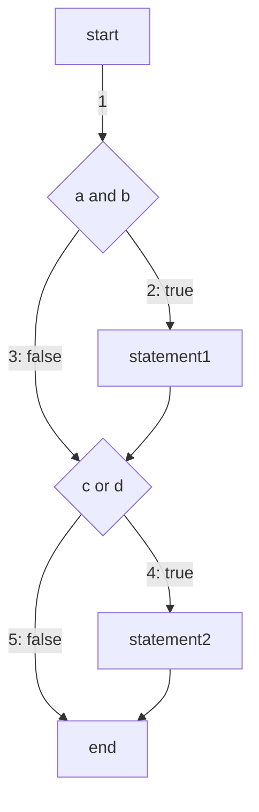

# 开发者测试

## 一句话结论

开发者测试用覆盖率衡量测试充分性，四种基本覆盖标准依次更严格：语句覆盖（每条语句至少执行一次）、判定覆盖（每个判断至少有一次真值/假值）、条件覆盖（每个条件至少有一次真值/假值）、路径覆盖（覆盖程序所有可能的路径）；越靠后的标准覆盖能力越强，但对用例的要求也越高。

## 核心概念

- **语句覆盖**：每条可执行语句至少执行一次。
- **判定覆盖（分支覆盖）**：程序每个判断至少有一次为真值、有一次为假值。
- **条件覆盖**：每个条件至少有一次为真值、有一次为假值。
- **路径覆盖**：覆盖程序所有可能的路径。

## 工作机制

以 `if a and b: statement1` 与 `if c or d: statement2` 两段代码为例：

- 语句集：`a and b`、`statement1`、`c or d`、`statement2`；
- 判定集：`a and b`、`c or d`；
- 条件集：`a`、`b`、`c`、`d`；
- 路径集：1、2、3、4、5。

各标准的局限：

- **语句覆盖缺陷**：测试用例虽可覆盖可执行语句，但不能检查判断逻辑是否有问题——某些路径无法执行；不能判断没有 else 分支的 if 语句为假时的错误；不能判别带 break 跳转的 while 语句的退出条件是否正确；不能判别 do-while 循环的条件错误。
- **判定覆盖缺陷**：不能对判定条件进行检查。

## 示例或代码

```python
if a and b:
    statement1
if c or d:
    statement2
```



对应用例：

- **语句覆盖**：`a = true; b = true; c = true;`
- **判定覆盖**：`a = true; b = true; c = true; d = true;` 与 `a = false; b = false; c = false; d = false;`
- **条件覆盖**：`a = true; b = false; c = true; d = false;` 与 `a = false; b = true; c = false; d = true;`
- **路径覆盖**：`1 -> 2 -> 4`、`1 -> 3 -> 4`、`1 -> 2 -> 5`、`1 -> 3 -> 5`，对应四组用例。

## 常见误区

- **误以为语句覆盖足够**：语句覆盖的用例虽然覆盖了所有可执行语句，但不能检查判断逻辑是否有问题，某些路径无法执行。
- **误以为判定覆盖能检查条件**：判定覆盖只能覆盖每个判断的真假分支，不能对判定条件本身进行检查。
- **忽略标准间的充分性差异**：条件覆盖、路径覆盖比语句覆盖、判定覆盖更严格，路径覆盖能覆盖程序所有可能的路径。

## 证据映射

| claim_id | 来源 | 要点 |
| --- | --- | --- |
| developer-test-audit-1 | martin-fowler-test-pyramid-v2 | 测试金字塔：把软件测试按不同粒度分层 |

## 待验证项

无。

## 关联知识

- [[software-design]] —— 软件设计
- [[refactoring-concepts-and-principles]] —— 重构的概念与原则（测试是重构的前提保障）

## 详细章节

### 开发者测试

#### 测试覆盖

* 语句覆盖：每条语句至少执行一次
* 判定覆盖（分支覆盖）：程序每个判断至少有一次为真值，有一次为假值
* 条件覆盖：每个条件至少有一次为真值，有一次为假值
* 路径覆盖：覆盖程序所有可能的路径


##### 例子


```python
if a and b:
    statement1
if c or d:
    statement2
```


语句

* a and b
* statement1
* c or d
* statement2


判定

* a and b
* c or d


条件

* a
* b
* c
* d


路径

* 1
* 2
* 3
* 4
* 5


###### 语句覆盖

每条可执行语句至少执行一次

* a and b
* statement1
* c or d
* statement2


用例

* a = true; b = true; c = true;


缺陷：测试用例虽然可以覆盖可执行语句，但是不能检查判断逻辑是否有问题

* 某些路径无法执行
* 不能判断没有else分支的if语句为假时的错误
* 不能判别带有break跳转的while语句的退出条件是否正确
* 不能判别do-while循环的条件错误


###### 判定覆盖

每个判断的真值和假值至少执行一次

* a and b
* c or d


用例

* a = true; b = true; c = true; d = true;
* a = false; b = false; c = false; d = false;


缺陷：不能对判定条件进行检查


###### 条件覆盖

每个条件的真值和假值至少执行一次

* a
* b
* c
* d


用例

* a = true; b = false; c = true; d = false;
* a = false; b = true; c = false; d = true;


###### 路径覆盖

覆盖程序所有可能的路径

* 1 -> 2 -> 4
* 1 -> 3 -> 4
* 1 -> 2 -> 5
* 1 -> 3 -> 5


用例

* a = true; b = true; c = true; d = true;
* a = true; b = false; c = true; d = true;
* a = true; b = true; c = false; d = false;
* a = true; b = false; c = false; d = false;

