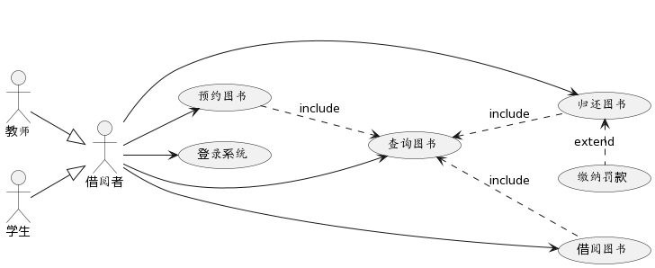
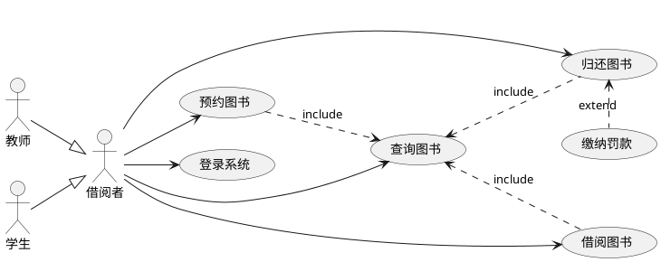
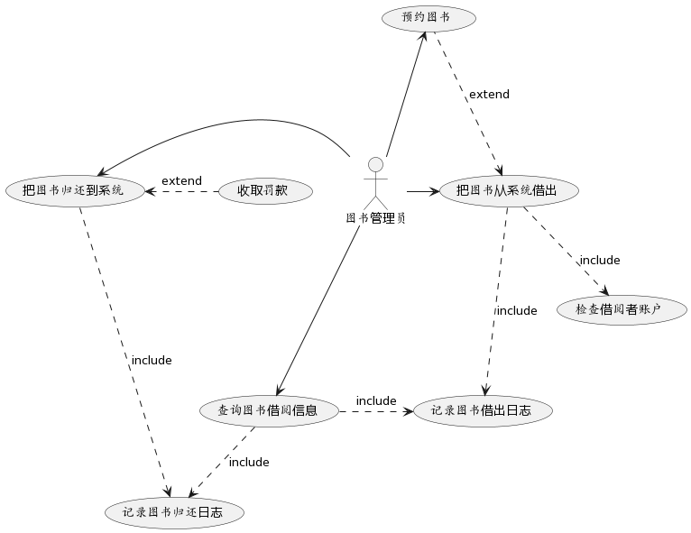
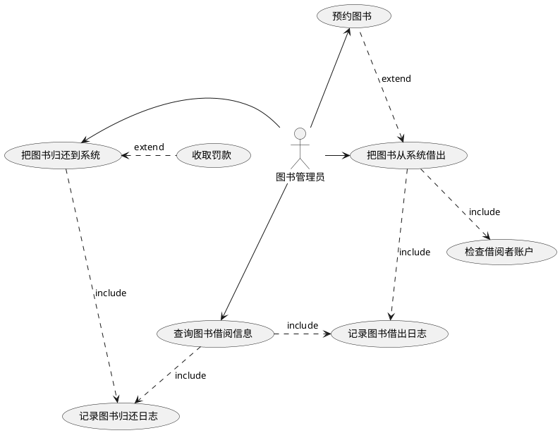
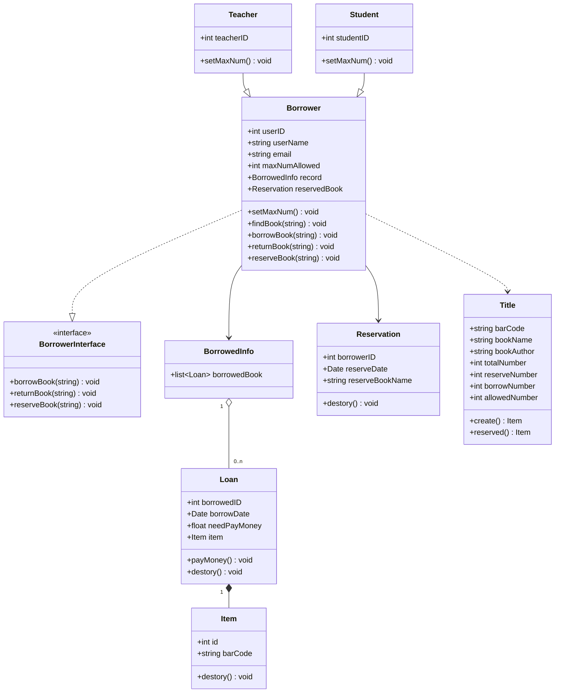

# 图书馆管理系统建模例子

## 一句话结论

图书馆管理系统建模以需求分析为起点：识别借阅者、图书管理员、系统管理员三类参与者及其业务功能，然后从**交互视角**（用例图）、**结构化视角**（类图）、**行为视角**（序列图、活动图、状态图）三个视角建立模型，分别对应 UML 4+1 视图中的用例视图、逻辑视图与行为视图。

## 核心概念

- **参与者（Actor）**：借阅者（含教师、学生）、图书管理员、系统管理员。
- **用例模型（用例图）**：对应 UML 4+1 视图中的用例视图，从交互视角描述参与者与系统功能。
- **静态模型（类图）**：对应 UML 4+1 视图中的逻辑视图，从结构化视角描述类及其关系（泛化、实现、关联、聚合、组合）。
- **动态模型（序列图、活动图、状态图）**：对应 UML 4+1 视图中的行为视图，从行为视角描述系统动态行为。
- **身份认证系统**：系统管理员和图书管理员操作需身份认证；借阅者除查询图书信息无需登录外，其他操作需登录认证。

## 工作机制

从系统的不同视角对图书管理系统进行软件建模：

1. 从**交互视角**（对应 UML 4+1 视图中的用例视图）建立**用例模型（用例图）**——用例图用参与者与用例描述"谁使用系统、能做什么"：借阅者可执行登录、查询、借阅、归还、预约、缴纳罚款等用例，教师/学生是借阅者的泛化子类；图书管理员负责把图书从系统借出、归还、查询借阅信息、处理预约、收取罚款。
2. 从**结构化视角**（对应逻辑视图）建立**静态模型（类图）**——类图描述 Borrower、Teacher、Student、Loan、Item、Title 等类及其之间的泛化、实现、关联、聚合、组合关系。
3. 从**行为视角**（对应行为视图）建立**动态模型（序列图、活动图、状态图）**。

## 示例或代码

- **借阅者用例图**（PlantUML）：借阅者参与登录、查询、借阅、归还、预约、缴纳罚款用例；借阅、归还、预约均 `include` 查询图书，缴纳罚款对归还图书是 `extend`。
- **图书管理员用例图**（PlantUML）：管理员处理图书出借、归还、查询借阅信息、预约、收取罚款；出借 `include` 检查账户与记录借出日志等。
- **类图**（Mermaid）：`Borrower` 实现 `BorrowerInterface`，`Teacher`/`Student` 泛化 `Borrower`，`Borrower` 与 `Title`、`Reservation`、`BorrowedInfo` 关联，`BorrowedInfo` 聚合多个 `Loan`，`Loan` 组合 `Item`。

完整图表代码见下文「详细章节」。

## 常见误区

- **"建模只画一种图就够了"**：需要从交互（用例图）、结构（类图）、行为（序列图/活动图/状态图）多个视角建模，才能完整描述系统。
- **"用例图就是流程图"**：用例图描述参与者与系统功能的交互；`include`/`extend` 表达用例之间的包含/扩展关系，而非流程顺序。
- **"类图只是罗列类"**：类图的核心还包括类之间的关系（泛化、实现、关联、聚合、组合）。

## 证据映射

| claim_id | 来源 | 要点 |
| --- | --- | --- |
| example-audit-1 | web-computer-science-uml | 该 claim 为 PlantUML 官网浏览器扩展推广文案（迁移期误锚），与图书馆建模主题无直接关联，按规则保留原文案 |

## 待验证项

无。

## 关联知识

- [[uml]] —— 统一建模语言（UML）总论。
- [[software-modeling]] —— 软件建模总论（视角与"需求 → 模型 → 实现"过程）。
- [[use-case-diagram]] / [[class-diagram]] / [[sequence-diagram]] / [[activity-diagram]] / [[statechart-diagram]] —— 本示例使用的各类 UML 图。

## 详细章节

### 图书馆管理系统建模例子

#### 需求分析

* 借阅者的基本业务功能
  * 支持查询、借阅、续借、预约/撤销、归还图书
  * 支持查询历史借阅记录，缴纳罚款
  * 不同类型的借阅者（如：老师、学生）一次借阅的书本数量和最大借阅时长限制可以不同
* 图书管理员的基本业务功能
  * 支持图书出借、图书归还、图书预约的处理
  * 支持收取罚款
* 系统管理员的基本业务功能
  * 支持添加、删除、修改图书信息
  * 支持添加、删除、修改借阅者信息
* 身份认证系统
  * 系统管理员和图书管理员需要进行身份认证才能操作
  * 借阅者除查询图书信息无需登录认证以外，其他操作需要登录认证才能操作

#### 建立模型

从系统的不同视角对图书管理系统进行软件建模：

1. 从交互视角（对应UML4+1视图中的用例视图）建立用例模型（用例图）。
2. 从结构化视角（对应UML4+1视图中的逻辑视图）建立静态模型（类图）。
3. 从行为视角（对应UML4+1视图中的行为视图）建立动态模型（序列图、活动图、状态图）。

##### 用例图

在图书管理系统中，参与者有借阅者、图书管理员和系统管理员。

###### 借阅者

###### 图书管理员

##### 类图

##### 序列图

##### 活动图

##### 状态图
