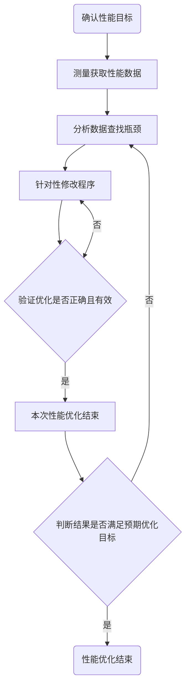

# 程序性能的度量指标及优化流程

## 一句话结论

程序性能用执行时间、计算/访存效率、吞吐量与延迟、加速比等指标度量，并用 Amdahl 定律与 Gustafson 定律刻画并行加速的上限；优化按"确认目标 → 测量 → 分析瓶颈 → 针对性修改 → 验证 → 迭代"的闭环流程进行，同时注意测试用例构造、指标选择、正确性判定、可读性与结束时机。

## 核心概念

- **程序执行时间**：判断性能优劣的简单方式；Linux `time` 命令可获取 real（实际运行）、user（用户态）、sys（内核态）三种时间。
- **计算效率**：实测浮点性能与理论浮点峰值性能之比。
- **访存效率**：程序有效访存带宽与存储器理论带宽之比（带宽是计算平台每秒内存交换量的最大值）；接近 1 说明带宽利用充分，远小于 1 说明还有访存优化空间。
- **吞吐量与延迟**：衡量软件系统最常见的两个指标，但高吞吐量并不意味着低延迟，二者关系并非一一对应；延迟表示所有操作完成的耗时。
- **加速比 speedup**：同一任务在单处理器系统与并行处理器系统中运行时间的比率，也可衡量优化前后的效果；加速比 = 优化前执行时间 / 优化后执行时间。
- **Amdahl 定律**：程序分为可加速与不可加速两部分，总加速比 `S = 1/((1-a)+a/n)`（a 为并行部分比例，n 为并行部分加速比）。
- **Gustafson 定律**：固定时间（扩展）加速比模型，`S = n + (1-n)*f = f - n*(f-1)`（f 为核数，n 为串行部分比例）。

## 工作机制

1. 选择度量指标：执行时间、计算效率、访存效率、吞吐量/延迟、加速比等，按场景选用。
2. 用定律估算加速上限：Amdahl 定律适用于固定负载模式，Gustafson 定律适用于固定时间模式（非固定负载）。
3. 按闭环流程优化：确认性能目标 → 测量获取性能数据 → 分析数据查找瓶颈 → 针对性修改程序 → 验证优化是否正确且有效（无效则回到修改）→ 判断结果是否满足预期目标（不满足则回到分析）。
4. 遵守优化注意事项：构造具有待调优程序特征的测试用例；根据性能指标选择相应分析策略；增加测试广度保证正确性；保持程序可读性、可移植性、可维护性与可靠性；知道程序与最优状态的差距、选择合适时机结束优化。

## 示例或代码

- **执行时间**：Linux 下 `time` 命令获取 real/user/sys 时间。
- **加速比**：`加速比 = 优化前的执行时间 / 优化后的执行时间`。
- **Amdahl 定律**：`S = 1 / ((1 - a) + a / n)`。
- **Gustafson 定律**：`S = n + (1 - n) * f = f - n * (f - 1)`。
- **优化流程**：见详细章节中的 mermaid 流程图（确认目标 → 测量 → 分析 → 修改 → 验证 → 判断是否满足目标，形成闭环迭代）。

## 常见误区

- **以为高吞吐必然低延迟**：高吞吐量并不意味着低延迟，两者关系不是简单的一一对应。
- **只用单一指标判断性能**：不同性能指标对应不同分析策略，应结合场景选择。
- **跳过验证环节**：修改后必须验证优化是否正确且有效，否则容易"为优化而优化"。
- **无限优化不止**：应知道程序与最优状态的差距，选择合适时机结束性能优化。
- **忽略正确性**：为避免测试不完全，需要增加测试的广度。

## 证据映射

| claim_id | 来源 | 要点 |
| --- | --- | --- |
| metrics-and-optimization-processes-audit-1 | osti-profiling-tracing | 剖析器（Profilers）提供执行统计/事件的汇总，常按函数、循环或用户指定片段给出整体性能概览 |

## 待验证项

无

## 关联知识

- [[program-performance-analysis]]：程序性能的分析与测量
- [[analysis-and-measurement-of-program-performance]]：程序性能的分析和测量
- [[linux-performance-tools]]：linux 性能分析工具
- [[arm-software-optimization]]：arm 软件性能优化

## 详细章节

### 程序性能的度量指标及优化流程

#### 程序性能的度量指标

##### 程序执行时间

程序的执行时间是判断程序性能优劣较为简单的方式之一，在使用相同计算设备且保证程序正确的前提下，程序运行时间越短意味着其性能越高效。

Linux下`time`命令可以获取一个程序的执行时间：

* 程序实际运行时间（real time）
* 程序运行在用户态时间（user time）
* 程序运行在内核态时间（sys time）

##### 计算与访存效率

* 计算效率是指实测浮点性能与理论浮点峰值性能之比。
* 访存效率是指程序的有效访存带宽与存储器理论带宽之比，其中带宽是计算平台每秒内存交换量的最大值。当程序的访存效率接近于1时，说明程序已经将整个存取器的带宽都利用了起来，与之对应的当访存效率远小于1，则说明存储带宽利用率较低，程序还有一定的访存优化空间。

##### 吞吐量与延迟

吞吐量和延迟是衡量软件系统最常见的两个指标。但高吞吐量并不意味着低延迟，高延迟也不代表吞吐量变小，它们之间的关系并不是简单的一一对应。延迟测量的是用于等待的时间，广义来说，延迟可以表示所有操作完成的耗时，例如一次应用程序请求、一次数据库查询、一次文件系统操作等，可以表示从单击链接到屏幕显示整个页面加载完成的时间。 

##### 加速比

加速比speedup是指同一个任务在单处理器系统和并行处理器系统中运行消耗的时间的比率，用来衡量并行系统或程序并行化的效果，也可以用于衡量程序优化前后的效果，由于加速比是一个相对比值，因此在保证程序正确性的前提下加速比数值越大，代表着优化的效果越显著。 计算加速比的公式为： 
$$
加速比 = \frac{优化前的执行时间}{优化后的执行时间}
$$

##### Amdahl定律

Amdahl定律将程序划分为可加速与不可加速两大部分，程序总的加速比S是一个关于程序中这两部分所占比例以及可加速部分性能加速程度的函数，用公式表示为：
$$
S = \frac{1}{(1 - a) + \frac{a}{n}}
$$
其中a为并行计算部分所占比例，n为并行计算部分获得的加速比。

##### Gustafson定律

对于某些不属于固定负载模式的问题不能使用Amdahl定律来解释。早在1988年Gustafson就发现了这个问题并提出了固定时间加速比模型，也就是经常提及的扩展加速比模型，通常被称为Gustafson定律，其公式为:
$$
S = n + (1 - n) * f = f - n * (f - 1)
$$
其中S表示扩展加速比，f表示处理器核的数量，n表示程序中串行部分的比例。

#### 优化流程

程序性能优化注意事项：

* 测试用例的构造。需要构造出具有待调优程序特征的测试用例。
* 性能指标的选择。根据不同的性能指标，分析策略也不相同。
* 正确性的判定。为避免出现测试不完全的情况，可以增加测试的广度。
* 保持程序的可读性。保证程序的可移植性、可读性、可维护性和可靠性。
* 程序性能优化结束的时机。优化人员需要知道程序与最优状态的差距，选择合适的时机结束程序性能优化。

#### 参考

https://www.bilibili.com/read/cv26060996/?spm_id_from=333.999.0.0

https://www.bilibili.com/read/cv26110227/?spm_id_from=333.999.0.0

## 参考

https://www.bilibili.com/read/cv26060996/?spm_id_from=333.999.0.0

https://www.bilibili.com/read/cv26110227/?spm_id_from=333.999.0.0
