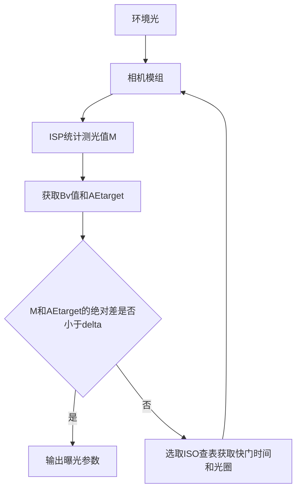

---
aliases:
- 自动曝光
- Auto Exposure
- AE
- Automatic exposure
confidentiality: public
domain: multimedia
evidence:
- claim: 曝光由曝光时间（快门）与感光材料上的照度共同决定：快门速度控制曝光时间，光圈与场景亮度决定照度；更慢的快门、更大的光圈、更亮的场景产生更大曝光。
  claim_id: exposure-factors
  support: direct
  supporting_quotes:
  - evidence_id: evidence-43626ae79bd6
    exact: "Exposure is a combination of the length of time and the illuminance at the photosensitive material. Exposure time is controlled in a camera by shutter speed, and the illuminance depends on the lens aperture and the scene luminance."
  targets:
  - evidence_id: evidence-43626ae79bd6
    source_id: wiki-exposure-photography
- claim: 更高 ISO（感光度）的胶片/感光材料需要更少的曝光即可得到可读图像。
  claim_id: exposure-iso
  support: direct
  supporting_quotes:
  - evidence_id: evidence-445f3cce2365
    exact: "Faster film, that is, film with a higher ISO rating, requires less exposure to make a readable image."
  targets:
  - evidence_id: evidence-445f3cce2365
    source_id: wiki-exposure-photography
- claim: 欠曝指暗部细节丢失：重要暗区"浑浊"或与黑色无法区分，即"死黑/压死暗部"。
  claim_id: exposure-underexposure
  support: direct
  supporting_quotes:
  - evidence_id: evidence-733c5ff57fe0
    exact: "A photograph may be described as underexposed when it has a loss of shadow detail, that is, when important dark areas are \"muddy\" or indistinguishable from black, known as \"blocked-up shadows\"."
  targets:
  - evidence_id: evidence-733c5ff57fe0
    source_id: wiki-exposure-photography
- claim: APEX（Additive System of Photographic Exposure）用曝光方程把推荐曝光与场景平均亮度关联：A²/T = B·Sx/K（A 光圈、T 快门、B 场景亮度、Sx 感光度、K 校准常数）。
  claim_id: exposure-equation
  support: direct
  supporting_quotes:
  - evidence_id: evidence-d5683985cdc6
    exact: "The relationship of recommended photographic exposure to a scene's average luminance is given by the camera exposure equation A^2/T = B*Sx/K, where A is the relative aperture (f-number), T is the exposure time (shutter speed) in seconds, B is the scene luminance, Sx is the ASA arithmetic film speed, and K is the reflected-light meter calibration constant."
  targets:
  - evidence_id: evidence-d5683985cdc6
    source_id: wiki-apex-system
- claim: 对曝光方程两边取以 2 为底的对数，曝光计算化为加法：Ev = Av + Tv = Bv + Sv（Av 光圈值、Tv 时间值、Sv 感光值、Bv 亮度值）。
  claim_id: exposure-ev
  support: direct
  supporting_quotes:
  - evidence_id: evidence-94fb33e0def3
    exact: "Taking base-2 logarithms of both sides of the exposure equation and separating numerators and denominators reduces exposure calculation to a matter of addition: Ev = Av + Tv = Bv + Sv, where Av is the aperture value, Tv is the time value, Sv is the speed value (aka sensitivity value), and Bv is the luminance value (aka brightness value)."
  targets:
  - evidence_id: evidence-94fb33e0def3
    source_id: wiki-apex-system
- claim: 测光模式指相机确定曝光的方式，一般可选点测光、中央重点平均测光或多区测光。
  claim_id: metering-modes
  support: direct
  supporting_quotes:
  - evidence_id: evidence-617f5a92fab0
    exact: "In photography, the metering mode refers to the way in which a camera determines exposure. Cameras generally allow the user to select between spot, center-weighted average, or multi-zone metering modes."
  targets:
  - evidence_id: evidence-617f5a92fab0
    source_id: wiki-metering-mode
- claim: 点测光只测量场景中很小一块区域（取景面积的 1-5%），默认位于画面中央。
  claim_id: metering-spot
  support: direct
  supporting_quotes:
  - evidence_id: evidence-33a767fc2e5f
    exact: "With spot metering, the camera will measure only a very small area of the scene (1–5% of the viewfinder area). By default this is the centre of the scene."
  targets:
  - evidence_id: evidence-33a767fc2e5f
    source_id: wiki-metering-mode
id: auto-exposure
kind: knowledge
publication_scope: public
related: []
sources:
- wiki-apex-system
- wiki-exposure-photography
- wiki-metering-mode
status: published
tags:
- camera
- isp
- exposure
- 3a
- photography
title: 自动曝光（AE）
updated_at: '2026-09-04'
---

# 自动曝光（AE）

## 一句话结论

自动曝光（Auto Exposure，AE）是相机/ISP 根据外界光线的强弱自动调整**光圈、快门、ISO**，防止曝光过度或不足的机制。其理论基础是 APEX 曝光方程（A²/T = B·Sx/K，对数化后 Ev = Av+Tv = Bv+Sv）：测出环境亮度 Bv 后即可计算合适的光圈/快门/ISO 组合。测光模式（平均/局部/点测/中央重点）决定如何度量场景亮度，是正确曝光的前提。

## 核心概念

- **曝光三要素**：光圈（进光孔径）、快门（曝光时间）、ISO（感光增益）——三者共同决定曝光量。
- **正确曝光**：把现实场景还原为平均亮度约 18% 中性灰；曝光过度/不足分别损失高光/暗部细节。
- **APEX 曝光方程**：A²/T = B·Sx/K，对数化后 Ev = Av+Tv = Bv+Sv，把曝光计算化为加法。
- **测光模式**：平均测光、局部测光、点测光、中央重点平均测光——决定相机如何度量场景亮度。

## 工作机制

1. **测光**：ISP 统计画面亮度（测光值 M），结合环境光获得 Bv 值与 AE target。
2. **比较**：若 M 与 AE target 的绝对差小于阈值 δ，输出当前曝光参数。
3. **调整**：否则选取 ISO 查表得到快门时间与光圈，更新相机模组，重新统计，迭代收敛。
4. **AE target 考量**：实际中并非简单 18% 中性灰，还需考虑特殊场景（蓝天、人脸等）与用户意图。

## 示例或代码

APEX 曝光方程与 EV 分解：

```text
曝光方程：A²/T = B·Sx/K            （A 光圈、T 快门、B 亮度、Sx ISO、K 校准常数）
取 log2：  Ev = Av + Tv = Bv + Sv
           Av = log2(A²)          光圈值
           Tv = log2(1/T)         时间值
           Sv = log2(N·Sx)        感光值
           Bv = log2(B/(N·K))     亮度值
```

## 常见误区

- **"曝光只是快门的事"**：曝光由光圈、快门、ISO 三者共同决定，可互换（互易律）。
- **"AE target 就是 18% 灰"**：18% 中性灰是基准，实际 AE target 需结合场景（蓝天、人脸、逆光）动态调整。
- **"点测光不常用"**：点测光只测 1-5% 小区域，在月亮、舞台等高反差场景很关键。
- **"高 ISO 只是变亮"**：高 ISO 是放大增益，会同步放大噪声——AE 需在曝光量与噪声间权衡。

## 证据映射

| Claim | 来源 | 要点 |
| --- | --- | --- |
| exposure-factors / exposure-iso / exposure-underexposure | wiki-exposure-photography | 曝光三要素 + 互易 + 欠曝 |
| exposure-equation / exposure-ev | wiki-apex-system | APEX 曝光方程 + EV 加法化 |
| metering-modes / metering-spot | wiki-metering-mode | 测光模式 + 点测光 |

## 待验证项

无。

## 关联知识

- [[demosaic]] —— AE 与 AWB/AF 构成 3A，是相机 ISP 自动控制的核心。
- [[android-camera-architecture]] —— Camera 流水线中 AE 统计位于 raw 域处理链。

## 详细章节

### 曝光的影响因素

- **光圈（Aperture）**：镜头内光圈叶片孔径大小，控制进光量；光圈越大（f 值越小）进光越多。
- **快门（Shutter）**：曝光时间；快门越慢曝光越长。
- **ISO（感光度）**：感光元件对光线的敏感程度（增益）；ISO 越高需曝光越少但噪声越大。

### 合适的曝光

一般把现实场景还原为平均亮度为 18% 中性灰。AE 算法通过反馈闭环（测光 → 比较 AE target → 调整曝光参数）使画面亮度收敛到目标。

### 自动曝光算法框架



### 测光模式

- **平均测光（分割测光）**：取景画面分割为若干区域，各区域加权平均。
- **局部测光**：对画面某一局部测光。
- **点测光**：只对很小区域（约 1-5% 取景面积）。
- **中央重点平均测光**：偏重取景器中央，再平均到整个场景。

## 参考

- https://en.wikipedia.org/wiki/Exposure_(photography)
- https://en.wikipedia.org/wiki/APEX_system
- https://en.wikipedia.org/wiki/Metering_mode
