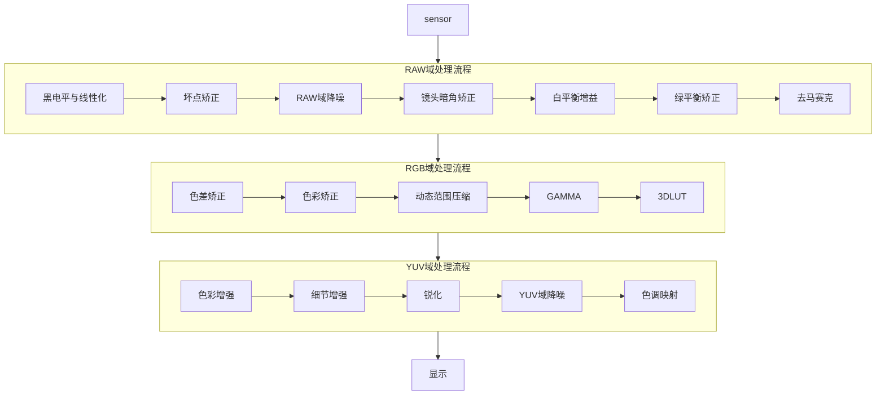

---
aliases:
- ISP 系统
- ISP System
- 数字成像系统
- 图像信号处理
confidentiality: public
domain: multimedia
evidence:
- claim: 数字成像系统为了模仿人的视觉系统，尽可能把现实场景恢复得与人眼接近；整个 ISP pipeline 都是围绕对真实世界的还原而设计的。
  claim_id: isp-system-definition
  support: personal
  supporting_quotes:
  - evidence_id: evidence-a194d9673e4d
    exact: 整个ISP pipeline都是围绕对真实世界的还原而设计的。
  targets:
  - evidence_id: evidence-a194d9673e4d
    source_id: working-multimedia-isp-system
id: isp-system
kind: knowledge
publication_scope: public
related: []
schema_version: wiki/v1
sources:
- working-multimedia-isp-system
status: published
tags:
- camera
- isp
- pipeline
- image-processing
- multimedia
title: ISP 系统
updated_at: '2026-09-04'
---

# ISP 系统

## 一句话结论

ISP（Image Signal Processor，图像信号处理）系统是数字成像系统的核心，目的是模仿人的视觉系统，尽可能把现实场景恢复得与人眼接近——整个 ISP pipeline 围绕对真实世界的还原而设计。数字成像把光信号转电信号再转数字信号（RAW），ISP 把 RAW 处理成三通道彩色图像。典型 pipeline 分 RAW 域（黑电平/坏点/降噪/暗角/白平衡/绿平衡/去马赛克）→ RGB 域（色差/色彩校正/DRC/GAMMA/3DLUT）→ YUV 域（色彩增强/细节/锐化/降噪/色调映射），外加 3A 与缩放/压缩/防抖等。

## 核心概念

- **数字成像系统**：模仿人眼，把现实场景光信号还原为数字图像。
- **组成**：镜头（Lens）→ 红外滤光片 → 图像传感器（Sensor，CCD/CMOS，输出 RAW）→ ISP → 显示。
- **RAW**：sensor 每像素只感 R/G/B 之一的最原始数据。
- **ISP pipeline**：RAW 域 → RGB 域 → YUV 域三段处理。
- **主 pipeline 外**：AE/AF/AWB 3A、闪光灯、缩放、压缩、畸变矫正、防抖、深度图、JPEG。

## 工作机制

数字成像流程：镜头汇聚光线 → Sensor 光电转换（+AD 数字信号，RAW）→ ISP 处理 → 显示/存储。

ISP pipeline（一种典型）：

1. **RAW 域**：黑电平与线性化 → 坏点矫正 → RAW 域降噪 → 镜头暗角矫正 → 白平衡增益 → 绿平衡矫正 → 去马赛克。
2. **RGB 域**：色差矫正 → 色彩矫正 → 动态范围压缩 → GAMMA → 3DLUT。
3. **YUV 域**：色彩增强 → 细节增强 → 锐化 → YUV 域降噪 → 色调映射。
4. **主 pipeline 外**：3A（AE/AF/AWB）、闪光灯、缩放、压缩、畸变矫正、防抖、深度图、JPEG。

## 示例或代码

## 常见误区

- **"ISP 只是降噪"**：ISP 是完整 pipeline（RAW/RGB/YUV 三段），含白平衡、色彩、DRC、色调映射等。
- **"RAW 就是图像"**：RAW 是 sensor 每像素单色数据，需 ISP 去马赛克等处理成三通道彩色图像。
- **"3A 是独立于 pipeline 的"**：AE/AF/AWB 在主 pipeline 之外但与各模块联动（白平衡增益、曝光）。
- **"镜头越少越便宜越差"**：透镜越多成像越好但成本越高，是质量与成本权衡。

## 证据映射

| Claim | 来源 | 要点 |
| --- | --- | --- |
| isp-system-definition | working-multimedia-isp-system | ISP 围绕还原真实世界设计 |

## 待验证项

无。

## 关联知识

- [[android-camera-architecture]] —— Camera 系统架构中 ISP 是 raw 域处理链。
- [[demosaic]] / [[black-level-correction]] / [[auto-white-balance]] —— ISP pipeline 各环节。
- [[hdr]] / [[tonemapping]] —— 动态范围与色调映射环节。

## 详细章节

### 数字成像系统

数字成像系统是为了模仿人的视觉系统，尽可能地把现实场景恢复得与人眼接近。将自然界中光信号转化为电信号，然后将模拟电信号转化为数字信号的过程，将数字信号进行处理，最终到显示设备送显或者文件格式存储。

### 目的

图像是人类视觉的基础，是自然景物的客观反映，是人类认识世界和人类本身的重要来源。"图"是物体反射或透射光的分布，"像"是人类视觉系统所接受的图在人脑中形成的印象或认识。数字成像系统是为了模仿人的视觉系统，尽可能地把现实场景恢复得与人眼接近。整个 ISP pipeline 都是围绕对真实世界的还原而设计的。

### 组成

- **镜头（Lens）**：镜头由透镜组成，景物的光线通过透镜在 sensor 平面形成清晰的像。透镜越多，成像效果越出色，但是成本也越高。
- **红外滤光片（可选）**：人眼无法观察红外光线，但是 sensor 可以，所以需要滤除红外光，让图像更接近人类观察的效果。
- **图像传感器（Sensor）**：将镜头的光信号转化为电信号，再经过内部 AD 将模拟电信号转化为数字信号。sensor 中每个像素点只能感光 R、G、B 中的一种，这些最原始的感光数据称为 RAW 数据。类型：CCD、CMOS。
- **ISP**：将 RAW 数据处理成三通道的彩色图像。
- **显示**。

### 应用

手机相机、数码相机、行车记录仪、安防系统、无人机、汽车 ADAS 系统。

### ISP处理流程

#### pipeline

经过 ISP 的处理后，图像信号反映更加真实的现实场景。ISP pipeline 有多种，以下是其中一种（见"示例或代码"的 mermaid 图）。

#### RAW域处理流程

- 黑电平与线性化 / 坏点矫正 / RAW 域降噪 / 镜头暗角矫正 / 白平衡增益 / 绿平衡矫正 / 去马赛克

#### RGB域处理流程

- 色差矫正 / 色彩矫正 / 动态范围压缩 / GAMMA / 3DLUT

#### YUV域处理流程

- 色彩增强 / 细节增强 / 锐化 / YUV 域降噪 / 色调映射

#### 主pipeline以外处理

- 自动曝光 / 自动对焦 / 自动白平衡 / 闪光灯 / 图像缩放 / 图像压缩 / 畸变矫正 / 图像防抖 / 深度图 / JPEG

## 参考

- ISP 系统与数字成像 pipeline（working 整理，personal 源）
- [[android-camera-architecture]] 中 Camera raw 域处理链相关章节
