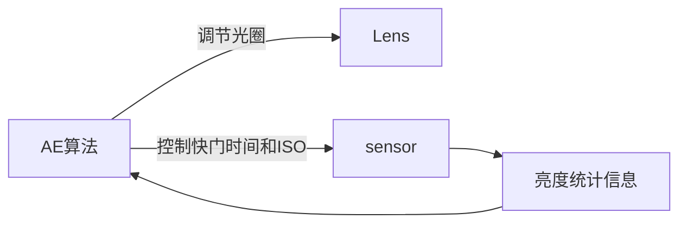
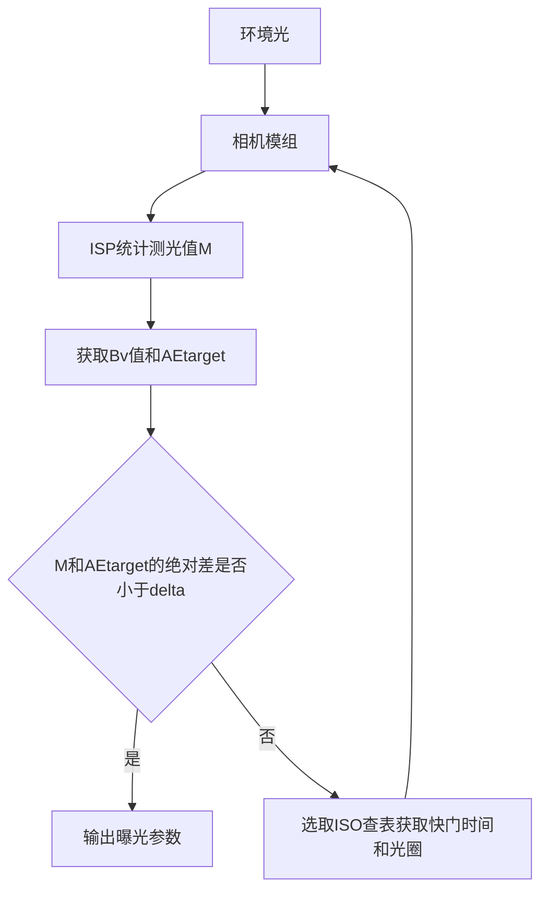

# 自动曝光

## 曝光的影响因素

* 光圈：镜头内光圈叶片孔径大小
* 快门：曝光时间
* ISO：感光元件对光线的敏感程度，增益

## 合适的曝光

一般把现实场景还原为平均亮度为18%中性灰。

## 自动曝光

相机系统根据外界光线的强弱自动调整光圈、快门、ISO，防止曝光过度或者不足的机制。

## 自动曝光原理（曝光方程）

[APEX](https://en.wikipedia.org/wiki/APEX_system)（Additive System of Photographic Exposure）：曝光方程，一个经验公式

拍摄平均亮度为Ls的场景时，满足如下方程的曝光参数，可以认为得到一个亮度合适的照片：
$$
\frac{F^2}{t}=\frac{L_s S}{K}
$$

* F：光圈值
* t：曝光时间
* Ls：环境平均亮度
* S：相机感光度
* K：常数，由厂商决定

两边取对数
$$
E_v = \log_2{F^2} + \log_2{\frac{1}{t}} = \log_2{S N} + \log_2{\frac{L_s}{K N}} \\
E_v = A_v + T_v = S_v + B_v
$$

* Av：光圈大小
* Tv：快门快慢
* Sv：相机感光度
* Bv：环境光平均亮度

在测出环境光Bv时，就可以计算出合适的光圈、快门、ISO组合

测光成为正确曝光的重要一环。

## 自动曝光算法框架

难点：

AE target在实际场景中并不是简单的使用18%中性灰亮度，还需要考虑特点场景（如蓝天、人脸等）。

## 测光模式

* 平均测光（分割测光）
  * 取景画面分割为若干区域，各区域加权
* 局部测光
  * 对画面的某一局部
* 点测光
  * 只对很小的区域
* 中央重点平均测光
  * 偏重于取景器中央，平均到整个场景