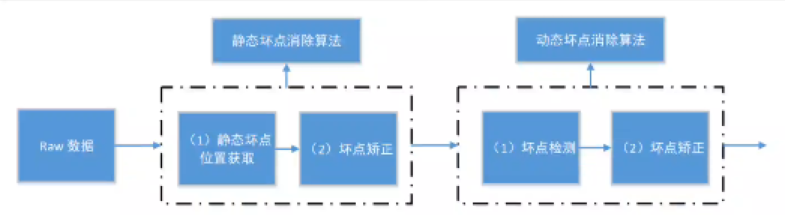
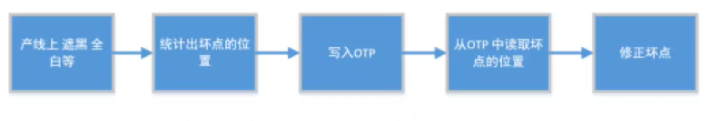

# 坏点矫正

## 坏点的定义

图像传感器的形成光线采集点（像素点）的阵列工艺存在缺陷，光信号进行转化为电信号的过程中出现错误，会造成图像上的部分像素信息有误，导致图像中的像素值不准确，这些有缺陷的像素点称为坏点。


坏点的计量单位是ppm（parts per million），例如有100ppm，对于一个5百万像素的sensor就有500个坏点。


## 坏点的成因

* 工艺缺陷
  * sensor生产时引入的缺陷：比如灰尘导致某像素电路损坏
  * 组装过程的缺陷：比如模组组装、电路焊接过程的损伤
* 使用缺陷
  * 使用过程中的损伤：比如跌落、碰撞造成的物理上损坏
  * 使用时间过长：电子产品的寿命有限，老化后器件变差
  * 使用环境：温度、湿度、光照等使用环境造成器件能力波动


## 坏点的分类

* 根据坏点是否变化分类
  * 静态坏点：不会随着时间、增益等改变，从sensor制造时因为工艺等产生的坏点。
    * 亮点： 一般来说像素点的亮度值是正比于入射光的，而亮点的亮度值明显大于入射光乘以相应比例，并且随着曝光时间的增加，该点的亮度会显著增加 。
    * 暗点： 无论在什么入射光下，该点的值接近于0。
  * 动态坏点：因为增益、温度等引起的坏点，会随着时间变化而改变。
* 根据坏点的亮度分类
  * hot pixel： 比周围点亮很多的坏点 。
  * dead pixel：无论什么入射光下，该点的值接近0。
  * stuck pixel：无论什么入射光下，该点的值接近255。
  * blinky pixel：随机值。
  * stuck to neighbor pixel：该点的值受相邻的像素通道像素值的影响。
  * phase detection pixel：相位像素，PDAF sensor专有的。
* 根据单通道相邻坏点的数量分类
  * 单坏点：单通道只有一个坏点，其余相邻像素点都是好点。
  * 双坏点：单通道相邻像素点有两个坏点，其余相邻像素点都是好点。
  * 多坏点：单通道下有大于两个坏点。


## 坏点的影响

如果图像中存在坏点，会造成以下影响

* 后续进行插值和滤波处理的时候，会影响到周围的像素值，因此需要在插值和滤波之前对坏点进行矫正。
* 会造成图像的边缘出现伪彩色的情况，不仅影响清晰度，还影响边缘的色彩。
* 会造成图像部分像素闪烁的现象。


## 坏点的消除

### 方法

坏点矫正是在RAW域实现的，分为静态坏点矫正和动态坏点矫正两个独立过程。




#### 静态坏点矫正

一般在sensor 或者模组产线上进行标定，并将坏点位置写在OTP（One Time Programmable）里面。




静态坏点矫正是毁于已有的静态坏点表，比较当前点的坐标是否与静态坏点表中的某个坐标一致，若一致则判定为坏点，然后再计算矫正结果对其进行矫正。


静态坏点的实用性不强：

* 每个sensor的坏点都不相同，需要厂家给出每个sensor的静态坏点表，出于成本的考虑，厂家一般不会提供。
* 一些低成本的sensor坏点很多，用户需要保存大量的坏点表，对于存储空间是一笔很大的开销。


相位像素；

部分像素遮左半边，部分像素遮挡右半边，用来快速聚焦。由于遮挡会造成亮度由差异，在图像上表现为坏点。


相位像素的特点：

* 相位像素的分布很规律。
* 位置总是静态不变的。
* 相位像素的位置和sensor的型号有关，同型号的sensor位置相同。


#### 动态坏点矫正

动态坏点矫正可以实时的检测和校正sensor 的亮点与暗点，并且校正的坏点个数不受限制。

动态坏点校正相对静态坏点校正具有更大的灵活性和不确定性。

动态坏点矫正可以分为两个步骤，分别为坏点检测和坏点校正。


##### 坏点检测

坏点比周围点更亮或更暗，利用这个特点，可以检测坏点。


###### Pinto算法

将中心像素*P5*与周围的像素*P1~P8*分别作差，根据结果的正负进行判断，如果结果全为正值或负值，则该点为坏点；反之，如果结果有正有负，则视为正常像素点，不进行坏点校正。


###### Kakarala算法

```c
bool IsDefectivePixel(P1, P2, P3, P4, P5, P6, P7, P8, P9) {
 	P_high = max(P1, P2, P3, P4, P5, P6, P7, P8, P9); // max为求最大值或次大值方法
    P_low = min(P1, P2, P3, P4, P5, P6, P7, P8, P9); // min为求最小值或次小值方法
    P_avg = ((P1 + P2 + P3 + P4 + P5 + P6 + P7 + P8 + P9) - (P5 + P_high + P_low)) / 6;
    P_diff = P_high - P_low;
    if (P5 < (P_avg - P_diff) || P5 > (P_avg + P_diff)) {
        return true;
    }
    return false;   
}
```


##### 坏点校正

###### 中值滤波

使用周围像素点*P1~P8*的中值进行替代。


###### 梯度均值

根据边缘情况（各个方向计算梯度，选择最小值），选择进行均值滤波的像素点。

如果是平坦区域，则根据周围所有像素进行均值。

P为R、G、B三个通道。

```c
if 水平方向梯度最小:
    P5_out = (P4 + P6) / 2;
else if 垂直方向梯度最小:
    P5_out = (P2 + P8) / 2;
else if 135°方向梯度最小:
    P5_out = (P1 + P9) / 2;
else if 45°方向梯度最小:
    P5_out =(P3 + P7) / 2;
else:
    P5_out = (P1 + P2 + P3 + P4 + P6 + P7 + P8 + P9) / 8;
```


### 消除算法评价指标

* 不能损失原有图像细节
* 尽量消除所有坏点
* 不能引起artifact


### 可能造成的问题

* noise 的影响
  * 高噪声的情况下，可能会把噪声当成坏点，所以坏点矫正调试时根据ISO进行调试。
* 高亮的孤立点
  * 例如LED 点阵灯、交通灯等。可能会把它当成坏点。
* 分辨率卡等
  * 比较密集的条纹不能模糊。


## 参考

* https://www.qinxing.xyz/posts/506138d8/
* https://zhuanlan.zhihu.com/p/116873535
* https://bbs.huaweicloud.com/blogs/345231
* https://blog.51cto.com/u_15202985/6009981
* http://www.notedeep.com/page/18332
* Pinto V, Shaposhnik D. Dynamic identification and correction of defective pixels: U.S. Patent 8,098,304[P].2012-1-17.
* Baharav I, Kakarala R, Zhang X,et al. Bad pixel detection and correction in an image sensing device: U.S.Patent 6,737,625[P]. 2004-5-18.