# UML

## 概述

UML（统一建模语言）是用于指定、可视化、构建和文档化软件系统的标准语言。

UML不是编程语言，但是工具可以使用UML图生成各种编程语言代码。

UML是一种用于制作软件蓝图的图形语言。

### 目标

定义一种简单的建模机制，用于对复杂环境中的系统进行建模。

### 特点

* 面向对象：支持面向对象技术的主要概念，提供了一批基本的模型元素的表示图形和方法，能简洁明了地表达面向对象的各自概念。
* 可视化，表达能力强：通过UML的模型图能清晰地表示系统的路基模型和实现模型。可用于各自复杂系统的建模。
* 独立于过程：是系统建模语言，独立于开发过程。
* 独立于程序设计语言：用UML建立的软件系统模型可以用JAVA、C++等任何一种面向对象的程序设计来实现。
* 易于掌握使用：UML图形结构清晰，建模简洁明了，容易掌握使用。

### 应用

#### 系统建模

##### 架构

在设计一个系统之前，架构是从不同的方面考虑的。

UML在定义系统以下方面起着重要意义（**4+1视图**）：

* 设计（逻辑视角、结构视角）
  * 由类、接口和协作组成。
  * 用**类图**、**对象图**来表示。

* 实现（实现视角、开发视角）
  * 组装在一起的组件构成一个完整的物理系统。
  * 用**组件图**来表示。

* 过程（过程视角、行为视角）
  * 系统的流程。设计中相同的元素来表示。
  * 用**序列图**、**协作图**、**活动图**、**状态图**来表示。

* 部署（部署视角、物理视角）
  * 构成硬件的系统的物理节点。
  * 用**部署图**来表示。

* 用例（用例视角、场景视角）
  * 用例是连接以上四方面。用例代表系统的功能。
  * 用**用例图**来表示。

##### 建模类型

###### 结构建模

结构建模代表系统的框架，这个框架是所有其他组件都存在的地方。

* 类图
* 对象图
* 部署图
* 封装图
* 复合结构图
* 组件图

###### 行为建模

行为建模描述系统中的交互。它表示结构图之间的交互。

* 活动图
* 交互图
* 用例图

###### 架构建模

架构模型代表系统的整体框架。它包含系统的结构和行为元素。架构模型可以定义为整个系统的蓝图。封装图属于架构建模。

#### 面向对象

##### 概念

对象

* 数据：表示对象的状态
* 控制数据的方法

面向对象的基本概念

* 对象：对象表示一个实体和基本的构建块。
* 类：类是对象的蓝图。
* 抽象：抽象简化现实世界实体的属性和方法。
* 封装：封装是将数据绑定在一起，并从外部世界隐藏起来的机制。
* 继承：继承是从现有类创建新类的机制。
* 多态：多态定义了存在不同形式的机制。

##### 分析与设计

目的：

* 识别系统的对象
* 识别对象之间的关系
* 进行设计，用面向对象语言将其转换为可执行文件

应用和实施面向对象概念的基本步骤：

1. 面向对象分析
   * 识别对象
   * 用适当的方式描述对象
2. 面向对象设计
   * 重点放在要求与其实现上
3. 使用面向对象语言实现
   * 使用JAVA、C++等面向对象语言实现

##### UML在面向对象设计中的作用

UML是面向对象分析与设计的后续者。面向对象设计根据需求转化为UML图。面向对象分析和设计的输入是UML的输入。

#### 软件开发流程

软件开发过程中，不同阶段需要用到不同的UML图。

| 软件开发流程 | 常用UML图                                       | 应用场景                                                     |
| ------------ | ----------------------------------------------- | ------------------------------------------------------------ |
| 需求分析     | 用例图                                          | 对外部的参与者（Actor）以及它们所需要的系统功能建模。 表示用户的需求。 |
| 概要设计     | 类图、对象图 协作图、状态图、序列图、活动图  | 描述系统的静态结构。 描述系统的动态结构。                 |
| 详细设计     | 类图、对象图 协作图、状态图、序列图、活动图 | 在详细设计阶段，把概要设计的结果扩展成技术解决方案。 分析阶段的领域问题类被嵌入在这个技术基础结构中。 |
| 编码阶段     | /                                               | 把设计阶段的类转换成某种面向对象程序设计语言的代码。         |
| 测试         | 类图、组件图、部署图                            | 不同的测试阶段使用不同的UML图，如：单元测试使用类图和类的规格说明；集成测试使用组件图和部署图。 |

## 构建块

UML由三部分组成。

1. 基本构建块（语言的单词）

2. 如何控制构建块组合在一起的规则（语法）
3. 适用于整个语言的通用机制（使用约定或语义）

### 事物

#### 结构事物

结构事物定义了模型的静态部分，表示物理和概念上的元素。

##### 类

一组具有相似职责（属性和操作）的对象。

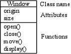

##### 接口

一组操作，类的函数集合，类的外部可见行为。

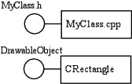

##### 协作

元素之间的交互。

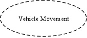

##### 用例

系统为特定目标执行的一组操作，产生可观察的结果。

用于构建模型中的行为。

通过协作实现。

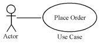

##### 活动类

类似一个类，但是它表示与其他行为并发运行的行为。

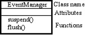

##### 组件

系统的物理部分和可替换部分，它实现了很多接口。

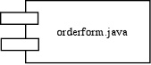

##### 节点

运行时存在的物理元素，代表资源。

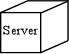

#### 行为事物

行为事物定义了模型的动态部分。

##### 交互

由一组在元素之间交换以完成特定任务的消息组成行为。

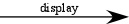

##### 状态机

定义了对象响应事件而经历的状态序列。

事件是导致状态变化的外部因素。

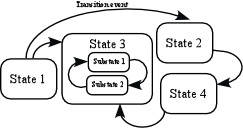

#### 组织事物

一种将UML模型的元素组合起来的机制。

##### 包

用于组合结构和行为事物的分组事物。

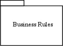

#### 辅助事物

一种捕获 UML 模型元素的注释和描述的机制。

##### 注释

用于呈现 UML 元素的评论、约束等。

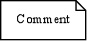

### 关系

描述元素之间如何关联和应用的功能，将事物紧密联系起来。

#### 依赖

连接两个事物的关系，其中一个事物（独立事物）的变化也会导致另一个事物（依赖事物）的变化。

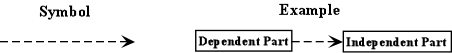

#### 关联

描述连接事物之间的结构关系，还可能包括连接的角色和数量。

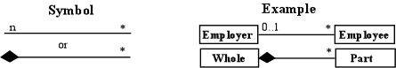

#### 泛化

连接特定元素和泛化元素的关系。

它基本上描述了对象世界中的父类（泛化）与其子类（专业化）的关系（继承关系）。

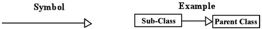

#### 实现

连接两个事物的关系，其中一个元素描述了一些没有实现的职责，而另一个元素实现这些职责。这种关系存在于接口的情况下。

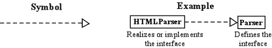

### 图

所有事件和关系都用于组成一个完整的UML图。

图表示一个系统。

#### 结构图

系统的静态部分，由类、接口、对象、组件和节点表示。

所有图表都相互之间存在某种关系。组件图依赖于作为类/对象图一部分的类、接口等。同样，部署图依赖于用于制作组件图的组件。

##### [类图](./diagram/class-diagram.md)

类图用于描述系统中的类，以及各个类之间的关系（如：泛化、实现、关联、依赖、聚合、组合）。

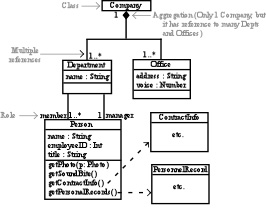

##### [对象图](./diagram/object-diagram.md)

与类图相似，对象图是类图的实例，对象图显示类的多个对象实例，而不是实际的类。

对象图描述对象之间的关系。

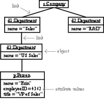

##### [组件图](./diagram/component-diagram.md)

组件图又称构件图。

组件图用于描述代码构件的物理结构以及各种构件之间的依赖关系。

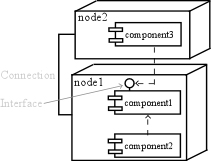

##### [部署图](./diagram/deployment-diagram.md)

部署图用于描述系统的物理部署。

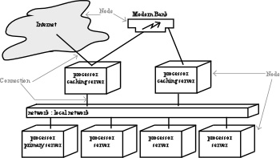

##### [用例图](./diagram/use-case-diagram.md)

用于描述角色以及角色与用例之间的连接关系（如：泛化、关联、依赖）。

说明的是谁要使用系统，以及他们使用该系统可以做些什么。

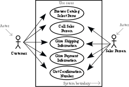

#### 行为图

系统的变化/移动部分。

UML 提供了从不同角度捕捉系统动态的功能。序列图和协作图是同构的，因此它们可以相互转换而不会丢失任何信息。状态图和活动图也是如此。

##### [序列图](./diagram/sequence-diagram.md)

序列图又称顺序图或时序图。

序列图用于描述参与者与系统对象之间有序的交互过程，强调消息是如何在对象之间被发送和接收的。

如果强调时间和顺序，则使用序列图。

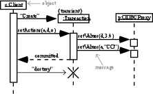

##### [协作图](./diagram/collaboration-diagram.md)

协作图又称合作图。

和序列图类似，用于描述对象间的动态合作关系。

可以看成类图和序列图的交集，重点描述对象之间的相互通信关系。

如果强调上下级关系，则使用协作图。

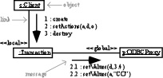

##### [状态图](./diagram/statechart-diagram.md)

状态图用于描述类的对象所有可能的状态，以及事件发生时状态转移条件，是对类图行为上的补充。

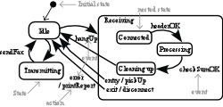

##### [活动图](./diagram/activity-diagram.md)

活动图用于描述用例要求所要进行的活动，以及活动间的约束关系，有利于识别并行活动。

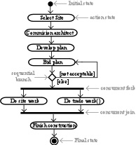

## 例子

[图书管理系统](./diagram/example.md)

## 工具

* PlantUML
  * [教程](https://plantuml.com/zh/)
  * [在线绘制](http://www.plantuml.com/plantuml/uml/SyfFKj2rKt3CoKnELR1Io4ZDoSa70000)
* mermaid
  * [教程](https://mermaid-js.github.io/mermaid/#/)
  * [在线绘制](https://mermaid.live/edit#pako:eNpVj82qwkAMhV8lZHUF-wJdCNre66agoLuOi9CmzqDzwzRFpO27O9WNN6uQ853DyYiNbxlzvEYKGs6lcpBmWxc6ml4s9RfIss20ZwHrHT8n2P3sPfTah2DcdfXhdwsExVgtGINo427zRyre_oPjCcq6oiA-XL6V88NP8Fubo07x_xUdObn-6o7yjrKGIhQU3wiu0XK0ZNpUfVwuCkWzZYV5WlvuaLiLQuXmhNIg_vR0DeYSB17jEFoSLg2lpy2m7HvP8wuLb1U-)

## 问题

* 一个软件系统可以通过哪几种视角来描述？
* UML是什么？
* UML具有什么特点？
* UML由哪些内容组成？
* UML有哪些关系？
* UML有哪几种图？

## 参考

https://www.tutorialspoint.com/uml/index.htm

https://www.cs.uah.edu/~rcoleman/Common/SoftwareEng/UML.html
