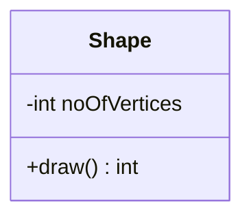
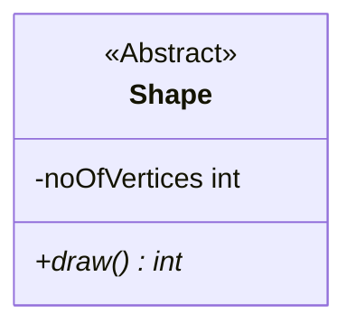
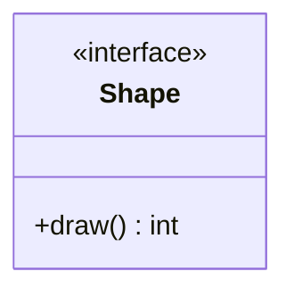
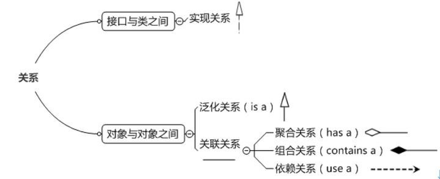
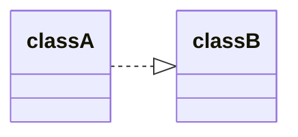
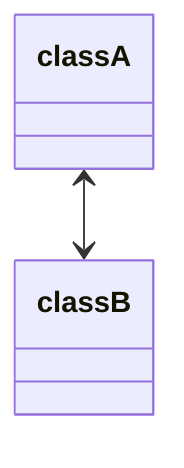
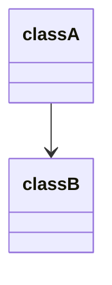
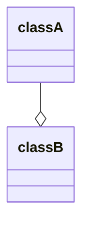
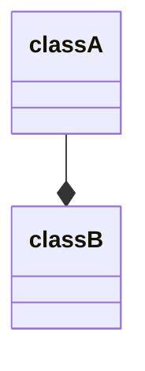
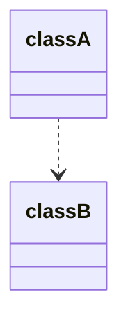

# 类图

类图由类、接口、关联、协作和约束组成。

在类图中使用活动类来表示系统的并发性。

类图表示系统的面向对象。因此，它通常用于开发目的。这是系统构建时使用最广泛的图。

类图是静态图。它代表应用程序的静态视图。类图不仅用于可视化、描述和记录系统的不同方面，还用于构建软件应用程序的可执行代码。

类图描述了类的属性和操作，以及对系统施加的约束。

## 目的

类图是唯一直接用面向对象语言映射的图。

- 应用程序静态视图的分析和设计。
- 描述系统的职责。
- 组件和部署图的基础。
- 正向和逆向工程。

## 哪里使用

- 描述系统的静态视图。
- 显示静态视图元素之间的协作。
- 描述系统执行的功能。
- 使用面向对象语言构建软件应用程序。

## 模块元素

### 类的分类

#### 具体类

分为三层

* 类名称
* 类成员变量
* 类方法

类成员变量和类方法的访问权限

* `+` 表示 `public`
* `-` 表示 `private`
* `# `表示 `protected`
* 不带符号表示 `default`

#### 抽象类

分为三层

* 类名称（斜体字）
* 类成员变量
* 类方法（斜体字）

#### 接口

分为两层

* 上部分用构造型 `<<interface>>`表示，下部分是接口名称
* 类方法

### 类的关系

#### 实现

##### 定义

实现关系是指接口及其实现类之间的关系，表示类是接口所有特征和行为的实现。

##### 如何表示

实现关系用空心三角和虚线组成的箭头来表示。

箭头指向：从实现类指向接口。

#### 泛化

##### 定义

泛化关系是指对象与对象之间的继承关系，指定了子类继承父类的所有特征和行为。

如果对象A和对象B之间的“is a”关系成立，那么二者之间就存在继承关系，对象B是父对象，对象A是子对象。

##### 如何表示

泛化关系用空心三角和实线组成的箭头表示。

箭头方向：从子类指向父类。

#### 关联

##### 定义

关联关系是指对象和对象之间的拥有关系，它使一个对象知道另一个对象的属性和方法。

关联关系有单向关联和双向关联。如果两个对象都知道（即可以调用）对方的公共属性和操作，那么二者就是双向关联。如果只有一个对象知道（即可以调用）另一个对象的公共属性和操作，那么就是单向关联。

##### 如何绘制

双向关联关系用带双箭头的实线或者无箭头的实线双线表示。

单向关联用一个带箭头的实线表示。

箭头方向：关联对象指向被关联的对象。

#### 聚合

##### 定义

聚合是关联关系的一种特例，它体现的是整体与部分的拥有关系，即 “has a” 的关系。此时整体与部分之间是可分离的，它们可以具有各自的生命周期，部分可以属于多个整体对象，也可以为多个整体对象共享，所以聚合关系也常称为共享关系。

聚合是整体和个体的关系，理解为把个体聚集到一起。

具体代码表现形式为部分对象是整体对象的一个成员变量。

##### 如何绘制

聚合关系用空心菱形加实线箭头表示，空心菱形在整体一方。

箭头方向：整体指向个体。

#### 组合

##### 定义

组合是关联关系的一种特例，它同样体现整体与部分间的包含关系，即 “contains a” 的关系。但此时整体与部分是不可分的，部分也不能给其它整体共享，作为整体的对象负责部分的对象的生命周期。这种关系比聚合更强，也称为强聚合。如果`A`组合`B`，则`A`需要知道`B`的生存周期，即可能`A`负责生成或者释放`B`，或者`A`通过某种途径知道`B`的生成和释放。

组合是整体和局部的关系，整体对象负责代表局部对象的生命周期，理解为整体是由局部组成。

具体代码表现形式为部分对象是整体对象的一个成员变量。

##### 如何绘制

组合关系用实心菱形加实线箭头表示，实心菱形在整体一方。

箭头方向：整体指向局部。

#### 强弱顺序

泛化=实现>组合>聚合>关联>依赖

图例助记

* 泛化和实现都是空心小三角，泛化是继承类（用实线），实现是实现接口（虚线），箭头都是指向被实现的接口或类（可以理解为前者实现或继承后者）。
* 组合和聚合都是菱形，组合是实心菱形，聚合是空心菱形，组合关系更强所以用实心，箭头都是指向个体/局部（可以理解为前者组合/聚合成后者）。
* 关联和依赖都是箭头，关联是实线，依赖是虚线，关联关系更强所以用实线，箭头都是指向被关联/依赖的类（可以理解为前者关联/依赖后者）。

#### 依赖

##### 定义

依赖关系是一种弱关联关系。如果对象A用到对象B，但是和B的关系不是太明显的时候，就可以把这种关系看作是依赖关系。如果对象A依赖于对象B，则 A “use a” B。

依赖关系是一种使用关系，有单向依赖和双向依赖，但是要避免使用双向依赖。

具体代码表现形式为**B为A的构造器**或**方法中的局部变量**、**方法或构造器的参数**、**方法的返回值**，或者**A调用B的静态方法**。

##### 如何表示

依赖关系用一个带虚线的箭头表示。

箭头方向：由使用方指向被使用方，表示使用方对象持有被使用方对象的引用。

## 如何绘制

https://mermaid-js.github.io/mermaid/#/classDiagram

## 参考

https://www.tutorialspoint.com/uml/index.htm

https://www.cs.uah.edu/~rcoleman/Common/SoftwareEng/UML.html

https://zhuanlan.zhihu.com/p/109655171
