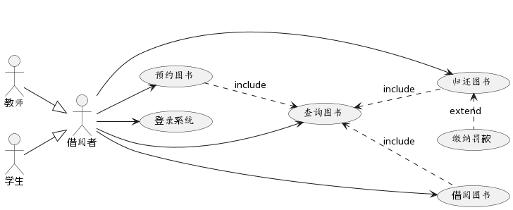
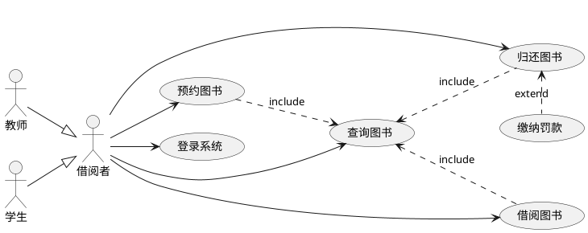
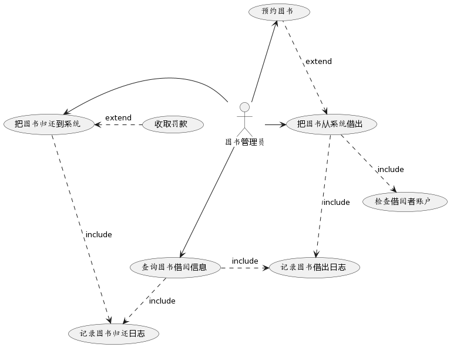
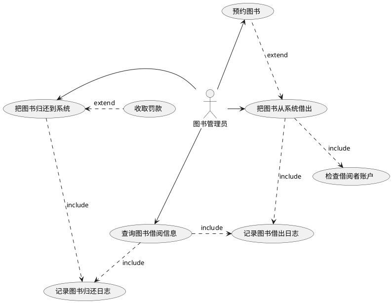
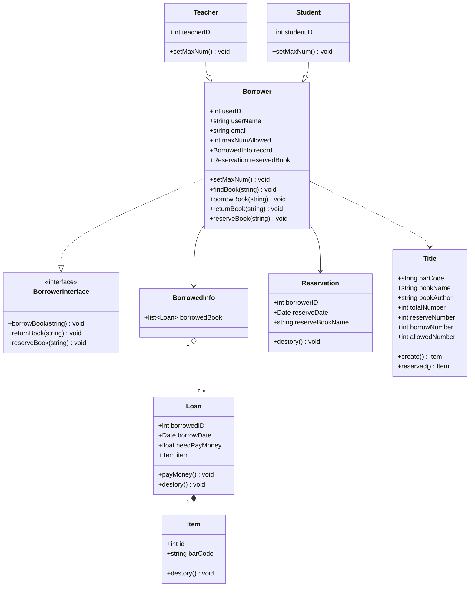

# 图书馆管理系统建模例子

## 需求分析

* 借阅者的基本业务功能
  * 支持查询、借阅、续借、预约/撤销、归还图书
  * 支持查询历史借阅记录，缴纳罚款
  * 不同类型的借阅者（如：老师、学生）一次借阅的书本数量和最大借阅时长限制可以不同
* 图书管理员的基本业务功能
  * 支持图书出借、图书归还、图书预约的处理
  * 支持收取罚款
* 系统管理员的基本业务功能
  * 支持添加、删除、修改图书信息
  * 支持添加、删除、修改借阅者信息
* 身份认证系统
  * 系统管理员和图书管理员需要进行身份认证才能操作
  * 借阅者除查询图书信息无需登录认证以外，其他操作需要登录认证才能操作

## 建立模型

从系统的不同视角对图书管理系统进行软件建模：

1. 从交互视角（对应UML4+1视图中的用例视图）建立用例模型（用例图）。
2. 从结构化视角（对应UML4+1视图中的逻辑视图）建立静态模型（类图）。
3. 从行为视角（对应UML4+1视图中的行为视图）建立动态模型（序列图、活动图、状态图）。

### 用例图

在图书管理系统中，参与者有借阅者、图书管理员和系统管理员。

#### 借阅者

#### 图书管理员

### 类图

### 序列图

### 活动图

### 状态图