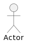
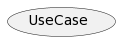
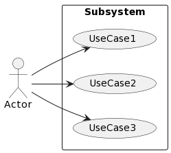
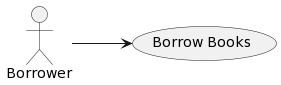
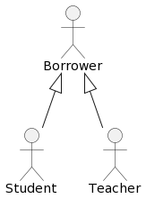
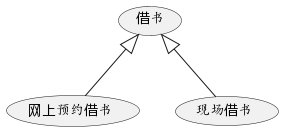
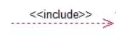
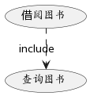
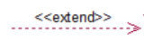
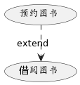

# 用例图

用例图由参与者（Actor）、用例（Use Case）及其关系组成。用例和参与者之间对应关系又叫做通信关联（Communication Association）。

用例图用于对应用程序的系统/子系统功能进行建模。

用例代表系统的特定功能。因此，用例图用于描述功能及其内部/外部控制器之间的关系。这些控制器被称为参与者。

用例图代表系统的用例视图。

单个用例图捕获系统的特定功能。

## 目的

- 用于收集系统的需求。
- 用于获取系统的外部视图。
- 识别影响系统的外部和内部因素。
- 显示需求之间的交互是参与者。

## 哪里使用

- 需求分析和高级设计。
- 对系统的上下文进行建模。
- 逆向工程。
- 正向工程。

## 模型元素

### 参与者

#### 定义

参与者表示与正在建模的系统进行交互的用户的角色。该用户可以是某个人、某个组织、一台机器或者另一个外部系统。

可以使用单个参与者来表示多个用户，而单个用户可以具有多个参与者的角色。

参与者位于系统外部，提供或接收系统信息。

参与者可以启动用例中所描述的行为，用例又可以对参与者执行操作。参与者还可以与系统交换数据。

在描述业务的模型中，参与者表示与业务交互的个人和机器的类型。

在描述软件应用程序的模型中，参与者表示与系统交互的个人外部系统或机器的类型。

#### 如何表示

参与者用火柴人来表示。

### 用例

#### 定义

用例是外部可见的系统功能，是对系统提供的服务进行描述。

用例描述系统为了实现用户的目标而执行的功能。用例必须产生对系统用户可视的结果。

用例包含有关系统、系统的用户、系统与用户之间的关系以及必需的系统行为的详细信息。用例并不会描述有关如何实现系统的详细信息。

用例需要从参与者希望系统提供的功能中提取，而不是从系统自身的角度提取，满足参与者需求的用例才是好用例。

每个用例都描述了用户的特殊目标以及用户如何与系统交互来实现该目标。用例描述了系统可以实现用户目标或者无法实现用户目标的所有情况。

每个用例必须具有用来描述系统执行的操作的唯一名称。用例的名称通常是以动词开头的一个简短的短语，例如，Place Order Online。

在用来描述业务的模型中，用例表示业务的流程和活动。

在用来描述软件系统的模型中，用例表示软件的功能。

可以将用例用于下列目的：

- 确定系统的需求
- 描述系统应该执行的操作
- 提供测试基础以确保系统按预期工作

可以对用例添加下列功能部件：

- 属性，用来标识用例中的对象的特性
- 操作，用来描述用例中的对象的行为以及这些行为如何影响系统
- 文档，用来详细说明用例中的事件的目的和流程

#### 如何表示

用椭圆来表示。

### 子系统

#### 定义

在 UML 模型中，子系统是一种已建立构造型的组件，它表示系统中独立的行为单元。在用例图中，子系统用来表示正在建模的系统中的大型组件，由用例组成。

使用包来表示各个层或各个子系统，来对系统的体系结构建模。

系统边界是指系统与系统之间的界限，用来将系统内部的用例与系统外部的参与者分隔开。

#### 如何表示

子系统通过包用方框和系统名称来表示。

### 元素之间的关系

#### 关联

##### 定义

在 UML 模型中，关联是指两个类元（例如，类或用例）之间的关系，这两个类元用来描述该关系的原因及其管理规则。

在用例图中，关联是参与者与用例之间的关系。

##### 如何表示

关联用箭头和实线表示。

箭头指向：参与者指向用例。

##### 例子

在图书管理系统中，借阅者借书。

#### 泛化

##### 定义

在 UML 建模中，如果一个模型元素（子代）基于另一个模型元素（父代），那么这两个元素之间就存在泛化关系。

泛化关系用来指示子代将接收父代中定义的所有属性、操作和关系。

在用例图中，泛化是参与者之间或用例之间的关系。

当系统中有多个参与者或用例的行为、结构和目的存在共性时，可以使用泛化关系。

##### 如何表示

泛化用带三角箭头和实线来表示。

箭头指向：子代指向夫代。

##### 例子

###### 参与者之间的泛化

在图书管理系统中，不同类型的借阅者（如：老师、学生）一次借阅的书本数量和最大借阅时长限制可以不同。

###### 用例之间的泛化

在图书管理系统中，借书有两种方式，一种是网上预约借书，一种是现场借书。

#### 包含

##### 定义

在 UML 建模中，如果一个用例（基本用例）包含另一个用例（包含用例）的功能，那么认为这两个用例之间存在包含关系。包含关系支持在用例模型中复用功能。

包含可以叫use，表示本用例会用到被包含的其他用例，被包含的用例可以被重复使用。

在用例图中，包含是用例之间的关系。

两种情况需要用到包含关系

* 多个用例用到同一段的行为，则可以把这段共同的行为单独抽象成一个用例，然后让其他用例来包含这一用例。
* 当某一个用例的功能过多、事件流过于复杂时，也可以把某一段事件流抽象成一个被包含的哟管理，以达到简化描述的目的。

优点

* 提高了用例模型的可维护性，当需要对公共需求进行修改时，只需要修改一个用例而不必修改所有与其有关的用例。
* 不但可以避免在多个用例中重复的描述同一段行为，还可以避免在多个用例中对同一段行为描述不一致的现象。

##### 如何表示

包含用`<<include>>`、箭头和虚线来表示。

箭头指向：基础用例指向被包含用例。

##### 例子

在图书管理系统中，借阅图书之前需要查询图书。

#### 扩展

##### 定义

在 UML 建模中，可以使用扩展关系来指定一个用例（扩展）扩展另一个用例（基本）的行为。这种类型的关系将揭示有关通常隐藏在用例中的系统或应用程序的详细信息。

在一定条件下，把新的行为加入到已有的用例中，获得的新用例叫做扩展用例（Extension）。原有的用例叫做基础用例（Base），从扩展用例到基础用例的关系就是扩展关系。

一个基础用例可以拥有一个或者多个扩展用例，这些扩展用例可以一起使用。需要注意的时：在扩展关系中是基础用例而不是扩展用例被当做例子使用。

扩展用例是可选的，在特定场景下可以补充基础用例，降低基础用例的复杂度。

在用例图中，扩展是用例之间的关系。

##### 如何表示

扩展用`<<extend>>`、箭头和虚线来表示。

箭头指向：扩展用例指向基础用例。

##### 例子

在图书管理系统中，预约图书是借阅图书的一种扩展。

## 如何绘制

https://plantuml.com/zh/use-case-diagram

## 参考

https://www.tutorialspoint.com/uml/index.htm

https://www.cs.uah.edu/~rcoleman/Common/SoftwareEng/UML.html

https://blog.csdn.net/cold___play/article/details/100824261

https://www.ibm.com/docs/zh/rsm/7.5.0?topic=diagrams-use-case
