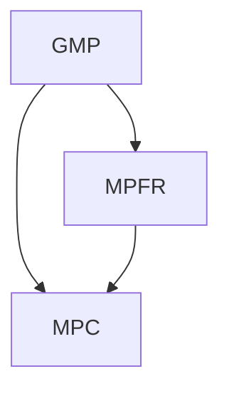

# Linux的编译器

## GNU Compiler Collection - GCC

### 下载链接

https://gcc.gnu.org/mirrors.html

```
wget https://ftp.gnu.org/gnu/gcc/gcc-14.2.0/gcc-14.2.0.tar.xz
```


ARM 工具链

https://developer.arm.com/downloads/-/arm-gnu-toolchain-downloads


### 安装依赖库

* GMP 是基础库，提供高精度整数和浮点运算。
* MPFR 基于 GMP，扩展了高精度浮点运算的严格性和功能。
* MPC 基于 GMP 和 MPFR，提供高精度复数运算。




#### GMP 安装

##### 安装依赖工具

确保系统已安装编译所需的工具和依赖库：

```
sudo apt update
sudo apt install build-essential m4
```


##### 下载源码

从[官方镜像](https://ftp.gnu.org/gnu/gmp/)下载 GMP 6.2.1 并验证完整性：

```
wget https://ftp.gnu.org/gnu/gmp/gmp-6.2.1.tar.xz
```


##### 安装步骤

```
# 1. 解压源码包
tar -xf gmp-6.2.1.tar.xz
cd gmp-6.2.1

# 2. 配置编译选项
# 运行 configure 脚本生成 Makefile，按需指定安装路径和选项
# 基本配置（默认安装到 /usr/local）
./configure --prefix=/usr/local --enable-cxx # --build=CPU架构  --enable-static --enable-shared

# 3. 使用多线程加速编译（根据 CPU 核心数调整 -j 后的数字）
make -j$(nproc) # 使用所有 CPU 核心加速编译

# 4. 运行测试（可选），确保编译结果正确
make check

# 5. 安装到系统
sudo make install

# 6. 更新动态库缓存
sudo ldconfig
```

编译选项

- --enable-cxx: 启用 C++ 支持。
- --prefix=/path: 指定安装路径（默认 /usr/local）。
- --enable-static: 生成静态库。
- --enable-shared: 生成动态库（默认启用）。


#### MPFR 安装

##### 下载源码

从[官方镜像](https://ftp.gnu.org/gnu/mpfr/)下载 MPFR 4.1.0 并验证完整性：

```
wget https://ftp.gnu.org/gnu/mpfr/mpfr-4.1.0.tar.xz
```


##### 安装步骤

```
# 1. 解压源码包
tar -xf mpfr-4.1.0.tar.xz
cd mpfr-4.1.0

# 2. 配置编译选项
# 运行 configure 脚本生成 Makefile，按需指定安装路径和选项
./configure --prefix=/usr/local --with-gmp=/usr/local

# 3. 使用多线程加速编译（根据 CPU 核心数调整 -j 后的数字）
make -j$(nproc) # 使用所有 CPU 核心加速编译

# 4. 运行测试（可选），确保编译结果正确
make check

# 5. 安装到系统
sudo make install

# 6. 更新动态库缓存
sudo ldconfig
```


#### MPC 安装

##### 下载源码

从[官方镜像](https://ftp.gnu.org/gnu/mpc/)下载 MPC 1.2.1 并验证完整性：

```
wget https://ftp.gnu.org/gnu/mpc/mpc-1.2.1.tar.gz
```


##### 安装步骤

```
# 1. 解压源码包
tar -zxvf mpc-1.2.1.tar.gz
cd mpc-1.2.1

# 2. 配置编译选项
# 运行 configure 脚本生成 Makefile，按需指定安装路径和选项
./configure --prefix=/usr/local \
    --with-gmp=/usr/local \      # 如果 GMP 在 /usr/local
    --with-mpfr=/usr/local      # 如果 MPFR 在 /usr/local

# 3. 使用多线程加速编译（根据 CPU 核心数调整 -j 后的数字）
make -j$(nproc) # 使用所有 CPU 核心加速编译

# 4. 运行测试（可选），确保编译结果正确
make check

# 5. 安装到系统
sudo make install

# 6. 更新动态库缓存
sudo ldconfig
```


### 安装步骤

```
# 1. 解压源码包
tar -xf gcc-14.2.0.tar.xz
cd gcc-14.2.0

# 2. 创建独立构建目录
mkdir build && cd build

# 3. 配置编译选项
# 运行 configure 脚本生成 Makefile，按需指定安装路径和选项
../configure \
    --prefix=/opt/gcc-14.2.0 \         # 指定安装路径（避免覆盖系统 GCC）
    --enable-languages=c,c++,fortran  # 选择需要编译的语言
    --disable-multilib \              # 禁用多目标库支持（简化安装）
    --with-gmp=/usr/local \           # 指定 GMP 路径
    --with-mpfr=/usr/local \          # 指定 MPFR 路径
    --with-mpc=/usr/local             # 指定 MPC 路径

# 3. 使用多线程加速编译（根据 CPU 核心数调整 -j 后的数字）
make -j$(nproc) # 使用所有 CPU 核心加速编译

# 4. 运行测试（可选），确保编译结果正确
make check

# 5. 安装到系统
sudo make install

# 6. 更新动态库缓存
sudo ldconfig
```

编译选项

- --prefix: 将 GCC 安装到独立目录（如 /opt/gcc-14.2.0），与系统默认的 /usr/bin/gcc 隔离。
- --with-*: 若依赖库安装在非默认路径（如 /opt/libs），需修改为对应路径。
- 若需要更多语言（如 Go、D），修改 --enable-languages。


### 使用 update-alternatives 进行版本切换

#### 核心功能

- 作用：通过符号链接（symlink）管理系统中的多个软件版本（如 GCC、Python、Java）。
- 原理：将 /usr/bin/gcc 等命令链接到实际安装的版本路径，通过配置工具切换不同版本。
- 优势：无需手动修改环境变量，系统级管理版本切换。


#### 基本命令及功能

| 命令                                                         | 功能                     |
| ------------------------------------------------------------ | ------------------------ |
| sudo update-alternatives --install <链接路径> <名称> <实际路径> <优先级> | 注册一个新版本到备选列表 |
| sudo update-alternatives --config <名称>                     | 交互式切换版本           |
| sudo update-alternatives --list <名称>                       | 列出所有已注册的版本     |
| sudo update-alternatives --remove <名称> <实际路径>          | 移除某个版本             |
| sudo update-alternatives --auto <名称>                       | 恢复默认优先级最高的版本 |


#### 步骤

```
# 0. 找到系统默认 GCC 的实际路径
ls -l /usr/bin/gcc

# 1. 使用实际的可执行文件路径注册（例如gcc 9.0）
sudo update-alternatives --install /usr/bin/gcc gcc /usr/bin/gcc-9 90 \
  --slave /usr/bin/g++ g++ /usr/bin/g++-9 \
  --slave /usr/bin/gfortran gfortran /usr/bin/gfortran-9
  
# 2. 注册自定义 GCC 版本（如 14.2.0）
sudo update-alternatives --install /usr/bin/gcc gcc /opt/gcc-14.2.0/bin/gcc 142 \
  --slave /usr/bin/g++ g++ /opt/gcc-14.2.0/bin/g++ \
  --slave /usr/bin/gfortran gfortran /opt/gcc-14.2.0/bin/gfortran
  
# 3. 切换 GCC 版本
sudo update-alternatives --config gcc

# 4. 验证切换结果
gcc --version
```


切换 GCC 版本

```
有 2 个候选项可用于替换 gcc (提供 /usr/bin/gcc)。

  选择       路径                       优先级  状态
------------------------------------------------------------
* 0            /usr/bin/gcc                 90        自动模式
  1            /usr/bin/gcc                 90        手动模式
  2            /opt/gcc-14.2.0/bin/gcc   142        手动模式

要维持当前值[*]，按回车键，或者键入选择的编号：2
```

操作：

* 输入编号（例如 2）选择 GCC 14.2.0。
* 按回车确认切换。


#### 注意事项

- 权限要求：所有操作需 sudo 权限。
- 路径有效性：注册前确保实际安装路径存在。
- 环境变量：若 PATH 中包含其他 GCC 路径（如 /opt/gcc-14.2.0/bin），需确保 /usr/bin 优先级更高，避免冲突。
- 依赖同步：切换 GCC 版本时，可能需要重新安装对应的运行时库（如 libstdc++）。