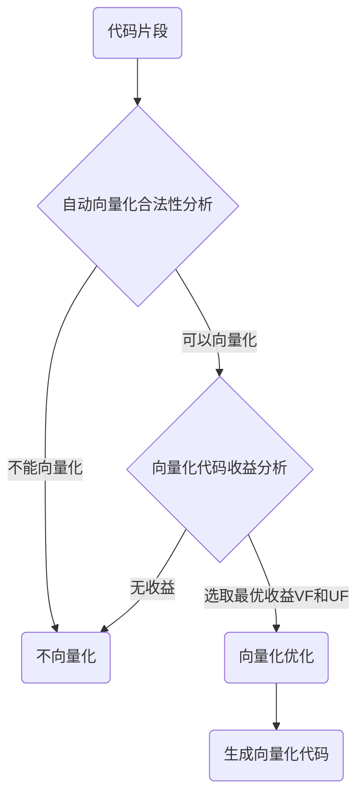

# 编译器向量化指南

## 向量化概述

向量化又称为矢量化。相对于标量一条指令运行一个操作，一条向量指令可以运行多个相同类型的操作。向量化是将标量程序转换为矢量程序，发挥程序SIMD（Single Instruction, Multiple Data）并行化的优化技术。
向量化技术需要在特定环境平台支持，如具有NEON扩展的ARM方案。向量化技术需要依赖编译工具链协助，常见的编译工具链如LLVM和GCC均有支持。常见的使用向量优化技术方法如下表：

| 方法       | 说明                                                         |
| ---------- | ------------------------------------------------------------ |
| 自动向量化 | 如LLVM的`-fvectorize`、`-fslp-vectorize`编译选项；使用简单，开发者使用编译选项开启优化获取收益，无需修改代码有益于代码移植与维护。 |
| 标记向量化 | `#pragma clang loop`标记：使用方便，开发者通过`#pragma clang loop` 编译指示辅助编译器更有效的执行优化获取收益。 |
| 手动向量化 | SIMD intrinsic：开发者基于SIMD intrinsic 提供的矢量接口重写替换标量程序，约束较少使用灵活。 |
| 汇编向量化 | asm vector inst：开发者基于矢量指令集，便携内嵌的汇编代码，向量化收益较好。 |

“自动向量化”优化编译器在编译阶段自动解析代码特征对适宜片段实施矢量转换优化，使用最简单。由于业务代码特征多样，对于编译器无法向量化优化的热点片段，使用标记向量化辅助编译器进行优化，对于无法优化的热点片段使用手动向量化重写替换标量程序可充分发挥并行性。


### 自动向量化

自动向量化优化主要包括两类：

* 循环向量化 （Loop vectorization）
  * 针对特定形式的循环片段，编译器优化处理流程的基本原理如下图所示，首先尝试对循环片段做unroll展开寻找矢量化机会，然后尝试使用矢量指令替代标量指令以并行运算。
* 超字并行向量 (SLP，Superword-Level Parallelism vectorization，又称Basic block vectorization)
  * 针对特定形式的标量片段，编译器优化处理流程的基本原理如下图所示，编译器将多个标量运算绑定到一起，使其成为向量运算。如下图将四次标量运算替换为一次向量运算。

编译器支持自动向量化优化，根据编译器以及版本差异在`-O2`或`-O3`优化选项时默认会开启该优化。该技术只有在拥有SIMD扩展的架构处理器上生效，如拥有NEON扩展的Armv7和Armv8处理器。


自动向量化优化流程：

编译器自动向量化优化由矢量器控制完成。编译器识别代码特征，矢量器分析代码特征，对于向量化合法的代码片段采用预设模型评估收益，对于矢量化有收益的代码片段执行向量化优化，对于无法向量化或能够向量化却无正向收益的代码不执行向量化优化。



* 循环是否满足向量化约束
  * 控制流结构（单入单出）
  * 基本块数量（无分支）
  * 循环次数（运行时不变）
  * 指令可向量化（矢量指令）
  * 指令相关性（无依赖）
* 向量化代码收益分析（向量化优化是否有收益）
  * 最大向量化长度计算，vectorization factor候选
  * 指令开销估算（芯片实际开销）
  * 存储开销策略（标量、聚合、跨幅方法代价调优）
  * 候选VF估算代价开销，VF优选
  * 平台寄存器数量，unroll factor优选


自动向量化优化含有约束条件：

编译器自动向量化优化只能对适宜的代码片段进行优化转换，对于含有约束特征的片段不优化处理。

常见的约束条件或阻碍向量化优化的原因包括：

* 循环次数无法确定;
* 循坏中有跳转指令;
* 含有复杂分支;
* 包含函数调用等。

即只有特定特征的代码才能够被编译器识别执行优化。对于能够向量化优化的片段还需要评估开销与收益，如SIMD的寄存器开销，评估矢量优化能够获取的收益，只有开销合理和有收益的片段才会被矢量化器执行向量化优化。


自动向量化编程建议：

自动向量化优化的约束条件较多。如需要发挥并行性优化能力，针对业务特征合理的规避约束条件，采用易于向量化的编程方法设计程序将有助于程序向量化优化。


自动向量化编程举例：

如下特征循环编译器将分析并尝试执行向量化优化。

```c++
void Add(float *input1, float *input2, float *output, int size)
{
    for (int i = 0; i < size; i++) {
        output[i] = input1[i] + input2[i];
    }
}
```


### 标记向量化

标记向量化使用举例：例如，LLVM编译器在如下特征循环在循坏上部标记`#pragma`指示，辅助编译器执行向量化优化。注意`#pragma`的标记是一种指示，如果编译器在分析循环时发现向量化存在风险时仍然会放弃实施向量化优化。

```c++
void Add(float *input1, float *input2, float *output, int size)
{
#pragma clang loop vectorize(enable)
    for (int i = 0; i < size; i++) {
        output[i] = input1[i] + input2[i];
    }
}
```


### 手动向量化

手动向量化使用举例：相对于自动向量化优化无需开发者修改程序代码，手动向量化优化主要面向无法进行自动向量化优化的热点片段，手动使用矢量的`intrinsic`接口编写程序。如下代码片段指示了ARM平台使用方法，代码引用`arm_neon.h`头文件，头文件中定义了矢量类与矢量接口，Add函数完成两个浮点数组的加法操作。

```c++
void Add(float *input1, float *input2, float *output, int size)
{
    int i = 0;
#ifdef __ARM_NEON
    for (; i < size - 3; i += 4) {
        float32x4_t v1 = vld1q_f32(input1 + i);
        float32x4_t v2 = vld1q_f32(input2 + i);
        float32x4_t v3 = vaddq_f32(v1, v2);
        vst1q_f32(output + i, v3);
    }
#endif
    for (; i < size; i++) {
        output[i] = input1[i] + input2[i];
    }
}
```


### 汇编向量化

汇编向量化使用举例：对于热点片段，使用汇编向量化可有效的提高程序性能，如下示例显示了Add函数完成两个浮点数组的加法操作。

```c++
void Add(float *input1, float *input2, float *output, int size)
{
    int i = 0;
    int alignSize = 0;
#ifdef __ARM_NEON
    alignSize = size & (~0x3);
    asm volatile(
        "1: \n"
        "ld1 {v0.4s}, [%[input1]], #16 \n"
        "ld1 {v1.4s}, [%[input2]], #16 \n"
        "fadd v0.4s, v0.4s, v1.4s    \n"
        "subs %w[size], %w[size], #4 \n"
        "st1 {v0.4s}, [%[output]], #16 \n"
        "bgt 1b \n"
        : [output] "+r"(output)
        : [input1] "r"(input1), [input2] "r"(input2), [size] "r"(size)
        : "memory", "v0", "v1"
    );
#endif
    int restSize = size - alignSize;
    for (; i < restSize; i++) {
        output[i] = input1[i] + input2[i];
    }
}
```


## GCC自动向量化

### 自动向量化编译选项

自动向量化优化技术可以通过编译选项开启使用或通过`-03`等优化级别使能。常用的优化选项有`-ftree-vectorize`，`-ftree-loop-vectorize`等。
GCC编译器目动向量化优化技术还提供了一些较为灵活的优化选项，如向量化循环的循坏次数阈值设置`-min-vect-loop-bound`，向量化优化代价模型设置
`-fvect-cost-model=model`等，更为详细的可通过编译器帮助手册查阅使用。

#### `-ftree-vectorize`

自动向量化优化开启选项，选项隐含开启了`-ftree-loop-vectorize`和`-ftree-slp-Vectorize`两个选项。对for和while循环类型以及合理的基本快进行自动向里化优化。该选项只有在拥有SIMD扩展的架构处理器上生效，如拥有NEON扩展的Armv7和Armv8处理器。低版本GCC编译器在`-O3`优化选项下会默认开启自动向量化优化，一些高版本GCC在`-02`优化选项下会默认开启。


#### `-ftree-loop-vectorize`

循环自动向量化优化开启选项。对for和while类型的循环进行自动向量化优化。


#### `-ftree-slp-vectorize`

超字并行自动向量化优化开启选项。对合适的基本块类型的代码片段进行自动向量化优化。


#### `-fast-math`

浮点数优化选项，`-ffast-math`是一个群组选项，包含`-fno-math-errno`等六个优化选项。由于浮点数在归纳运算场景的矢量化运算时不完全的符合IEEE 标准，将阻碍向量化优化，在一定精度的条件下为了更充分的发挥向量化优化可启用 `-ffast-math`提升运算效率。


### 自动向量化诊断

#### `-fopt-info-vec-optimized`

诊断标识向量化优化成功的循环。编译阶段对成功向量化优化的循环片段进行报告。


#### `-fopt-info-vec-missed`

诊断标识向量化优化失败的循环。编译阶段对未成功向量化的循环片段进行报告。


#### `-fopt-info-vec-note`

诊断向量化优化信息。编译阶段对未成功向量化优化的循环片段进行分析，报告阻碍向量化的语句和原因。


### 自动向量化特性

#### 支持循环次数为常量

```c++
int a[256], b[256], c[256];
foo () {
    int i;

    for (i=0; i<256; i++){
    	a[i] = b[i] + c[i];
    }
}
```


#### 支持循环次数为变量

```c++
int a[256], b[256], c[256];
foo (int n, int x) {
    int i;

    /* feature: support for unknown loop bound  */
    /* feature: support for loop invariants  */
    for (i=0; i<n; i++)
		b[i] = x;
    }

    /* feature: general loop exit condition  */
    /* feature: support for bitwise operations  */
    while (n--){
		a[i] = b[i]&c[i]; i++;
    }
}
```


#### 支持位操作

```c++
```


#### 支持对齐指针访问

```c++
typedef int aint __attribute__ ((__aligned__(16)));
foo (int n, aint * __restrict__ p, aint * __restrict q) {

   /* feature: support for (aligned) pointer accesses.  */
   while (n--){
      *p++ = *q++;
   }
}
```


#### 支持常量运算

```c++
while (n--) {
    *p++ = *q++ + 5;
}
```


#### 支持编译时可知的未对齐访问

```c++
/* feature: support for read accesses with a compile time known misalignment.  */
for (i = 0; i < n; i++) {
    a[i] = b[i + 1] + c[i + 3];
}
```


#### 支持简单条件

```c++
/* feature: support for if-conversion.  */
for (i = 0; i < n; i++) {
    j = a[i];
    b[i] = (j > MAX ? MAX : 0);
}
```


#### 支持结构体地址对齐访问

```c++
struct a {
	int ca[N];
} s;
for (i = 0; i < N; i++)
{
    /* feature: support for alignable struct access  */
    s.ca[i] = 5;
}
```


#### 支持编译时未知的未对齐访问

```c++
int a[256], b[256];
foo (int x) {
   int i;

   /* feature: support for read accesses with an unknown misalignment  */
   for (i=0; i<N; i++){
      a[i] = b[i+x];
   }
}
```


#### 支持多维数组

```c++
int a[M][N];
foo (int x) {
   int i,j;

   /* feature: support for multidimensional arrays  */
   for (i=0; i<M; i++) {
        for (j=0; j<N; j++) {
        	a[i][j] = x;
        }
   }
}
```


#### 支持reduction

```c++
unsigned int ub[N], uc[N];
foo () {
    int i;

    /* feature: support summation reduction.
     note: in case of floats use -funsafe-math-optimizations  */
    unsigned int diff = 0;
    for (i = 0; i < N; i++) {
    	udiff += (ub[i] - uc[i]);
    }
}
```


#### 支持不同类型远算

```c++
/* feature: support data-types of different sizes.
   Currently only a single vector-size per target is supported; 
   it can accommodate n elements such that n = vector-size/element-size 
   (e.g, 4 ints, 8 shorts, or 16 chars for a vector of size 16 bytes). 
   A combination of data-types of different sizes in the same loop 
   requires special handling. This support is now present in mainline,
   and also includes support for type conversions.  */

short *sa, *sb, *sc;
int *ia, *ib, *ic;
for (i = 0; i < N; i++) {
	ia[i] = ib[i] + ic[i];
	sa[i] = sb[i] + sc[i];
}

for (i = 0; i < N; i++) {
	ia[i] = (int) sb[i];
}
```


#### 支持跨步访问

```c++
/* feature: support strided accesses - the data elements
   that are to be operated upon in parallel are not consecutive - they
   are accessed with a stride > 1 (in the example, the stride is 2):  */

for (i = 0; i < N/2; i++){
    a[i] = b[2*i+1] * c[2*i+1] - b[2*i] * c[2*i];
    d[i] = b[2*i] * c[2*i+1] + b[2*i+1] * c[2*i];
}
```


#### 支持Induction

```c++
for (i = 0; i < N; i++) {
	a[i] = i;
}
```


#### 支持外层循环向量化

```c++
for (i = 0; i < M; i++) {
    diff = 0;
    for (j = 0; j < N; j+=8) {
		diff += (a[i][j] - b[i][j]);
    }
    out[i] = diff;
}
```


#### 支持Double reduction

```c++
for (k = 0; k < K; k++) {
    sum = 0;
    for (j = 0; j < M; j++)
        for (i = 0; i < N; i++)
        	sum += in[i+k][j] * coeff[i][j];

    out[k] = sum;
}
```


#### 支持嵌套循环条件

```c++
for (j = 0; j < M; j++)
{
    x = x_in[j];
    curr_a = a[0];

    for (i = 0; i < N; i++) {
        next_a = a[i+1];
        curr_a = x > c[i] ? curr_a : next_a;
    }

    x_out[j] = curr_a;
}
```


#### 支持Load permutation in loop-aware slp

```c++
for (i = 0; i < N; i++)
{
    a = *pInput++;
    b = *pInput++;
    c = *pInput++;

    *pOutput++ = M00 * a + M01 * b + M02 * c;
    *pOutput++ = M10 * a + M11 * b + M12 * c;
    *pOutput++ = M20 * a + M21 * b + M22 * c;
}
```


#### 支持基本块向量化

```c++
void foo ()
{
    unsigned int *pin = &in[0];
    unsigned int *pout = &out[0];

    *pout++ = *pin++;
    *pout++ = *pin++;
    *pout++ = *pin++;
    *pout++ = *pin++;
}
```


#### 支持基本块简单reduction

```c++
int sum1;
int sum2;
int a[128];
void foo (void)
{
    int i;

    for (i = 0; i < 64; i++) {
        sum1 += a[2*i];
        sum2 += a[2*i+1];
    }
}
```


#### 支持基本块Reduction 

```c++
int sum;
int a[128];
void foo (void)
{
    int i;

    for (i = 0; i < 64; i++) {
        sum += a[2*i];
        sum += a[2*i+1];
    }
}
```


#### 支持Basic block SLP with multiple types, loads with different offsets, misaligned load and not-affine access

```c++
void foo (int * __restrict__ dst, short * __restrict__ src,
          int h, int stride, short A, short B)
{
    int i;
    for (i = 0; i < h; i++) {
        dst[0] += A*src[0] + B*src[1];
        dst[1] += A*src[1] + B*src[2];
        dst[2] += A*src[2] + B*src[3];
        dst[3] += A*src[3] + B*src[4];
        dst[4] += A*src[4] + B*src[5];
        dst[5] += A*src[5] + B*src[6];
        dst[6] += A*src[6] + B*src[7];
        dst[7] += A*src[7] + B*src[8];
        dst += stride;
        src += stride;
    }
}
```


#### 支持后向遍历

```c++
int foo (int *b, int n)
{
    int i, a = 0;

    for (i = n-1; i ≥ 0; i--)
    	a += b[i];

    return a;
}
```


#### 支持对齐提示

```c++
void foo (int *out1, int *in1, int *in2, int n)
{
    int i;

    out1 = __builtin_assume_aligned (out1, 32, 16);
    in1 = __builtin_assume_aligned (in1, 32, 16);
    in2 = __builtin_assume_aligned (in2, 32, 0);

    for (i = 0; i < n; i++)
    	out1[i] = in1[i] * in2[i];
}
```


#### 支持移位向更宽的类型

```c++
void foo (unsigned short *src, unsigned int *dst)
{
    int i;

    for (i = 0; i < 256; i++)
        *dst++ = *src++ << 7;
}
```


#### 支持条件混合类型运算

```c++
#define N 1024
float a[N], b[N];
int c[N];

void foo (short x, short y)
{
    int i;
    for (i = 0; i < N; i++)
    	c[i] = a[i] < b[i] ? x : y;
}
```


#### 支持bool类型

```c++
#define N 1024
float a[N], b[N], c[N], d[N];
int j[N];

void foo (void)
{
    int i;
    _Bool x, y;
    for (i = 0; i < N; i++)
    {
        x = (a[i] < b[i]);
        y = (c[i] < d[i]);
        j[i] = x & y;
    }
}
```


## LLVM自动向量化

### 自动向量化编译选项

自动向量化优化技术可以通过编译选项开启使用，常用的优化选项有`-fvectorize`，`-fslp-vectorize` 等。LLVM编译器自动向量化优化技术还提供了一些较为灵活的优化选项，如开启尾循环优化 `enable-epilogue-vectorization`，开启外层循环向量化`enable-vplan-native-path`，循环迭代数量阈值设置`vectorizer-min-trip-count`，强制循环展开数量`force-vector-interleave`等，可通过`clang-cc1 -mllvm--help-hidden`方法查询选项的具体描述，这些优化选项编译器会有的默认的使能策略，若需要手动设置建议查询选项的优化原理合理设置以充分发挥优化价值。

#### `-fvectorize`

循环自动向量化优化开启选项，等效的选项为`-fvectorize-loops`。对for和while类型的循环进行自动向量化优化，如果多层循环则仅优化最内层循环。该选项只有在拥有SIMD扩展的架构处理器上生效，如拥有NEON扩展的Armv7和Armv8处理器，NEON可以通过`-mfpu=neon` 编译选项使能。

* LLVM编译器在开启`-O2`，`-O3`，`-O4`或`-Ofast`优化选项时`-fvectorize`默认开启。
* GCC编译器在`-O3`优化选项下会默认开启自动向量化优化。


#### `-fslp-vectorize`

超字并行自动向量化优化开启选项，等效的选项为`-fvectorize-slp`。同`-fvectorize`类似需要在拥有SIMD扩展的硬件平台上生效。


#### `-fno-vectorize`

循环自动向量化优化关闭选项。禁用对循环进行自动向量化的优化。


#### `-fno-slp-vectorize`

超字并行自动向量化优化关闭选项。禁用对超字并行自动向量化优化。


#### `-fveclib= <value>`

使用矢量数学库，可选值有`Accelerate`、`libmvec`、`MASSV`、`SVML`、`Darwin_libsystem_m`、`libmathlib`或`none`。其中`libmathlib`是ARM平台扩展的矢量数据库。
注：使用`fvedlib`指定矢量数学库，在链接时需要指定对应的动态库进行链接。
例如`-fveclib=libmathlib -Imathlib`


#### `-ffast-math`

浮点数优化选项，`-ffast-math`是一个群组选项，包含`-fno-math-errno`等六个优化选项。由于浮点数在归纳运算场暴的向量化运算时不完全的符合IEEE标准，将阻碍向量化优化，在一定精度的条件下为了更充分的发挥向量化优化可启用`-ffast-math`提升运算效率。


### 自动向量化诊断

SIMD 技术适合在计算密集型场景，不合适业务控制类场景。在许多循环无法自动向量化，比如循环中包含有复杂控制流、不可向量化的类型、不可向量化的函数调用等。
自动向量化优化模块具有诊断信息在编译阶段提示具体片段优化是否成功以及失败的原因。

#### `-Rpass=loop-vectorize`

诊断标识向量化优化成功的循环。编泽阶段对成功向量化优化的循环片取进行报告。


#### `-Rpass-missed=loop-vectorize`

诊断标识向量化优化失败的循环。编译阶段对未成功向量化的循环片段进行报告。


#### `-Rpass-analysis=loop-vectorize`

诊断标识向量化优化分析。编译阶段对未成功向量化优化的循环片段进行分析，报告阻碍向量化的语句和原因。


### 自动向量化特性

#### [Loops with unknown trip count](https://llvm.org/docs/Vectorizers.html#loops-with-unknown-trip-count)

```c++
void bar(float *A, float* B, float K, int start, int end) {
    for (int i = start; i < end; ++i)
    	A[i] *= B[i] + K;
}
```


#### [Runtime Checks of Pointers](https://llvm.org/docs/Vectorizers.html#runtime-checks-of-pointers)

```c++
void bar(float *A, float* B, float K, int n) {
    for (int i = 0; i < n; ++i)
  		A[i] *= B[i] + K;
}
```


#### [Reductions](https://llvm.org/docs/Vectorizers.html#reductions)

```c++
int foo(int *A, int n) {
    unsigned sum = 0;
    for (int i = 0; i < n; ++i)
    	sum += A[i] + 5;
    return sum;
}
```


#### [Inductions](https://llvm.org/docs/Vectorizers.html#inductions)

```c++
void bar(float *A, int n) {
    for (int i = 0; i < n; ++i)
    	A[i] = i;
}
```


#### [If Conversion](https://llvm.org/docs/Vectorizers.html#if-conversion)

```c++
int foo(int *A, int *B, int n) {
    unsigned sum = 0;
    for (int i = 0; i < n; ++i)
    	if (A[i] > B[i])
    		sum += A[i] + 5;
    return sum;
}
```


#### [Pointer Induction Variables](https://llvm.org/docs/Vectorizers.html#pointer-induction-variables)

```c++
int baz(int *A, int n) {
	return std::accumulate(A, A + n, 0);
}
```


#### [Reverse Iterators](https://llvm.org/docs/Vectorizers.html#reverse-iterators)

```c++
void foo(int *A, int n) {
    for (int i = n; i > 0; --i)
    	A[i] +=1;
}
```


#### [Scatter / Gather](https://llvm.org/docs/Vectorizers.html#scatter-gather)

```c++
void foo(int * A, int * B, int n) {
  for (intptr_t i = 0; i < n; ++i)
      A[i] += B[i * 4];
}
```


#### [Vectorization of Mixed Types](https://llvm.org/docs/Vectorizers.html#vectorization-of-mixed-types)

```c++
void foo(int *A, char *B, int n) {
    for (int i = 0; i < n; ++i)
    	A[i] += 4 * B[i];
}
```


#### [Global Structures Alias Analysis](https://llvm.org/docs/Vectorizers.html#global-structures-alias-analysis)

```c++
struct { int A[100], K, B[100]; } Foo;

void foo() {
    for (int i = 0; i < 100; ++i)
    	Foo.A[i] = Foo.B[i] + 100;
}
```


#### [Vectorization of function calls](https://llvm.org/docs/Vectorizers.html#vectorization-of-function-calls)

```c++
void foo(float *f) {
    for (int i = 0; i != 1024; ++i)
    	f[i] = floorf(f[i]);
}
```


#### [Partial unrolling during vectorization](https://llvm.org/docs/Vectorizers.html#partial-unrolling-during-vectorization)

```c++
int foo(int *A, int n) {
    unsigned sum = 0;
    for (int i = 0; i < n; ++i)
		sum += A[i];
    return sum;
}
```


#### [Epilogue Vectorization](https://llvm.org/docs/Vectorizers.html#epilogue-vectorization)


## 向量化编程

编译器自动向量化优化模块具有能力可以对一些复杂形式的循环进行优化，然而循环代码特征多样，加之编译器分析能力有限导致一些循环无法自动向量化优化。通过诊断信息可以看到阻碍向量化的原因，根据业务特征可适当调整代码形式实现向量化优化。根据向量化优化的原理以及约束特征，采用易于向量化的编程方法设计程序对向量化很有帮助，通常这些方法在GCC和LLVM等编译器上都适用。


### pragma标记gcc

对循环标记 ivdep用于提示编译器循环中数据不存在内存依赖，即数组a和数组b不重叠，此时编译器可不用考虑数据内存依赖约束尽力的执行向量化优化。

```c++
void foo(int n,int *a,int *b,int *c)
{
    int i, j;
#pragma GCC ivdep
    for (i = 0; i < n; ++i) {
    	a[i] = b[i] + c[i];
    }
}
```


### pragma标记llvm

编译器通常采用较为保守的方法进行优化，如果一些循环片段实际可以优化，当编译器无法确定优化的安全性通常会放弃优化。编译器提供了`#pragma clang loop`语法供开发者使用，用于指导编译器按照开发者的意图去进行优化。Pragma 导语标记是一种指示性语言，编译器还会根据自身的判断，如果循环优化会产生安全性风险仍然会放弃执行优化。


#### 标记分类

* vectorize(enable) 
    * 开启自动向量化优化。
* vectorize(disable) 
    * 关闭自动向量化优化。
* vectorize(assume_safety) 
    * 不校验正确性执行向量化优化。
* vectorize_width(N) 
    * 指定向量宽度 N进行自动向量化优化（N是2的幂）。
* interleave(enable) 
    * 开启循环展平优化。
* interleave(disable) 
    * 关闭循环展平优化。
* interleave(N) 
    * 使用N循环展平优化。


#### vectorize(enable)

指示编译器强制对指示循环语句实施向量化优化，如果编译器解析到循环片段有明确的阻碍向量化的原因（如跳转、未知的循环次数等）仍然会放弃向量化优化。由于编译器解析能力有限通常采用较为保守的优化策略，一些循环实际上有矢量收益可能性或被编译器放弃优化，通过"#pragma clang loop vectorize（enable）"标记可以指导编译器执行向量化优化，对于业务场景的热点函数的优化有辅助作用。


#### vectorize(disable)

指示编译器禁止对指示循环语句向量化优化。如果一些循环执行了自动向量化优化，却因数据对齐或类型转换等原因导致结果异常，可以通过"#pragma clang loop vectorize（disable）"指示编译器禁止对该循环片段进行向量化优化。


#### vectorize(assume_safety)

指示编泽器对循环向量化优化是安全的。

如果编泽器无法分析指针识别指针是否存在别名或者重叠情况，向量化器通常需要插入运行时检查指令判断指针情况。当开发者确认指针不存在重叠时，可以通过
"#pragma clang loop vectorize（assume_safety）"指示编译器指针不存在別名和重叠，编译器优化时会删除对指针进行检查，这样可减少冗余指令同时有助于效率提升。

对于存在数据依赖场景，编译器通常会插入运行时检查指令，判断依赖距离和矢量宽度的关系。如果依赖距离大于矢量宽度，那么数据的读写不会有实际的依赖从而可以使用矢量片段否则只能进行标量运算。如果开发者能够确认 m 的数值大于矢量宽度可通过 "#pragma clang loop vectorize （assume_safety）"指示编译器不存在依赖，编译器优化时会删除对依赖进行检查，这样可减少冗余指令同时有助于效率提升。


#### vectorize_width(N)

指示编译器使用 N作为矢量参数。

矢量参数VF确定了向量化并行处理的数量，可通过N设置 VF 的取值，N要求为2的幂，如果不是2的幂将会忽略。如果 N设置为1等效为 vectorize（disable）即禁止向量化优化，如果设置大于1时标记包含 vectorize（enable）含义。当设置的N大于寄存器所能容纳变量数量时矢量器将进行展平 unroll优化。


#### interleave(enable)

指示编译器使能 unroll优化，unroll 的数量由编译器自主择优确定。


#### interleave(disable)

指示编译器禁止 unroll优化。


#### interleave(N)

指示编译器采用 N数值执行 unroll优化。

unroll优化可充分利用了现代处理器架构的ILP特性，如多执行单元和乱序执行等，在展平优化时矢量器会评估性能收益，寄存器限制，codesize等因素选择合理的参数。


### restrict修饰

在向量化优化中阻碍优化的一大因素是指针别名（Aliasing）问题。当多个指针指向同一个对象时，它们互相成为基他指针的“别名”。指针别名会对编译器的优化带来很大的困扰。如下用例如果A和 B 完全不重叠则无论何种顺序执行结果都一样，如果A和B指向同一块内存那么A和B会是指针别名如果编译器进行读写合并或向量化优化将会导致结果异常。通常向量化器优化时会加入判断指令以检查A和B执行的内存是否发生重叠，当重叠时执行标量版本，当不重叠时执行矢量版本，这会增加指令条数同时在运行时产生性能开销。

```c++
```


编译器在分析指针关系时不能跨越编译单元（通常是一个.c文件），当编译器无法确定指针是否重叠时通常按照可能重叠的保守方法处理。从C99开始引入的 `restrict`修饰符正是为了弥补编译器自动分析的局限。程序员可以通过对指针添加`restrict`修饰告诉编译器：在其作用域内，该指针是访问其所指内存对象唯一。添加`restrict`修饰的结果是编译器会按照两个指针不存在别名的情况来尽量优化，而其结果的正确性依赖于人对`restrict`修饰指针的承诺。
如下用例如果 A,B,C 数组不存在重叠时使用`restrict`修饰指针，编译器优化将明显減少冗余指令执行效率也有提升。

```c++
```


### 循环次数在循环执行前确定

循环次数可以是常量，也可以是循环运行前确定的变量。当为变量的时要求其数值运行前确定，同时不因循环的迭代执行而动态变化，即要求循环次数是一个不变的数值。
如果循环次数为常数尽量使用常数。以下用例无法确定循环次数无法向量化

```c++
```


### 数据对齐

创建数据对象在特定字节边界对齐，将有助于处理器对数据的加载，迁移和存储的效率。对于具有NEON扩展的ARM环境，数据起始地址以32字节边界对齐时，内存数据的移动可达到最佳状态。不对齐的数据会给向量化优化产生优化代价甚至阻碍向量化优化。常用的对齐方法有：编译器对齐编译优化选项，`#pragma pack`声明，数組使用`alignas`修饰，堆内存申请使用地址对齐接口`aligned_alloc`等


### 避免跳转

避免在循环中使用 `break`、`continue`、`return` 跳转指令，这些指令会阻碍向量化优化，即向量化优化适合对数据处理密集型场景，不适合控制逻辑场景。以下用例包含`break`的跳转会阻碍向量化优化。

```c++
```


### 避免函数调用

避免函数调用，除非一些简单的能被完全内联的内联函数或者编译器适配的一些矢量数学函数库调用。以下用例包含 bar() 的函数调用，如果 bar 不能够内敛将会阻碍向量化优化。

```c++
```


### 避免数据依赖

向量化技术的SIMD 指令同时对多个元素同时操作，通常矢量器需改变操作顺序，只有在顺序调整结果不变的情况下向量化优化才有意义。如无数据依赖的循环其迭代间无依赖即无论按照任何顺序或并行执行结果不变。如果需要向量化优化的计算型循环建议避免数据依赖。
数据的读写在循环迭代之间无依赖关系将有助于向量化优化，如果数据存在依赖将会阻碍向量化优化，常见的数据依赖包括以下情况。

#### 读后读依赖

并非真正的依赖，向量化优化是安全的。

```c++
```


#### 先与后读依赖

本次的内存读取依赖上一次迭代运算的写入会造成并行运算产生风险。若矢量化优化，如前4次运算使用矢量指令进行并行运算，那么由于第2次的迭代读取 A[]依赖第1次的选代写入A[1]未正确执行，读取了错误的数据导致结果异常。矢量器会检测并停止该场景的向量化优化。

```c++
```


#### 先读后写依赖

本次的内存读取在下一次迭代中会被改写。并行优化可能会产生安全风险。如下循环示例并行化会产生安全风险，若矢量化优化则A数组的元素在第二条矢量指令之前会被第一条矢量指令覆盖，引发读取A数据异常。

```c++
```


#### 潜在依赖

存在安全风险。编译器有时难以确定指针A，B指向的内存位置是否有重叠，可能存在依赖的可能，建议分析A，B指针对于不重叠的情况使用`restrict`修饰。

```c++
```


### 避免混合类型运算

尽量避免混合类型运算，混合类型转换需要矢量化器进行转化通常会产生转化代价影响收益，有些场景无法进行类型转化会放弃向量化优化。


### 尽量连续内存访问

连续的内存访问有助于向量化优化以及向量化运行效率提升。不连续的内存访问需要向量化器插入特定的指令对非连续的数据进行整理通常会影响向量化收益，甚至无法向量化。如下片段示例的不连续内存访问会影响自动向量化优化建议尽量避免。

```c++
for (int i = 0; i < n; i += 2) {
    a[i] = b[i] + 1; // with stride 2
}

for (int i = 0; i < n; i++) {
    for (int j = 0; j < m; j++) {
    	a[i] += b[i][j] + c[j]; // with stride n
    }
}

for (int i = 0; i < n; i++) {
    a[i] = b[table[i]]; // indirect addressing of b
}
```


### 尽量直线型代码

向量化的循环需要单个入口单个出口（如避免`break`、`return`等出口），循环体尽量是简单的直线型結构，避免复杂的跳转和控制语句（如`switch`、`if-else`、`goto`）。简单的代码流程更易于向量化优化，复杂的控制流矢量器需要花费代价进行优化转化甚至无法优化。


### 尽量使用数组类型

循环体中的数据尽量使用数组类型，通常标量数据需要矢量器进行针对性的矢量转化才能够进行并行化运算。


### 尽量循环变量作为下标

尽量使用迭代变量作为数组下标，而不建议使用单独的计数变量作为下标，尽可能的连续内存访问，不建议无规律的数组内存访问。


### 尽量使用数组下标访问形式

尽量使用数组下标形式而非使用指针形式。C语言指针使用比较灵活，在一些场景下编译器分析数据之间的关系相对困难，给向量化优化产生一些负担。


### 尽量小的数据类型

向量化寄存器宽度有限，为了更充分的发挥并行性通常寄存器中需要尽力填充较多的数据。比如NEON的寄存器128位可以放置16个8位宽的char数据，而如果是32位int的数据只能放置4个。所以使用尽可能小的数据类型有助于充分发挥并行性。


### 尽量基本数据类型

数组的元素最好是基础类型，而不是结构体或类。


### 尽量SOA而非AOS

用SOA（structure of arrays）而不是AOS（array of structures）来组织数据，即结构体的域为数组而不建议数组的元素为结构体类型。如下示例，SOA形式组织数据是向量化优化的友好形式而AOS形式的数据不连续会影响向量化优化。对于多重循环来说，以行（row）为主序遍历，连续的同类型的数据容易被一次读取到向量寄存器里做并行处理。非连续内存访问的开销较大，编译器在评估性能得失后很可能放弃。

```c++
// structure of arrays
struct Points3D {
    float x[N];
    float y[N];
    float z[N];
}
struct Points3D points;

// array of structures
struct Point3D {
    float x;
    float y;
    float z;
}
struct Point3D points[N];
```


### 编写简单形式的代码

使用简单的循环语法形式设计程序，如`for`、`while`循环语句，使用简单语句设计程序，避免使用`goto`等复杂形式构造循环，编译器更容易理解代码意图从而更好的进行向量化优化。循环代码规模合理有利于充分发挥并行性，超大循环可能会超出硬件矢量寄存器开销约束导致无法向量化。


### 循环迭代次数调整

如果迭代次数为常量建议优选使用常量，编译器在优化时可理解迭代次数决定是否保留标量部分。更多的场景循环迭代次数为变量，如果已知迭代次数为4的倍数可以使用以下示例方法，编译器可理解更充分的优化去除冗余的标量尾部指令。

```c++
void foo(float *restrict a, float *restrict b, float *restrict c)
{
    for (int i = 0; i < (n & ~3); i++) {
        c[i] = a[i] + b[i];
    }
}
```


## 参考

* https://gcc.gnu.org/projects/tree-ssa/vectorization.html
* https://llvm.org/docs/Vectorizers.html

