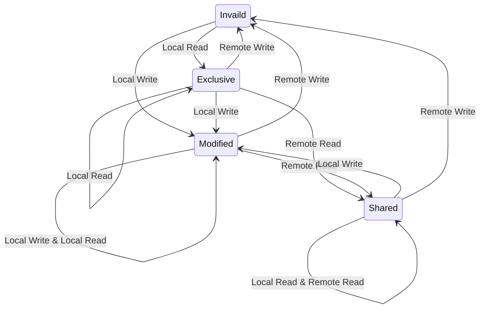

# CPU和内存

## CPU指令流水线机制

### CPU体系结构

CPU

中央处理器是计算机的运算核心和控制核心，主要功能是解释计算机指令以及处理计算机软件中的数据。


逻辑架构

* 控制单元（调度）
* 运算单元（算术运算和逻辑运算）
* 存储单元（传递命令、记录数据和计算结果）
* 通过内部总线连接控制单元、运算单元和存储单元


指令

CPU依靠指令来计算和控制计算机系统，一套这样的指令称为指令集


指令执行顺序

冯洛伊曼架构指令执行分为五个阶段，包括取指令（IF）、指令译码（ID）、指令执行（EXE）、访存取数（MEM）、写回（WB）


### CPU流水线

#### 概述

CPU流水线方式：将一条指令分成若干stage，流水线方式前后两条指令的stage在时间上可以重叠进行。理想状态下，当流水线满载时，每个时钟周期都可以输出一条指令。流水线方式每条指令的绝对执行时间没有缩短，但是却通过并行使得指令的运行速度大幅提升。

| stage | 描述     | 硬件部件 |
| ----- | -------- | -------- |
| IF    | 取指令   | IMem     |
| ID    | 指令译码 | Reg      |
| EXE   | 指令执行 | ALU      |
| MEM   | 访存取数 | DMem     |
| WB    | 写回     | Reg      |


#### 主要问题

流水线带来cpu吞吐率大幅提高的同时，也面临一些风险。一旦指令流水线执行乱序可能会导致无法得到正确的计算结果，流水线风险包括**结构、数据和控制**三类典型的风险。


##### 结构冒险

又称资源冲突，指的是用不同指令争用同一部件产生的冲突。例如取值和取操作数会发生访存冲突。


解决方式：

* 流水线完成第一条指令对数据的存储器访问时，暂停取后一条指令
* 设置独立存储器存放操作数和指令
* 采用指令预取技术，将指令预取到指令队列中，这样取数操作便可以独占存储器访问


##### 数据冒险

又称数据冲突，指的是在同一个程序中，后一条指令必须等待前一条指令执行完成才能执行后一条指令的情况


解决方式：

* 硬件阻塞(stall)：把遇到数据相关的指令及其后续指令都暂停一到几个时钟周期，直到问题消失
* 软件阻塞：在遇到数据相关的指令后续插入多个空指令(nop)，直到问题消失
* 数据旁路技术：产生结果直接送给运算单元
* 编译优化：通过编译器调整指令顺序解决数据依赖


##### 控制冒险

指的是由转移指令而引起的流水线中断


解决方式：

* 尽早判别转移是否发生，尽早生成转移目标地址
* 预取转移成功和不成功两个控制流方向上的目标指令
* 加快和提前形成条件码
* 提高转移方向的猜准率


#### 多发流水线技术

##### 超标量技术

* 每个时钟周期可以并发多条独立指令
* 要配置多个功能部件
* 不能调整指令的执行顺序
* 通过编译优化技术，可把并行执行的指令搭配起来


##### 超流水技术

* 在一个时钟周期内再分段
* 在一个时钟周期内一个功能部件要使用多次
* 不能调整指令的执行顺序
* 需要通过编译程序解决优化问题


##### 超长指令字技术

* 编译程序挖掘出指令间潜在的并行性，将多条能并行操作的指令组合成一条
* 具有多个操作码字段的超长指令字
* 采用多个处理部件


## 分级缓存机制

### Cache子系统

Memory wall：限制处理器发挥的主要瓶颈

主存性能增速远远不如CPU每年提升的速度


### Cache基本结构

#### cpu局部性原理

* 时间局部性
  * 如果一个信息项正在被访问，那么在近期它很可能还会被再次访问
* 空间局部性
  * 如果一个存储器的位置被引用，那么将来它附近的位置也可能被引用


#### cache line

内存映射到cache的过程中传输的最小单位是cache line。现在一般为64字节，就算cpu只取一个字节，也会把字节所在的内存段64字节全部映射到cache line中


#### 基本结构

* CPU
  * Core 1
    * CPU寄存器
    * L1 Cache
    * L2 Cache
  * Core 2
    * CPU寄存器
    * L1 Cache
    * L2 Cache
  * L3 Cache

* 主内存

| 内存层次 | 访问时延       | 容量                            |
| -------- | -------------- | ------------------------------- |
| L1       | 4 cycles       | i-cache和d-cache 32KB~64KB/Core |
| L2       | 10 cycles      | 256KB~1MB/Core                  |
| L3       | 35~45 cycles   | 512KB~2MB/Core                  |
| 主内存   | 100~300 cycles | XX GB                           |


### Cache地址映射规则

#### 全互联映射

* 特点
  * 主存中任意一个块可以映射到cache中的任意一个行。
* 优点
  * 灵活性好，cache中只要有空行就可以调入需要的主存数据。
* 缺点
  * cache利用率不高，需要存储主存标记位。
  * 速度慢，访问cache时需要遍历cache line，判断主存是否在cache中。
  * 电路复杂。
  * 适用于简单系统。


#### 直接映射

* 特点
  * 主存中的一块数据只能映射到cache中固定行。
  * cache line = block idx % cache line num
* 优点
  * 硬件实现简单，成本低。
* 缺点
  * 灵活性差。如果cache容量小，容易发生冲突，影响性能。一般使用大容量cache。


#### 组相连映射

* 特点
  * 全互联和直接映射的折中方案，主存和cache分组，主存中的一个组内块数和cache的组数相同，组间直接映射，组内全映射。
  * 常采用的组相连结构cache，每组内有2、4、8、16块，称为2、4、8、16路组相连。
  * 组相连兼顾了全互联和直接映射的优点，目前主流cpu均采用多路组相连的地址映射方式。


### Cache获取方式

内存地址构成

* block offset
  * 对于内存地址来说，其后block offset个字节的数据会构成一个和cache做数据交换的块，这就是cache块的大小
* set index
  * 确定内存被映射到cache里的哪个组
* tag
  * 使用index选出cache组后，通过tag获取cache块位于哪一路


### Cache更新策略

cache容量有限，当cache空间被占满后，需要从主存加载数据到cache时，需要选择一个cache line替换。


常用替换策略

* 随机算法（Rand）
  * 随机法是随机地确定替换的存储块。设置一个随机数产生器，根据所产生的随机数，确定替换块。方法简单，易于实现，但是命中率较低。
* 最久未使用算法（LRU, Least Recently Used）
  * LRU法根据各块的使用情况，纵深选择那个最长时间未被使用的块替换。每块设置一个计数器，cache每命中一次，命中块计数器清零，其他各块计数器加1。当需要替换时，替换计数值最大的块。这种方法比较好地反映了程序局部性规律，cache命中率较高。
* 最不经常使用算法（LFU, Least Frequently Used）
  * 将最近一段时间内，访问次数最少的块替换出cache。每块设置一个计数器，从0开始计数，每访问一次，计数加1。当需要替换时将计数最小的替换出去。


### Cache一致性协议MESI

缓存一致性：一个物理cpu会有多个物理core，每个物理core在程序运行时可以支持一个并发，利用超线程技术可以支持两个并发，每个物理core都拥有自己的L1、L2 cache，一个物理cpu上所有的物理core共享一个L3 cache。因为每个core都有自己的cache，所以一个cache line可能被映射到多个core的cache中，这就会有cache不一致问题。如果其中一个core修改了cache line，那么就多有多个cache line不一致问题。


缓存状态：cpu中cache line状态，使用2bit表示。

| 状态              | 描述                                                         | 监听任务                                                     | 状态转换                                                     |
| ----------------- | ------------------------------------------------------------ | ------------------------------------------------------------ | ------------------------------------------------------------ |
| 修改（Modified）  | cache line有效，数据被修改了，和内存中的数据不一致，数据只存在本cache中 | 缓存行必须时刻监听所有试图读该缓存相对应主存的操作，这种操作必须在缓存该缓存行写回主存并将状态变成共享（Shared）之前被延迟执行 | 当被写回主存后，该缓存行的状态变换独享（Exclusive）状态      |
| 独享（Exclusive） | cache line有效，数据和内存中的数据一致，数据只存在本cache中  | 缓存行必须监听其他缓存读主存中该缓存行的操作，一旦有这种操作，该缓存行需要变成共享（Shared）状态 | 当CPU修改该缓存行中内容时，该状态可以变为修改（Modified）    |
| 共享（Shared）    | cache line有效，数据和内存的中的数据一致，数据存在多个cache中 | 缓存行必须监听其他缓存是该缓存行无效或独享该缓存行的请求，并将该缓存行变成无效（Invalid） | 当一个CPU修改该缓存行时，其他CPU中该缓存行变为无效（Invalid）状态 |
| 无效（Invalid）   | cache line无效                                               | 无                                                           | 无                                                           |


MESI状态转换示意




* 本地读取（Local Read）：本地cache读取本地cache的数据
* 远端读取（Remote Read）：其他cache读取本地cache的数据

* 本地写入（Local Write）：本地cache将数据写入本地cache中

* 远端写入（Remote Write）：其他cache将数据写入本地cache中


## 虚拟内存管理

### 虚拟地址空间

#### 虚拟内存

内核给每个进程独立的地址空间，用户态进程不能直接操作物理内存，通过MMU进行虚拟内存和物理内存的映射。以32位系统为例，寻址空间范围为4G，最大4G虚拟地址空间，内核占用1G，理论每个进程最大可用3G


#### 虚拟地址空间分布

* 内核空间
* 栈（STACK）：存储局部、临时变量，函数调用时，存储函数的返回指针，用于控制函数的调用和返回。在程序块开始时自动分配内存，结束时自动释放内存，其操作方式类似数据结构中的栈
* 共享库
* 堆（HEAP）：存储动态内存分配，需要程序员手工分配和释放
* 数据段
  * 未初始化的数据（BSS）：未初始化的全局变量和静态变量
  * 初始化过的数据（DATA）：已初始化的全局变量、静态变量（全局和局部）、常量数据
* 文本段（TEXT）：程序代码在内存的映射，存放函数体的二进制代码


### 虚拟内存映射

#### 一级页表

需要内存较大，以32位系统为例，虚拟地址空间4GB。假设页大小4KB，需要4\*1024\*1024KB/4KB个，每个页表项4B存储，4G空间映射需要约为4MB大小；虚拟地址空间是每个进程独立，如果系统有100个进程，则需要400MB物理内存空间


#### 多级页表

对于64位系统，一般采用四级目录，页表项只在下级页表存在记录时才创建，减少无效空间消耗

* PGD（Page Global Directory）
* PUD（Page Upper Directory）
* PMD（Page Middle Directory）
* PTE（Page Table Entry）


### 内存地址转换

多级页表虽然解决了内存空间占用的问题，但是由于页表层级的增加，会导致从页表查询效率变差。因此引入TLB（table lookaside buffer）用于缓存虚拟地址到物理地址转换的映射关系。


虚拟地址到物理地址转换的过程

* MMU首先从TLB获取物理地址，TLB命中的话，返回对应的物理地址
* 如果TLB中没有找到虚拟地址对应的物理地址（TLB miss），则从页表中获取对应的物理地址，页表命中，返回对应的物理地址，同时更新TLB
* 页表未命中，产生Page Fault，则需要从磁盘加载数据到主存


## 常见性能优化手段

### 增加指令并发度

超标量技术

* 每个时钟周期可以并发多条独立指令
* 要配置多个功能部件
* 不能调整指令的执行顺序
* 通过编译优化技术，可把并行执行的指令搭配起来


循环展开

循环unroll：循环迭代间并行度


技术：

* 将循环中多个连续的指令组合到一个循环中完成来节省工作
* 减少循环的总迭代次数
* 减少控制循环的指令执行的次数


优化前

```c++
int Calc(int *array, int bound)
{
    int sum = 0;
    for (int i = 0; i < bound; ++i) {
        sum += array[i];
    }
    return sum;
}
```


优化后

```c++
int Calc(int *array, int bound)
{
    int sum = 0;
    int boundOpt = (bound >> 2) << 2;
    for (int i = 0; i < boundOpt; i += 4) {
        sum += array[i];
        sum += array[i + 1];
        sum += array[i + 2];
        sum += array[i + 3];
    }
    for (int i = boundOpt; i < bound; ++i) {
        sum += array[i];
    }
    return sum;
}
```


### 分支预测

在计算机体系结构中，分支预测器(branch predictor)是一种数字电路，在分支指令执行结束之前猜测哪一路分支将会被执行，以提高处理器的指令流水线的性能。使用分支预测器的目的，在于改善指令流水线的流程，减少流水线停顿


intel分支预测处理单元：

1. 分支目标缓冲器BTB(branch target buff)
2. 静态预测器(the static predictor)


likely/unlikely分支预测

通过使用GCC的build-in function `__builtin_expect`（GCC v2.96版本引入），将最有可能执行的分支告诉编译器，从而触发编译器对生成指令的顺序调整，从而尽可能发挥CPU指令预取的优势，提高指令cache的命中率来提高程序性能。

预测成功的概率大点，使用likely，编译器调整处理成功的汇编指令到判断条件后面，以便在指令加载的时候利用局部性原理，提供指令的cache命中率。


### 数据预取

CPU访问数据的时候会优先从cache中获取数据。如果数据在cache中不存在(cache miss)，则需要到主存获取数据，主存的访问延时一般在150~300个cycle，因此如果遇到cache miss会导致cpu流水线出现多个周期的停顿，极大影响效率。

数据预取的目的就是在下一个load & store指令到来之前，先将数据从主存调入cache，尽量减少cache miss带来的延迟。


数据预取分类：

* 软件数据预取(software data prefetch)
  * 软件数据预取是在程序中显式地插入预取指令，以非阻塞的方式让处理器从DRAM中读取指定地址的数据进行cache
* 硬件数据预取(hardware data prefetch)
  * 硬件数据预取通过跟踪load指令数据地址的变化规律来预测将会被访问到的内存地址，并提前从DRAM中读取这些数据到cache


通过使用GCC的build-in function `__builtin_prefetch`，对数据进行手工预取，提高内存访问性能