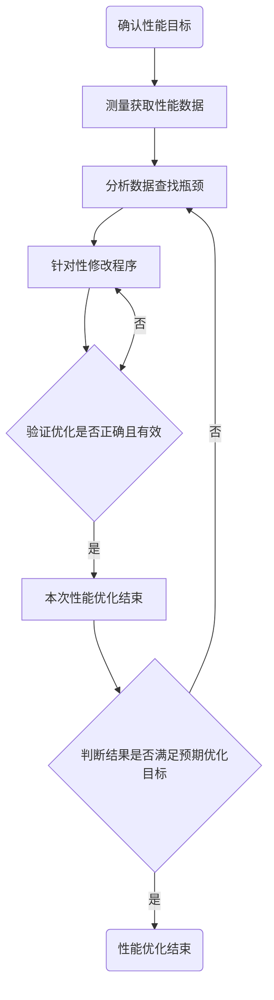

# 程序性能的度量指标及优化流程

## 程序性能的度量指标

### 程序执行时间

程序的执行时间是判断程序性能优劣较为简单的方式之一，在使用相同计算设备且保证程序正确的前提下，程序运行时间越短意味着其性能越高效。

Linux下`time`命令可以获取一个程序的执行时间：

* 程序实际运行时间（real time）
* 程序运行在用户态时间（user time）
* 程序运行在内核态时间（sys time）

### 计算与访存效率

* 计算效率是指实测浮点性能与理论浮点峰值性能之比。
* 访存效率是指程序的有效访存带宽与存储器理论带宽之比，其中带宽是计算平台每秒内存交换量的最大值。当程序的访存效率接近于1时，说明程序已经将整个存取器的带宽都利用了起来，与之对应的当访存效率远小于1，则说明存储带宽利用率较低，程序还有一定的访存优化空间。

### 吞吐量与延迟

吞吐量和延迟是衡量软件系统最常见的两个指标。但高吞吐量并不意味着低延迟，高延迟也不代表吞吐量变小，它们之间的关系并不是简单的一一对应。延迟测量的是用于等待的时间，广义来说，延迟可以表示所有操作完成的耗时，例如一次应用程序请求、一次数据库查询、一次文件系统操作等，可以表示从单击链接到屏幕显示整个页面加载完成的时间。 

### 加速比

加速比speedup是指同一个任务在单处理器系统和并行处理器系统中运行消耗的时间的比率，用来衡量并行系统或程序并行化的效果，也可以用于衡量程序优化前后的效果，由于加速比是一个相对比值，因此在保证程序正确性的前提下加速比数值越大，代表着优化的效果越显著。 计算加速比的公式为： 
$$
加速比 = \frac{优化前的执行时间}{优化后的执行时间}
$$

### Amdahl定律

Amdahl定律将程序划分为可加速与不可加速两大部分，程序总的加速比S是一个关于程序中这两部分所占比例以及可加速部分性能加速程度的函数，用公式表示为：
$$
S = \frac{1}{(1 - a) + \frac{a}{n}}
$$
其中a为并行计算部分所占比例，n为并行计算部分获得的加速比。

### Gustafson定律

对于某些不属于固定负载模式的问题不能使用Amdahl定律来解释。早在1988年Gustafson就发现了这个问题并提出了固定时间加速比模型，也就是经常提及的扩展加速比模型，通常被称为Gustafson定律，其公式为:
$$
S = n + (1 - n) * f = f - n * (f - 1)
$$
其中S表示扩展加速比，f表示处理器核的数量，n表示程序中串行部分的比例。

## 优化流程

程序性能优化注意事项：

* 测试用例的构造。需要构造出具有待调优程序特征的测试用例。
* 性能指标的选择。根据不同的性能指标，分析策略也不相同。
* 正确性的判定。为避免出现测试不完全的情况，可以增加测试的广度。
* 保持程序的可读性。保证程序的可移植性、可读性、可维护性和可靠性。
* 程序性能优化结束的时机。优化人员需要知道程序与最优状态的差距，选择合适的时机结束程序性能优化。

## 参考

https://www.bilibili.com/read/cv26060996/?spm_id_from=333.999.0.0

https://www.bilibili.com/read/cv26110227/?spm_id_from=333.999.0.0