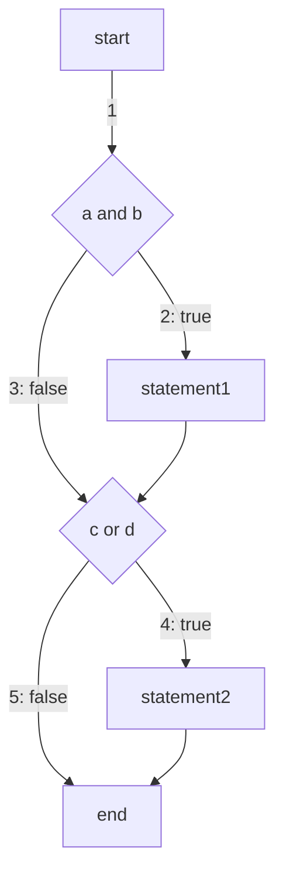

# 开发者测试

## 测试覆盖

* 语句覆盖：每条语句至少执行一次
* 判定覆盖（分支覆盖）：程序每个判断至少有一次为真值，有一次为假值
* 条件覆盖：每个条件至少有一次为真值，有一次为假值
* 路径覆盖：覆盖程序所有可能的路径


### 例子




```python
if a and b:
    statement1
if c or d:
    statement2
```


语句

* a and b
* statement1
* c or d
* statement2


判定

* a and b
* c or d


条件

* a
* b
* c
* d


路径

* 1
* 2
* 3
* 4
* 5


#### 语句覆盖

每条可执行语句至少执行一次

* a and b
* statement1
* c or d
* statement2


用例

* a = true; b = true; c = true;


缺陷：测试用例虽然可以覆盖可执行语句，但是不能检查判断逻辑是否有问题

* 某些路径无法执行
* 不能判断没有else分支的if语句为假时的错误
* 不能判别带有break跳转的while语句的退出条件是否正确
* 不能判别do-while循环的条件错误


#### 判定覆盖

每个判断的真值和假值至少执行一次

* a and b
* c or d


用例

* a = true; b = true; c = true; d = true;
* a = false; b = false; c = false; d = false;


缺陷：不能对判定条件进行检查


#### 条件覆盖

每个条件的真值和假值至少执行一次

* a
* b
* c
* d


用例

* a = true; b = false; c = true; d = false;
* a = false; b = true; c = false; d = true;


#### 路径覆盖

覆盖程序所有可能的路径

* 1 -> 2 -> 4
* 1 -> 3 -> 4
* 1 -> 2 -> 5
* 1 -> 3 -> 5


用例

* a = true; b = true; c = true; d = true;
* a = true; b = false; c = true; d = true;
* a = true; b = true; c = false; d = false;
* a = true; b = false; c = false; d = false;

