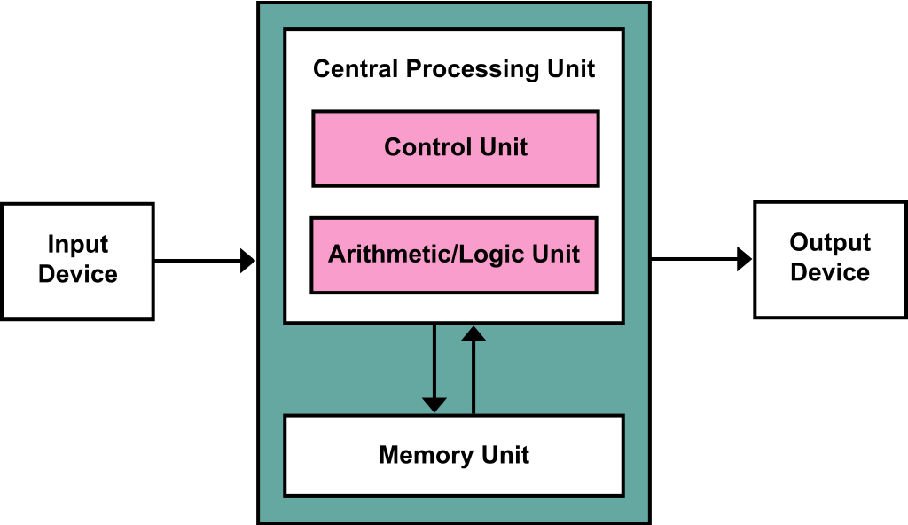

# 冯诺依曼结构

存储程序计算机在体系结构上主要特点有：

1. 以运算单元为中心
2. 采用存储程序原理
3. 存储器是按地址访问、线性编址的空间
4. 控制流由指令流产生
5. 指令由操作码和地址码组成
6. 数据以二进制编码

存储程序计算机的两个核心点：

* 可编程
* 可存储

一台计算机包含部分

* 包含算术逻辑单元和处理器寄存器的处理器单元，来完成各种算术和逻辑运算
* 包含指令计算器和程序计数器的控制器单元，用来控制程序的流程，通常是不同条件下的分支和跳转。
* 存储数据和指令的内存
* 更大容量的外部存储 硬盘
* 输入输出设备

简单的想计算机的任何一个部件都可以归到运算器、控制器、存储器、输入和输出设备

计算机程序可以抽象为从输入设备读取输入信息，通过运算器和控制器来执行存储在存储器里的程序，最终把结果输出到输出设备。

