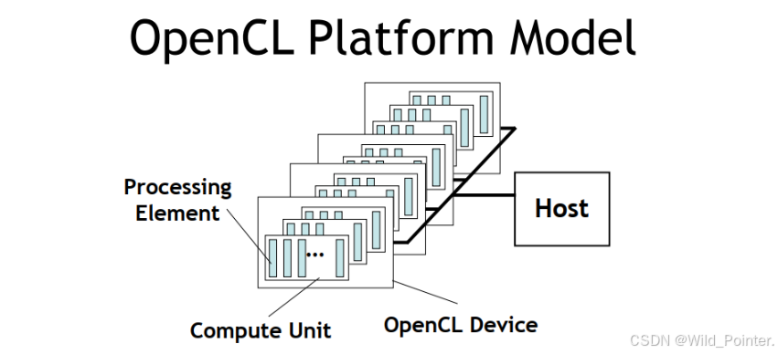
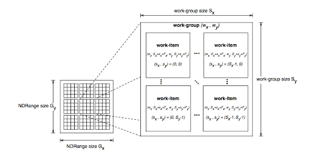
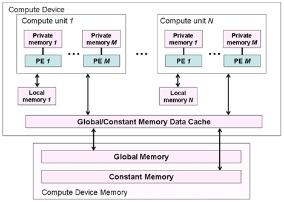

# OpenCL

## 基本概念

### 简介

#### **什么是OpenCL？**

**一句话解释**：
OpenCL（Open Computing Language，开放计算语言）是一套**跨平台并行编程开发标准**，能让你的程序同时使用CPU、GPU、FPGA等多种处理器协同工作，大幅提升计算速度！

**类比理解**：
想象你要做1000份手工蛋糕：

- **传统方式 → 速度慢 ❌**：
    - 1个厨师（CPU）从头做到尾

- **OpenCL方式 → 效率提升100倍！ ✅**：
    - 1个总指挥（主机/Host）协调任务
    - 10个专业蛋糕师（GPU）并行处理装饰
    - 5个烤箱管理员（FPGA）控制烘焙


#### **OpenCL能做什么？**

|      能力      |             实际应用场景             |
| :------------: | :----------------------------------: |
|  **数据并行**  |   图像滤镜、科学计算（如天气预报）   |
|  **任务并行**  |    视频转码（解码+编码同时进行）     |
|  **异构计算**  |     游戏渲染（CPU逻辑+GPU图形）      |
| **跨平台支持** | 同一套代码在NVIDIA/AMD/Intel硬件运行 |


#### **OpenCL的组成**

##### 编程语言

- 设备端：OpenCL C/C++（写"做什么"）

  ```c
  // 示例：并行加法（每个工作项加一个数）
  kernel void add(global float* a, global float* b) {
      int id = get_global_id(0); // 自动获取工作项ID
      a[id] += b[id];
  }
  ```

- **主机端**：C/C++等


##### OpenCL异构并行计算架构

|               模型                |                             作用                             |                 新手类比                 |
| :-------------------------------: | :----------------------------------------------------------: | :--------------------------------------: |
|  **平台模型（platform model）**   | 将硬件抽象为主机（host）或设备（device）<br />指定一个主机处理器，用于任务调度<br />指定一个或多个设备处理器，用于执行OpenCL内核（OpenCL C kernel） |       建筑工地：项目经理 + 施工队        |
|   **内存模型（memory model）**    | 定义了内存对象的类型，抽象了内存层次，内核无需了解其使用的内存实际架构<br />区分了主机和核中用到的内存结构、内容和行为<br />定义了执行顺序关系和同步需要用到的规则 | 仓库：公共货架 + 小组储物柜 + 个人工具箱 |
|  **执行模型（execution model）**  | 定义了OpenCL在主机上运行的环境该如何配置，以及主机如何指定设备执行某项任务<br />主机运行环境<br />主机与设备交互的机制<br />配置内核时使用的并发模型：定义如何将算法分解成OpenCL工作项和工作组 |   快递系统：分拣中心 → 快递员分组配送    |
| **编程模型（programming model）** |             定义了并发模型如何映射到实际物理硬件             |    拼图策略：先分区块 → 小组协作完成     |


### 平台模型

#### 组成

OpenCL平台模型由主机及其相连的一个或多个OpenCL设备组成。

* 主机包括X86或ARM处理器的计算平台。
* 设备可以是CPU（也可以将主机端的CPU作为OpenCL设备）、GPU、DSP、FPGA或硬件商提供、OpenCL开发商支持的任何其他处理器。




平台模型包括一个主机和一个或多个设备，每个设备有一个或多个计算单元（Compute Units， CU），每个计算单元由一个或多个处理元素（Processing Elements， PE）组成。

处理元素（PE）是设备上执行数据计算的最小元素。

|                组件                 |       技术定义        |               类比解释               |        实际硬件示例         |
| :---------------------------------: | :-------------------: | :----------------------------------: | :-------------------------: |
|          **Host（主机）**           | 中央控制器，通常是CPU | 工地项目经理 负责任务调度和资源分配  |     Intel i7, AMD Ryzen     |
|         **Device（设备）**          |  执行计算的硬件单元   |    专业施工队 （混凝土队/钢筋队）    |   NVIDIA GPU, Intel FPGA    |
|    **Compute Unit （计算单元）**    | 设备内的并行处理模块  | 工程专业小组 （绑钢筋小组/浇筑小组） | GPU中的SM模块 CPU中的核心组 |
| **Processing Element （处理单元）** |     最小计算单元      |      技术工人 每人完成具体任务       | GPU的CUDA核心 CPU的ALU单元  |


#### 控制流属性

* converged：一个计算单元（CU）中的处理元素（PE）都在以相同的顺序执行指令。针对跨处理元素（PE）执行单个指令流的硬件优化适合converged控制流
* diverged: 处理元素（PE）之间控制流不同。

内核通常以converged控制流开始执行，两种控制流都会在一个内核里发生。这种机制为能在OpenCL上实现的算法提供了很大的灵活性。


### 执行模型

OpenCL程序包括**主机端程序**和**内核（kernel）程序**

* 主机端程序（host program）运行在主机处理器上，主机端程序以命令方式将内核程序从主机传输到设备。
  * 创建**上下文（context）**以及**命令通道（command queue）**。
  * 提交命令，例如拷贝数据到设备（device）上。
  
* 内核程序（kernel program）定义在程序（program）中，在设备（device）的处理单元上执行。
    * 计算在工作项（work-group）中执行的工作组（work-item）进行。
    * **内核（kernel）**通常是一些计算量大、逻辑简单的函数。
    * 设备通过内核将输入数据计算后输出给主机。


#### 上下文

上下文由主机创建和管理，执行内核。

|     组件     |                           技术定义                           |            新手类比             |
| :----------: | :----------------------------------------------------------: | :-----------------------------: |
| **设备集合** | 平台包含一个或多个设备：<br />OpenCL支持的设备有CPU、GPU、DSP、FPGA等。<br />主机可以根据具体问题和运行的内核选择设备的组合方案（例如1个CPU、1个GPU、1个CPU+1个GPU、多个GPU等方案），在定义的上下文中包含设备方案。 |       可调用的施工队名单        |
| **内核对象** |                       设备上运行的函数                       | 施工图纸（钢筋绑扎/混凝土浇筑） |
| **程序对象** | 实现整个内核程序的源代码和目标二进制码：<br />上下文包含一个或多个程序对象。<br />程序对象可以理解为动态库。可以从程序对象中选取内核使用的函数。<br />程序对象在运行时由主机程序构建（从程序源代码中构建 或 从源代码中已经编译好的代码上构建） | 施工标准手册（含多种工艺规范）  |
| **内存对象** | 对主机和设备可见的对象，内核执行时操作内存对象的实例：<br />在主机上定义。<br />在主机与设备间交换数据。 |          工地建材仓库           |


#### 命令队列

主机通过命令队列（command-queue）与设备（device）进行交互。

一个命令队列在上下文中会与一个设备进行关联。

同一上下文中可以多个命令队列，独立执行。对主机端程序可见的事件对象可被用于定义不同命令队列中各命令之间的同步点。

命令由主机或运行在设备中的内核（支持OpenCL 2.0以上设备）提交给命令队列，然后等待，直到被调度到OpenCL设备上执行。


##### 命令类型

|                  命令类型                  |                           功能描述                           |     应用场景      |                   关键特性                    |
| :----------------------------------------: | :----------------------------------------------------------: | :---------------: | :-------------------------------------------: |
| **内核入队命令（Kernel-enqueue command）** | 在一个设备执行内核，需要将内核入队到与该设备关联的命令队列。 | 图像处理/科学计算 |        异步执行，支持NDRange工作项分解        |
|      **内存命令（Memory commands）**       | 在主机与设备内存对象间传输数据。<br />将内存对象映射到主机地址空间，或取消内存对象映射到主机地址空间。 | 输入/输出数据处理 | 支持阻塞/非阻塞模式 包含读/写/映射/解映射操作 |
|  **同步命令（Synchronization commands）**  | 对命令队列中需要执行的命令施加执行顺序约束，如只有某个命令执行完成其他命令才能开始执行。 |  复杂任务流水线   |    支持事件依赖、提供barrier/标记点等机制     |

命令执行类型

* 阻塞式命令：在命令完成之前OpenCL API接口不会返回。
* 非阻塞式命令：立即返回，需要程序员保证入队命令的执行顺序，入队命令需要在必要资源可用之后执行。

实际的命令可能是**异步执行**的：主机或运行在设备的内核将命令进入命令队列，无需等待命令完成，就可以继续工作。如果需要等待命令完成，可以利用命令执行相关的同步机制进行同步。


##### 执行模式

|   执行模式   |            工作原理            |              优点              |               缺点               |          适用场景          |
| :----------: | :----------------------------: | :----------------------------: | :------------------------------: | :------------------------: |
| **按序执行** |       严格按入队顺序执行       |   简单可靠<br />自动依赖管理   | 无法利用并行性<br />潜在性能瓶颈 | 简单任务流<br />初学者使用 |
| **乱序执行** | 命令并行执行<br />显式事件依赖 | 最大化硬件利用率<br />灵活调度 |  需要手动管理依赖<br />复杂度高  | 高性能计算<br />复杂流水线 |

在同一个命令队列中的命令在命令队列中执行方式

* 按序（in-order）执行：命令按其进入命令队列中的先后顺序执行，并按顺序完成。
* 乱序（out-of-order）执行：命令以任意顺序执行，通过显式的同步点或显式事件依赖项来约束顺序。


只有在内核实例执行时才会做与内核相关的计算。如果通过主机程序多次启动内核实例进行执行，会增加开销或加重应用程序控制流。一个有效的办法是从内核内部嵌套内核命令，运行在设备上的内核（父内核）入队一个内核实例（子内核）到设备端命令队列，无需主机程序参与。


##### 命令状态

无论是子内核还是父内核，每个命令经过六个状态


1. Queue：这条指令已入队。指令会一直在队列中，直到被显式冲掉或被其他指令隐式冲掉。
2. Submitted：命令从命令队列中被冲掉，提交至设备上运行。从命令队列出队后，命令会在前置条件都满足的情况下执行。
3. Ready：所有命令需要的前置条件都满足。这条命令与内核入队命令相关的工作组集合，会进入设备资源池等待调度执行。
4. Running：命令执行开始。在核入队列命令的情况下，一个或多个相关的工作组开始执行。
5. Ended：命令执行结束。内核入队命令结束，所有相关的工作组都结束执行。
6. Complete：命令和子命令都结束执行，事件对象的状态转移到CL_COMPLETE。

命令间通过事件对象进行通信。把命令相关联的状态设为CL_COMPLETE即为成功执行指令。把事件状态设为负值即为执行指令失败，异常终止。在这种情况下，与异常终止指令相关的指令和在同一个上下文中的所有其他指令可能都无法再获取，它们的行为由实现定义。


提交至设备的命令只有在所有限制命令顺序的前置条件都满足时才会launch。这些前置条件有以下三种资源：

* 执行顺序的限制。e.g. barrier。
* 依赖关系。
* 全局变量的Non-trivial C初始化器或C++构造函数。此时OpenCL的C/C++编译器需要进行C的初始化或者C++的构造来生成程序初始化内核。这些内核必须在同一程序在同—设备上的其他核之前执行。程序初始化核的ND range是`{1, 1, 1}`。多个程序连接在一起时，未定义程序初始化核的执行顺序。


#### 内核

内核实例：

* 内核
    * **OpenCL内核**：用OpenCL C编程语言编写，并用OpenCL C编译器编译的函数。所有OpenCL实现都必须支持OpenCL内核和OpenCL C编程语言。
    * **原生内核**：OpenCL之外创建的函数，在OpenCL中可以通过一个函数指针来访问。例如，这些函数可以是主机源代码中定义的函数，或者是从一个专门库导出的函数。需要指出的是，执行原生内核是OpenCL的一个可选功能，原生内核的语义依赖于具体OpenCL实现。
    * **内建（built-in）内核**：被绑定到特定设备，并不需要源码编译成程序对象的函数。常见用法是针对公开固定函数硬件或固件，将它们关联到一个特定的OpenCL设备或自定义设备。内建内核是OpenCL扩展功能，内建内核语义依赖于具体OpenCL实现。
* 关联内核参数的参数值
* 定义索引空间的参数


##### 编译构建

可使用OpenCL C源程序，SPIR-V中间语言或者二进制obj文件提供程序。OpenCL的编译器将这些形式的程序翻译为可执行obj。


设备内核代码编译器分类：

* online：在主机端程序执行期间使用标准API调用。
* offline：使用平台特定的方法，在主机端程序控制之外调用。

OpenCL runtime允许开发者执行之前编译好的设备程序，能够加载、执行之前编译好的设备程序。一般设备只支持built-in内核，不能使用内核语言编程。


平台profile分类：

* Full profile： 为所有设备提供online compiler
* Embedded profile：不是必须提供online compiler

用于特殊用途的设备可作为built-in内核。平台提供API，用于枚举和调用built-in内核。


##### 索引空间


OpenCL运行时将会创建一个整数索引空间。索引空间是OpenCL支持的一个N维网格，称为NDRange，其中N为1、2或3。三个长度为N的数据确定了NDRange的以下特征：

- 每个维度索引空间（或全局大小）的范围；
- 一个偏移指数F表明每个维度的初始索引值（默认为0）；
- 一个工作组（局部大小）每个维度大小。


###### 工作项

工作项：索引空间的每个点，用于执行内核实例。

工作项的全局ID：工作项在索引空间的坐标。

工作项的局部ID：工作项在工作组中的坐标。

虽然工作项执行内核定义的相同的指令，但是由于工作项的全局ID不同，工作项的行为可能不同。

工作项提供对索引空间细粒度的分解。


###### 工作组

工作组：由多个工作项组成，数量由内核入队时的参数决定。

工作组ID：工作组在索引空间的坐标。

工作组提供对索引空间粗粒度的分解。


###### 二维索引空间



定义一个二维的索引空间：

工作项在索引空间的大小为(Ax, Ay)

工作项在工作组的大小为(Bx, By)

工作组在索引空间的大小为(Cx, Cy)
$$
Cx = ceil(Ax / Bx)\\Cy = ceil(Ay / By)
$$
工作项的全局ID为(Gx, Gy)

工作项的全局偏移为(Fx, Fy)

工作项的局部ID为(Lx, Ly)，范围从(0, 0)到(Bx-1, By-1)

工作组ID为(Wx, Wy)，范围从(0, 0)到(Cx-1, Cy-1)
$$
Gx = Wx * Bx + Lx + Fx\\Gy = Wy * By + Ly + Fy
$$


### 内存模型

#### 内存区域

内存区域包括主机和设备的内存。

OpenCL设备通常没有IO处理能力，IO操作通常由主机承担，这意味着程序开始执行时，数据通常在主机上，设备需要从主机上获取数据，在设备完成计算后，又要将数据从设备复制到主机。




类型：

* 主机内存（host memory）：主机直接可用的内存，OpenCL并未定义主机内存的具体行为。通过OpenCL API或者共享虚拟内存接口，实现内存对象在主机与设备间的传输。
* 全局内存（global memory）：这个内存区域允许上下文中任何设备中所有工作组的所有工作项的读写，工作项可以读写内存对象中的任意元素。全局内存的读写可能会被缓存，这取决于设备能力。
* 常量内存（constant memory）：全局内存中的一块区域，在内核实例执行期间其保存的数据保持不变。对工作项而言这个内存对象是只读的，主机负责对该内存对象的分配和初始化。
* 局部内存（local memory）：这个内存区域对工作组是局部可见的，它可以用来分配由该工作组中所有工作项共享的变量。
* 私有内存（private memory）：这个内存区域是一个工作项的私有区域。一个工作项私有内存中定义的变量对其他工作项是不可见的。

|    操作端    | 操作类型 | 全局内存 | 常量内存 | 本地内存 | 私有内存 |
| :----------: | :------: | :------: | :------: | :------: | :------: |
|  **Host端**  |   分配   |   动态   |   动态   |   动态   | 不可分配 |
|              |   访问   |  可读写  |  可读写  | 不可访问 | 不可访问 |
| **Kernel端** |   分配   | 不可分配 |   静态   |   静态   |   静态   |
|              |   访问   |  可读写  |   只读   |  可读写  |  可读写  |


#### 内存对象

内存对象表示全局内存区域中数据内容。


类型：

- 缓冲（buffer）：内核可用的一个连续的内存区域，编程人员可以将内建数据类型、矢量类型数据或用户自定义的数据结构（当然要符合OpenCL编程规范）映射到这个缓冲区，内核通过指针来访问缓冲区。
- 图像（image）：图像对象用于存储基于标准格式的图像。图像对象是一个不透明的数据结构，使用OpenCL API函数来管理。通常不允许OpenCL内核对单个图像同时进行读和写。然而在OpenCL 2.0中，提供了同步和栅栏操作来放宽这个限制。
- 管道（pipe）：管道内存是数据项有序的队列。管道有两个端点：一个是写端点，用于插入数据项；另一个是读端点，数据项从读端点被移除。同一时刻，仅有一个内核实例可向一个管道写入数据，同时仅有一个内核实例可从一个管道读出数据。


主机和设备的内存模型是独立的，内存模型的交互方式：

* 读/写/填充
    * 主机将读/写/填充的命令入队，数据在主机和全局内存之间传输。

* 映射和解映射
    * 将内存区域映射到主机可以访问的地址空间。
    * 在主机安全操作内存对象之前，主机需要将映射该内存对象的命令入队到命令队列。
    * 主机完成对内存对象操作后，主机需要将解映射的命令入队到命令队列，这样内存才能安全读写缓冲。

* 拷贝
    * 拷贝命令是将存储器对象在两个缓冲间拷贝，这两个缓冲可驻留在主机或设备上。


上述三个操作命令可以是阻塞或非阻塞操作。


#### 共享虚拟内存

通过映射，可以将全局内存区域映射到主机可以访问的地址空间。而除了这种方式，在OpenCL 2.0中，OpenCL通过共享虚拟内存（Shared Virtual Memory，SVM）机制扩展了全局内存区域到主机内存区域的方式。


OpenCL 2.0中定义了三种SVM类型：

- 粗粒度SVM：共享发生在OpenCL缓冲内存对象区域的粒度；
- 细粒度SVM：共享发生在OpenCL缓冲内存对象里独立地以字节加载/存储的粒度；
- 细粒度系统SVM：共享发生在主机内存内任何地方独立地以字节加载/存储的粒度。

粗粒度内存SVM是OpenCL的核心规范，而对于后两种细粒度实现是可选。


### 编程模型

The OpenCL Framework

框架让应用把主机和一到多个设备当做单个的异构并行计算机系统来使用，包含以下三个组件：

*  OpenCL平台层：这层允许host program来感知设备及设备能力和创建上下文
*  OpenCL Runtime：允许host program在创建上下文后控制它们
*  OpenCL compiler：创建包含OpenCL kernel的可执行程序。


## 基础教程

### 类图


### 代码

```
#include <stdio.h>
#include <stdlib.h>
#include <CL/cl.h>

#define ARRAY_SIZE 1024

const char* kernelSource = 
"__kernel void vector_add(__global const float* a,     \n" 
"                         __global const float* b,     \n" 
"                         __global float* result) {    \n" 
"    int idx = get_global_id(0);                       \n" 
"    result[idx] = a[idx] + b[idx];                    \n" 
"}                                                     \n"; 

int main() {
    // 1. 准备测试数据
    float a[ARRAY_SIZE], b[ARRAY_SIZE], result[ARRAY_SIZE];
    for (int i = 0; i < ARRAY_SIZE; i++) {
        a[i] = 1.0f;
        b[i] = 2.0f;
        result[i] = 0.0f;
    }

    cl_int err;
    
    // 2. 获取平台
    cl_platform_id platform;
    err = clGetPlatformIDs(1, &platform, NULL);
    if (err != CL_SUCCESS) {
        printf("Error getting platform: %d\n", err);
        return 1;
    }

    // 3. 获取设备 (首选GPU)
    cl_device_id device;
    err = clGetDeviceIDs(platform, CL_DEVICE_TYPE_GPU, 1, &device, NULL);
    if (err != CL_SUCCESS) {
        printf("GPU not found, trying CPU...\n");
        err = clGetDeviceIDs(platform, CL_DEVICE_TYPE_CPU, 1, &device, NULL);
        if (err != CL_SUCCESS) {
            printf("Error getting device: %d\n", err);
            return 1;
        }
    }

    // 4. 创建上下文
    cl_context context = clCreateContext(NULL, 1, &device, NULL, NULL, &err);
    if (err != CL_SUCCESS) {
        printf("Error creating context: %d\n", err);
        return 1;
    }

    // 5. 创建命令队列
    cl_command_queue queue = clCreateCommandQueue(context, device, CL_QUEUE_PROFILING_ENABLE, &err);
    if (err != CL_SUCCESS) {
        printf("Error creating command queue: %d\n", err);
        return 1;
    }

    // 6. 创建内存对象
    cl_mem bufferA = clCreateBuffer(context, CL_MEM_READ_ONLY | CL_MEM_COPY_HOST_PTR, 
                                   sizeof(float) * ARRAY_SIZE, a, &err);
    cl_mem bufferB = clCreateBuffer(context, CL_MEM_READ_ONLY | CL_MEM_COPY_HOST_PTR, 
                                   sizeof(float) * ARRAY_SIZE, b, &err);
    cl_mem bufferResult = clCreateBuffer(context, CL_MEM_WRITE_ONLY, 
                                       sizeof(float) * ARRAY_SIZE, NULL, &err);
    if (err != CL_SUCCESS) {
        printf("Error creating buffers: %d\n", err);
        return 1;
    }

    // 7. 创建程序
    cl_program program = clCreateProgramWithSource(context, 1, &kernelSource, NULL, &err);
    if (err != CL_SUCCESS) {
        printf("Error creating program: %d\n", err);
        return 1;
    }

    // 8. 构建程序
    err = clBuildProgram(program, 1, &device, NULL, NULL, NULL);
    if (err != CL_SUCCESS) {
        // 获取构建日志
        size_t logSize;
        clGetProgramBuildInfo(program, device, CL_PROGRAM_BUILD_LOG, 0, NULL, &logSize);
        char* log = (char*)malloc(logSize);
        clGetProgramBuildInfo(program, device, CL_PROGRAM_BUILD_LOG, logSize, log, NULL);
        printf("Build error:\n%s\n", log);
        free(log);
        return 1;
    }

    // 9. 创建内核
    cl_kernel kernel = clCreateKernel(program, "vector_add", &err);
    if (err != CL_SUCCESS) {
        printf("Error creating kernel: %d\n", err);
        return 1;
    }

    // 10. 设置内核参数
    err  = clSetKernelArg(kernel, 0, sizeof(cl_mem), &bufferA);
    err |= clSetKernelArg(kernel, 1, sizeof(cl_mem), &bufferB);
    err |= clSetKernelArg(kernel, 2, sizeof(cl_mem), &bufferResult);
    if (err != CL_SUCCESS) {
        printf("Error setting kernel args: %d\n", err);
        return 1;
    }

    // 11. 执行内核
    size_t globalSize = ARRAY_SIZE;
    cl_event kernelEvent;
    err = clEnqueueNDRangeKernel(queue, kernel, 1, NULL, &globalSize, NULL, 
                                0, NULL, &kernelEvent);
    if (err != CL_SUCCESS) {
        printf("Error enqueuing kernel: %d\n", err);
        return 1;
    }

    // 12. 读取结果
    err = clEnqueueReadBuffer(queue, bufferResult, CL_TRUE, 0, 
                             sizeof(float) * ARRAY_SIZE, result, 
                             0, NULL, NULL);
    if (err != CL_SUCCESS) {
        printf("Error reading buffer: %d\n", err);
        return 1;
    }

    // 13. 验证结果
    int correct = 1;
    for (int i = 0; i < 5; i++) {
        if (result[i] != 3.0f) {
            correct = 0;
            break;
        }
    }

    // 14. 性能分析
    cl_ulong start, end;
    clGetEventProfilingInfo(kernelEvent, CL_PROFILING_COMMAND_START, sizeof(cl_ulong), &start, NULL);
    clGetEventProfilingInfo(kernelEvent, CL_PROFILING_COMMAND_END, sizeof(cl_ulong), &end, NULL);
    double time_ms = (end - start) * 1e-6;

    // 15. 清理资源
    clReleaseEvent(kernelEvent);
    clReleaseKernel(kernel);
    clReleaseProgram(program);
    clReleaseMemObject(bufferA);
    clReleaseMemObject(bufferB);
    clReleaseMemObject(bufferResult);
    clReleaseCommandQueue(queue);
    clReleaseContext(context);

    // 16. 输出结果
    printf("Array addition %s!\n", correct ? "SUCCEEDED" : "FAILED");
    printf("Execution time: %.3f ms\n", time_ms);
    printf("First element: %.1f (expected 3.0)\n", result[0]);

    return 0;
}
```


|           API函数           |        功能        |       关键参数        |
| :-------------------------: | :----------------: | :-------------------: |
|     `clGetPlatformIDs`      | 获取可用OpenCL平台 |     `platform_id`     |
|      `clGetDeviceIDs`       |      获取设备      | `device_id`, 设备类型 |
|      `clCreateContext`      |   创建执行上下文   |       设备列表        |
|   `clCreateCommandQueue`    |    创建命令队列    |     上下文, 设备      |
|      `clCreateBuffer`       |    创建内存对象    |   上下文, 内存标志    |
| `clCreateProgramWithSource` |   从源码创建程序   |   上下文, 内核源码    |
|      `clBuildProgram`       |      编译程序      |    程序对象, 设备     |
|      `clCreateKernel`       |      创建内核      |    程序, 内核名称     |
|      `clSetKernelArg`       |    设置内核参数    |    内核, 参数索引     |
|  `clEnqueueNDRangeKernel`   |      执行内核      |  命令队列, 全局大小   |
|    `clEnqueueReadBuffer`    |      读取结果      |   命令队列, 缓冲区    |
|        `clRelease*`         |      释放资源      |    各种OpenCL对象     |


### 编译

```
# Linux
gcc -o vector_add vector_add.c -lOpenCL

# Windows (MinGW)
gcc -o vector_add vector_add.c -lOpenCL

# Windows (Visual Studio)
cl vector_add.c /I"<OpenCL_Include_Path>" /link OpenCL.lib
```


