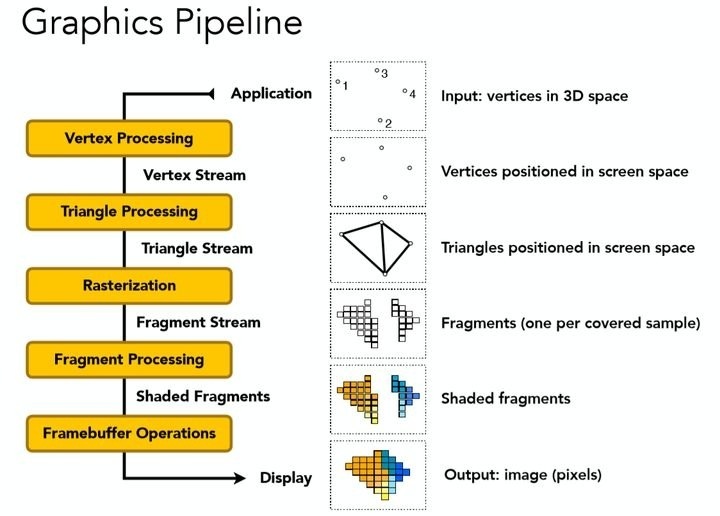
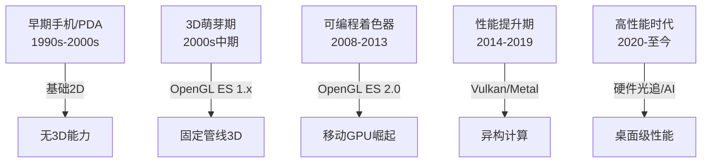
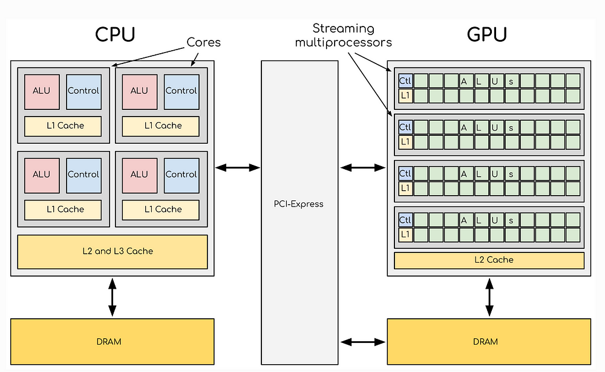

# GPU

## 图像处理器

- **全称：** Graphics Processing Unit，图形处理器。
- **定义：** GPU 是一种专门设计用于**并行处理**和**快速渲染图像、视频和图形**的微处理器芯片。它最初是为了满足 PC 游戏和高性能图形工作站的图形渲染需求而诞生的。
- **核心能力：**
    - **并行计算：** GPU 拥有成百上千个更小、更高效的核心，能够同时处理大量相似的任务（如计算屏幕上数百万像素的颜色）。
    - **图形渲染：** 高效执行复杂的图形处理管线中的任务，包括几何变换、光照计算、纹理映射、着色、抗锯齿、最终像素绘制等。
    - **高吞吐量：** 专为处理海量数据（如图像像素、顶点数据）而优化，拥有极高的内存带宽（通过专用显存）。
- **扩展角色（GPGPU）：** 
    - 随着时代发展，人们发现 GPU 强大的并行计算能力非常适合处理**大规模、高度并行的通用计算任务**，这被称为 GPGPU。现代 GPU（特别是 NVIDIA CUDA 或 AMD ROCm / HIP 架构的）被广泛用于科学计算、人工智能（AI）训练与推理、深度学习、大数据分析、物理模拟、密码学、视频编解码等非图形领域。

1. 顶点处理（Vertex Processing）
    * 输入：3D 空间中的顶点（如模型的角点，图中左上的°1-°4）。
    * 处理：通过 **顶点着色器（Vertex Shader）** 进行坐标变换（如从 3D 世界坐标转换为屏幕坐标）、光照计算（顶点法线与光源交互），输出屏幕空间的顶点（图中第二行，顶点已在屏幕上定位）。
    * 并行性：每个顶点独立处理，数千顶点可同时计算。
2. 三角形处理（Triangle Processing）
    * 输入：屏幕空间的顶点（Vertex Stream）。
    * 处理：将顶点组装为三角形（3D 模型的基本渲染单元），生成三角形流（Triangle Stream），图中第三行显示屏幕空间中的三角形（如两个相邻三角形组成的面）。
    * 可选：**几何着色器（Geometry Shader）**在此阶段动态生成 / 修改几何图形（如粒子效果）。
3. 光栅化（Rasterization）
    * 输入：屏幕空间的三角形（Triangle Stream）。
    * 处理：将三角形转换为片段（Fragments，像素的前身），每个片段对应屏幕上的一个采样点（图中第四行，网格状的片段分布，覆盖三角形内的像素区域）。
    * 计算片段的属性（如颜色、深度），为后续着色做准备。
4. 片段处理（Fragment Processing）
    * 输入：光栅化后的片段（Fragment Stream）。
    * 处理：通过**像素着色器（Pixel Shader）**对每个片段进行颜色计算：应用纹理贴图（如给三角形贴皮肤纹理）、光照特效（高光、阴影）、透明度混合等，生成着色片段（Shaded Fragments，图中第五行彩色方块）。
    * 并行性：每个片段独立处理，1080p 分辨率下可同时处理 200 万 + 片段。
5. 帧缓冲操作（Framebuffer Operations）
    * 输入：着色片段（Shaded Fragments）。
    * 处理：执行深度测试（Depth Testing，确定像素前后遮挡）、混合（Blending，透明物体叠加）等，最终将片段合成像素（Pixels，图中第六行彩色图像），输出到显示器或存储设备。

## 发展历史

### 桌面/主机端 GPU 发展简史

```mermaid
graph TD
    A["早期图形加速卡<br>(1970s-1990s早期)"] -->|固定2D功能| A1["代表：VGA卡"]
    
    B["3D加速卡诞生<br>(1995-1999)"] -->|固定功能管线| B1["硬件加速3D渲染<br>需求爆发于PC游戏"]
    B --> B2["代表产品：<br>3dfx Voodoo Graphics<br>NVIDIA RIVA TNT2<br>ATI Rage Pro"]
    
    C["可编程管线革命<br>(2000-2006)"] -->|引入可编程着色器| C1["DirectX 8/OpenGL 1.5<br>定义可编程接口"]
    C --> C2["GPU从固定硬件<br>变为可编程处理器"]
    C --> C3["代表产品：<br>NVIDIA GeForce 3/6系列<br>ATI Radeon 8500/X系列"]
    
    D["统一着色器架构<br>(2006-2010s中期)"] -->|通用化流处理器| D1["DirectX 10/OpenGL 3.x支持<br>CUDA/OpenCL框架兴起"]
    D --> D2["代表产品：<br>NVIDIA GeForce 8系列<br>ATI Radeon HD 2000系列<br>Xbox 360 GPU"]
    
    E["并行计算/GPGPU<br>(2010s)"] -->|CUDA/OpenCL标准化| E1["DirectX 11/OpenGL 4.x<br>提升计算能力"]
    E --> E2["GDDR5普及<br>借鉴移动端能效设计"]
    
    F["API革命与专用加速<br>(2010s中期-至今)"] -->|现代API| F1["DirectX 12/Vulkan/Metal<br>减少CPU开销"]
    F -->|硬件创新| F2["光追核心（NVIDIA RTX/AMD RDNA2）<br>张量核心（AI加速）<br>GDDR6/X/HBM显存"]
    F --> F3["代表架构：<br>NVIDIA Ampere/Ada Lovelace<br>AMD RDNA1/2/3"]
 
```

1. 早期图形加速卡 (1970s - 1990s 早期)：
    * 主要是固定的 2D 显示控制器和简单的 2D 位图块移动。
    * 代表：如 VGA 卡。
2. 3D 加速卡的诞生 (1995-1999)：
    * 硬件加速 3D 渲染需求爆发（主要来自 PC 游戏）。
    * 固定功能管线：硬件执行固定的图形处理步骤（如几何变换和光照、纹理映射、光栅化）。
    * 代表产品：3dfx Voodoo Graphics (1996 - 开创性的独立 3D 加速卡), NVIDIA RIVA TNT2, ATI Rage Pro。
3. 可编程管线的革命 (2000-2006)：
    * 最重大的飞跃：引入可编程着色器（顶点着色器、像素/片段着色器）。
    * DirectX 8 / OpenGL 1.5：定义了这些可编程阶段的接口。GPU 从纯固定功能硬件变成可编程处理器。开发者可以编写算法在着色器上运行。
    * 代表产品：NVIDIA GeForce 3 / FX / 6系列, ATI Radeon 8500 / X 系列。
4. 统一着色器架构 (2006-2010 年代中期)：
    * 摒弃了分离的顶点/像素着色器硬件单元。所有流处理器核心变得通用化，可以动态分配执行顶点、像素、几何、曲面细分等任何类型的着色器任务。大幅提高了核心利用率和灵活性。
    * DirectX 10 / OpenGL 3.x 规范支持。CUDA / OpenCL 等 GPGPU 计算框架兴起。
    * 代表产品：NVIDIA GeForce 8 系列, ATI Radeon HD 2000 系列, Xbox 360 GPU (Xenos)。
5. 并行计算/GPGPU 与 API 标准化 (2010 年代)：
    * GPGPU 走向成熟，CUDA 和 OpenCL 成为主要编程模型。
    * 图形 API 现代化：DirectX 11 / OpenGL 4.x 带来更多计算能力。
    * 性能大幅提升，核心数量激增，显存带宽不断提高（GDDR5 普及）。
    * 移动端架构影响：桌面 GPU 开始借鉴移动端的能效比优化设计。
6. API 革命与专用硬件加速 (2010 年代中期 - 至今)：
    * 现代 API： DirectX 12, Vulkan, Metal 出现，提供更底层的硬件访问，减少 CPU 开销，更好发挥 GPU 并行潜力。
    * 硬件加速光追： NVIDIA RTX (2018), AMD RDNA2 (2020) 引入专用光追核心（RT Cores），使实时光线追踪成为可能。
    * 张量核心与 AI： NVIDIA RTX 引入 Tensor Cores，加速深度学习（DLSS 等超采样/帧生成技术核心）。AMD 在 RDNA3 及更新架构也加入 AI 加速单元。
    * 更强统一着色器： 架构持续演进，流处理器规模更大、效率更高（如 NVIDIA Ampere / Ada Lovelace, AMD RDNA1/2/3）。
    * 显存技术： GDDR6/X 成为主流，HBM 在高性能计算卡上应用。

### 移动端 GPU 发展简史

1. 早期手机和 PDA (1990s-2000s 初期)：
    * 只有非常基础的 2D 显示控制器，无 3D 能力。
    * 固定功能/可编程 3D 的萌芽 (2000s 中后期)：J2ME Mobile 3D Graphics / OpenGL ES 1.x：引入有限的固定管线 3D 加速。
    * 代表：早期三星、德州仪器芯片内置的 3D 加速器。
2. 可编程着色器的兴起 (2008-2013)：
    * OpenGL ES 2.0 普及：支持顶点和片段着色器，使手机也能执行可编程渲染。
    * 独立的移动 GPU IP 供应商崛起：Imagination Technologies (PowerVR Series 5/6), ARM (Mali-400 及以上), Qualcomm (Adreno)。NVIDIA Tegra 系列也曾在早期引领。
    * 性能提升迅速，但仍与桌面差距巨大，功耗是核心挑战。
3. API 现代化与性能提升 (2014-2019)：
    * Vulkan 和 OpenGL ES 3.x / Metal (iOS) 提供更高效图形接口。
    * 异构计算： GPU 作为 SoC 一部分，与 CPU、NPU/DSP 协作，处理图形外的通用计算任务（如相机处理、UI 加速）。
    * 架构优化： 各供应商改进架构（如 PowerVR Series7, Mali T700/T800/G7x, Adreno 3xx/4xx/5xx），提升性能/功耗比。核心数量增加，引入统一着色器架构理念。支持更复杂的图形效果（如硬件曲面细分）。
4. 高性能移动游戏 & 专用单元 (2020-至今)：
    * 性能逼近入门级桌面显卡： 旗舰手机 GPU 性能达到甚至超越一些轻薄本独显（如 Apple A12Z Bionic / M1 iPad Pro, Qualcomm Snapdragon 8 Gen 2/3 Adreno, Apple A17 Pro）。
    * API 升级： OpenGL ES 3.2, Vulkan 1.1/1.2/1.3 广泛支持。
    * 硬件光追落地： Arm Mali-G710+, Immortalis-G715+, Qualcomm Adreno (自 8 Gen 2), Apple A17 Pro 开始引入硬件光追加速单元（规模比桌面小，但架构优化）。
    * AI 加速整合： GPU 常与 NPU 协同，为相机、游戏增强（如插帧、超分）等提供算力。部分 GPU 内部集成针对 ML 优化的执行单元。
    * 架构持续精进： ARM 推出性能内核+效率内核设计（如 Immortalis / Mali 的 Valhall 架构），Apple 持续优化自研 GPU，高通 Adreno 不断提升效率与性能上限，联发科采用 ARM Mali/IP。

## GPU和CPU

| 特性           | CPU                                                          | GPU                                                          |
| :------------- | :----------------------------------------------------------- | ------------------------------------------------------------ |
| **设计目标**   | **串行处理性能** (指令并行和任务并行)                        | **大规模并行处理** (数据并行)                                |
| **核心数量**   | **相对较少** (通常 2 到 128+ 个复杂核心)                     | **非常多** (数百到数万个简化核心)                            |
| **核心复杂度** | **复杂核心** (强大的分支预测、乱序执行等)                    | **简化核心** (专注于基础计算)                                |
| **适用任务**   | **延迟敏感、逻辑复杂、需要分支的任务**： 操作系统运行 运行应用程序逻辑 文件系统管理 网络通信管理 数据库操作 | **计算密集型、吞吐量密集型任务**： 渲染数百万像素/顶点 大规模科学计算 (SIMD) AI/深度学习训练推理 (矩阵运算) 物理模拟 视频编码/解码 |
| **内存模型**   | **低延迟** (系统内存 DDR4/DDR5) 侧重于快速响应随机内存访问请求 | **高带宽** (专用显存 GDDR/HBM) 侧重于快速读取大块数据（如图像纹理） |
| **缓存结构**   | **缓存层次多且大**，更注重降低访问内存延迟                   | **缓存较小**，更注重全局数据流和高带宽                       |
| **控制逻辑**   | **极其复杂** (强大的分支预测、乱序执行等)                    | **相对简单**，硬件调度为主                                   |
| **编程模型**   | MIMD / 多线程 (如 C/C++, Java)                               | SIMT / SIMD / GPGPU (如 CUDA, OpenCL)                        |
| **能耗效率**   | 在执行串行/复杂任务时相对高效                                | 在大规模并行计算任务上能效比更高                             |
| **适用场景**   | “快速做完一个复杂的事情”                                     | “一次做很多简单的事情”                                       |

**简单比喻：**

- **CPU** 就像一个聪明的教授，可以非常快速地解答一道非常复杂的数学题（串行高性能）。
- **GPU** 就像一支由成千上万名小学生组成的队伍，每人只负责做非常简单的加法题，但整个队伍可以在一眨眼间解决几百万道甚至几十亿道这样的题目（大规模并行）。

两者在现代系统中是互补的：CPU 负责复杂的逻辑调度和整体程序控制，GPU 负责计算密集型的“重活”。

## GPU架构

* **流处理器 / CUDA 核心 / 计算单元：**
    - 这是 GPU 最核心的组成部分，也是其并行能力的源泉。
    - 数量巨大：相比 CPU 的个位或十位数核心，现代 GPU 可包含数千乃至数万个流处理器。
    - 结构简化：每个流处理器（尤其是在早期的设计中）通常比 CPU 核心更小、更简化，专注于执行基本的浮点或整数运算。
    - 分组结构：流处理器通常被组织成更大的单元（如 NVIDIA 的 Streaming Multiprocessors - SM / AMD 的 Compute Units - CU），这些单元内部共享一些关键资源（如寄存器、缓存、指令调度器）。
* **纹理映射单元：**
    - 专门用于高效地从显存中读取图像纹理数据（通常是二维图像），并应用各种插值、过滤（如双线性、三线性、各向异性过滤）到需要贴图的图元（如三角形）上。
    - TMU 的数量通常与流处理器群组（SM/CU）相关联。
* **光栅操作单元 / 渲染输出单元：**
    - 负责 GPU 渲染流水线的最后阶段。
    - 主要任务：将处理好的像素写入帧缓冲区；执行混合、抗锯齿、深度和模板测试等操作。
    - ROP 的数量对最终像素填充率（每秒可写入帧缓冲区的像素数量）有很大影响。
* **显存：**
    - **VRAM：** GPU 拥有自己专用的高性能内存，称为显存或 VRAM。
    - **高速带宽：** 显存接口（位宽）非常大，配合高速内存技术（如 GDDR5, GDDR6, GDDR6X, HBM, HBM2, HBM2e, HBM3），提供远超系统内存的巨大带宽，以满足海量数据处理的需求。
    - **作用：** 存储当前正在处理的帧数据（帧缓冲）、纹理、顶点数据、着色器程序、各种计算任务的中间结果等。
* **高速缓存：**
    - 与 CPU 类似，GPU 内部也有层级缓存（L1, L2），用于减少访问显存的延迟和带宽压力，提高流处理器访问常用数据的效率。
* **总线接口：**
    - **AGP / PCIe：** 用于与 CPU 和系统其他部分通信的主接口。目前主要是 PCIe，提供数据交换通道。
* **显示输出接口：**
    - **HDMI, DisplayPort, DVI, VGA：** 负责将 GPU 渲染完成的最终图像信号输出到显示器。
* **专用硬件加速单元：**
    - 为特定任务优化的固定功能硬件：
        - **视频编解码引擎：** 专门用于硬件加速视频编码（如 H.264, HEVC/H.265, AV1）和解码，极大减轻 CPU 负担。
        - **硬件加速光追核心：** 用于实时光线追踪加速。
        - **张量核心：** 专门加速深度学习和 AI 中常见的矩阵乘法和累加操作（如 NVIDIA 的 Tensor Core）。
        - **几何处理引擎：** 负责处理顶点数据等任务。
* **电源管理和时钟控制：** 负责管理功耗和核心/显存频率。

## GPU适合处理的程序

1. 计算密集型程序：所谓计算密集型程序，大部分运行时间消耗在寄存器运算上，寄存器的速度和处理器速度相当，从寄存器读写数据几乎没有时延
2. 易于并行程序：GPU虽然是SIMT，其实为特殊的SIMD，拥有大量的cuda core，每个核在同一时间执行同样指令

## 参考

* [英伟达GPU架构史](https://www.zhaokangkang.com/article/9786a890-60dd-4454-90f8-1a6b09af7d73)
* [ARM GPU架构史](https://zhuanlan.zhihu.com/p/452667063)
