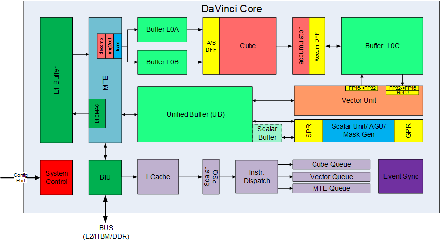

# 华为达芬奇（DaVinci）架构

## 达芬奇基本架构

DaVinci架构指的是AlCore，擅长矩阵和矢量运算，不擅长标量计算。

### Cube（矩阵乘，算力担当）

#### 组成

##### Cube

矩阵乘运算单元
$$
C = A * B
$$

* 如果是`fp16`输入，则一拍完成`16*16`与`16*16`矩阵乘
* 如果是`int8`输入，则一拍完成`16*32`与`32*16`矩阵乘

##### accumulator

累加器，把当前矩阵乘的结果与前次计算的中间结果相加，可以用于完成卷积中加bias操作，1条指令512乘加
$$
C = A * B + C
$$

##### L0A/L0B/L0C Buffer

* L0A：存储矩阵乘的左矩阵数据
* L0B：存储矩阵乘的右矩阵数据
* L0C：存储矩阵乘的结果和中间结果

##### A/B DFF

数据寄存器，缓存当前计算的`16*16`左/右子矩阵

##### Accum DFF

数据寄存器，缓存当前计算的`16*16`结果矩阵

#### 输入输出类型

| L0A   | L0B  | L0C  |
| ----- | ---- | ---- |
| fp16  | fp16 | fp16 |
| fp16  | fp16 | fp32 |
| u8    | u8   | u32  |
| s8/u8 | s8   | s32  |
| s8/u8 | u2   | s32  |
| fp16  | u2   | fp16 |

 

Cube is divided into two main submodule: Decode & Cube Arithmetic Unit.

When CCU (Central Control Unit) sends matrix instruction to Cube, it will kickstart the decode and FSM logic. The instruction will be analyzed and split into multiple unit matrix micro-operations (up is `16*16` * `16*16` matrix multiplication). After computes the unit uops, Cube will store its result into L0C RAM, and wait to be used inside Vector unit.

### Vector（向量运算，多面手）

#### 组成

##### Vector Unit

向量运算单元，覆盖各种基本的计算类型和许多定制的计算类型，主要包括`fp16`/`fp32`/`int32`/`int8`等数据类型的计算（具体指令支持的数据类型请参考指令集文档）

一拍可以完成128个`fp16`类型的向量相加/乘，或者64个`fp32`/`int32`类型的向量相加/乘

支持连续或者固定间隔寻址；或者VA寄存器寻址（不规则向量运算）

##### Unified Buffer（UB）

保存Vector运算的源操作数和目的操作数

一般要求32Byte对齐

数据从L0C->UB，需要以Vector Unit作为中转，并可以随数据搬运完成一些RELU/数据格式转换等操作

#### 指令

##### 常用的Vector指令

* VADD
* VSUB
* VMUL
* VDIV
* VREC
* VMAX
* VMIN
* VEXP
* VLN
* VDIV
* VSQRT
* VABS
* VCADD
* VRELU
* VMADD
* VMADD
* RELU
* VMLA
* VMULS
* VCGMAX
* VTranspose
* ...

##### RPN类专用指令

* VIOU
* VAADD
* VRPAC
* RPN_COR
* VBS16
* VMS4
* VCONCAT
* VMERGECH
* ...

### Scalar（标量运算，司令部）

#### 组成

##### Scalar Unit

负责完成AICore中的标量运算，功能上可以看做一个小CPU；

完成整个程序的循环控制、分支判断、CUBE/Vector等指令的地址和参数计算以及基本的算术运算等。（具体支持的运算类型根据不同的芯片版本有不同，具体请参考相应的芯片使用手册）

##### Unified Buffer or Scalar Buffer

昇腾310/910 Scalar Unit不能直接访问外面的DDR/HBM，需要预留UB的一部分（310）或者使用专门的ScalarBuffer（910）用作Scalar Unit的堆栈空间；

##### GPR

通用寄存器，目前包含32个通用寄存器

##### SPR

专用寄存器，为了支持指令集一些指令的特妹需要，Davinci设计了许多专用寄存器，比如，CorelD, BLOCKID, VA, STATUS, CTRL等寄存器。具体专用寄存器的类型和功能请参考指令集文档；

### MTE/BIU和片上高速存储（Buffer）

#### 组成

##### BIU （Bus Interface Unit）

AICore 的“大门”，与总线交互的接口。

AlCore从外部（L2/DDR/HBM）读取数据的入口以及往外写数据的出口。

负责把AICore的读写请求转换为总线上的请求并完成协议交互等工作。

##### MTE（Memory Transfer Unit），也被称作 LSU （LoadStore Unit）

负责AICore内部数据在不同Buffer之间的读写管理，以及完成一些格式转换的操作，比
如adding、转置、Img2Col、解压等;

##### L1 Buffer

AI Core内比较大的一块数据中转区（1MB），可以用来暂存AICore需要反复使用的一些数据从而减少从总线读写。

某些MTE的数据格式转换功能，比如Img2col操作，要求源数据必须位于
L1 Buffer。

##### L0A/L0B/L0C/UB/Scalar Buffer

前面已介绍

#### 大小和最小访问粒度

| Buffer Name         | Size  | 最小访问粒度 |
| ------------------- | ----- | ------------ |
| L1 Buffer           | 1MB   | 32B          |
| L0A/L0B Buffer      | 64KB  | 512B/128B    |
| L0C Buffer          | 256KB | 512B/1024B   |
| Unified Buffer (UB) | 256KB | 32B/2B       |
| Scalar Buffer (SB)  | 16KB  | 2B           |

## 昇腾系列芯片

### 910B（V220）

910B 1个Al Core上有

* 1个CUBE Core（负责矩阵乘运算）
* 2个VEC Core（负责矢量运算）

#### CUBE核架构

* 5个异步并行执行单元
  * MTE1
  * MTE2
  * MTE3
  * CUB
  * SU
* 1个FixP（FixPipe）
* 多个内存单元
  * GM
  * L1
  * L0A
  * L0B
  * L0C
  * L2（开发者不可控制，所有GM的内存操作都要经过L2 CACHE）

#### VEC核架构：

* 4个并行执行单元
  * MTE2
  * MTE3
  * VEC
  * SU
* 2个内存单元
  * GM
  * UB

#### 典型计算数据流

* VEC计算
  * GM - (MTE2) - UB - (VEC) - UB - (MTE3) - GM
* CUB计算
  * GM - (MTE2) - L1 - (MTE1) - L0A/L0B - (CUBE) - L0C - (FixP) - GM

### 910A（V100）

910A/310P 1个AICore上有

* 1个CUBE Core（负责矩阵乘运算）
* 1个VEC Core（负责矢量运算）

#### Al Core架构

* 6个异步并行执行单元
  * MTE1
  * MTE2
  * MTE3
  * CUB
  * VEC
  * SU
* 多个内存单元
  * GM
  * L1
  * L0A
  * L0B
  * L0C
  * UB
  * L2（开发者不可控制，所有GM的内存操作都要经过L2 CACHE）

#### 典型计算数据流

* VEC计算
  * GM - (MTE2) - UB - (VEC) - UB - (MTE3) - GM
* CUB计算
  * GM-(MTE2) - L1- (MTE1) - L0A/L0B - (CUBE) - L0C - UB - GM

### 内存

* L2 Buffer vs L2 Cache（192M 930 AICore共享）
  *   同一个介质，两种使用模式
  *   Buffer：程序员可见并可以直接读写（地址空间和
DDR/HBM不重合）
  *   Cache： 作为DDR/HBM高速缓存，程序员不可见
* DDR/HBM（AICore共享）
  * DDR：普通内存，带宽低/价格低
  * HBM(High Bandwidth Memory) ：带宽高/成本高

## 参考

https://blog.csdn.net/lovechris00/article/details/132096691

https://www.cmc.ca/wp-content/uploads/2020/03/Zhan-Xu-Huawei.pdf