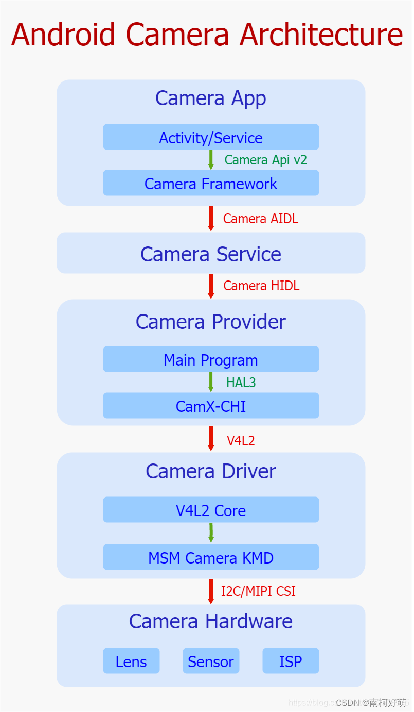
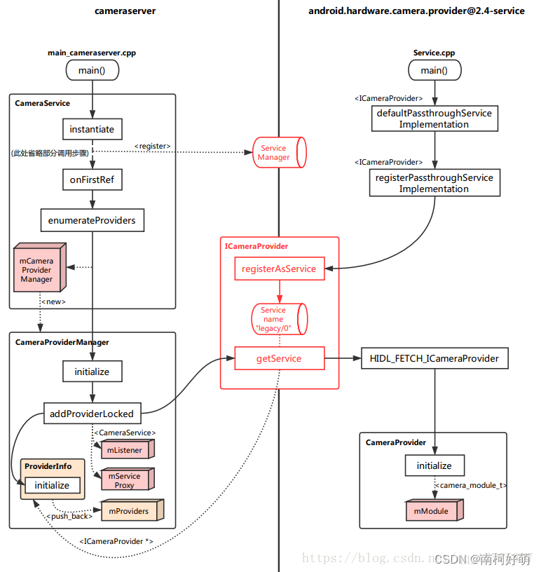

# android camera 架构

Android系统利用分层思想，将各层的接口定义与实现分离开来，以接口作为各层的脉络连接整体框架，将具体实现的主导权交由各自有具体实现需求的平台厂商或者Android
开发者，这样既做到把控全局，也给予了众多开发者足够大的创作空间，这体现出了一个优秀的开源系统应有的胸怀和远见。其中，谷歌根据职能的不同将Camera框架一共划分成了五层，分别是App、Service、Provider、Driver以及Hardware.左图的Camera的整体架构图很清晰地显示出了其五层架构以及相互的关联接口。

## camera app

应用层处于整个框架的顶层，和用户直接交互，采纳来自用户直接或简洁的需求（例如拍照、预览、录像等）。一旦接收到用户相关的UI操作，便会通过camera api v2标准接口将需求发给camera framework，并且等待camera framework回传处理结果。结果包括图像数据和整体相机系统状态参数。

Camera App
1. 获取CameraManager
2. 打开Camera设备
3. 创建Camera capture session
4. 发送图像请求到Camera Framework
5. Camera Framework返回metadata，Buffer Queue返回图像数据到Camera App的预览/拍照/录像

应用层处于整个框架的顶端，承担着于用户直接进行交互的责任，承接来自用户直接或者间接的比如预览/拍照/录像等一系列具体需求，一旦接收到用户相关U操作，便会通过Camera Api v2标准接口将需求发送至Camera Framework部分，并且等待Camera Framework品传处理结果，其中包括了图像数据以及整体相机系统状态参数，之后将结果以一定方式反馈给用户，达到记录显示种种美好瞬间的目的。

### camera framework

位于camera app与camera service之间，以jar包形式运行在app进程中，它封装了camera api v2接口的具体实现细节，只暴露接口给app调用，接收来自app的请求，同时维护请求在内部流转的业务逻辑，最终通过调用camera AIDL跨进程接口，将请求发送给camera service处理，然后等待camera service结果回传，进而将最终发送至app。

## camera service

Camera Framework与Camera Provider之间，作为一个独立进程存在于Android系统中，在系统启动初期会运行起来，它封装了Camera AIDL跨进程接口，提供给Framework进行调用，进而接收来自Framework的图像请求，同时内部维护着关于请求在该层的处理逻辑，最终通过调用Camera HIDL跨进程接口将请求再次下发到Camera Provider中，并且等待结果的回传，进而将结果上传至Framework中。

## camera provider

始于谷歌Treble开源项目，基于接口与实现分离的设计原则，该层位于Camera Service与Camera Driver之间，作为一个独立进程存在于系统，同时在系统启动初期被运行，提供Camera HIDL跨进程接口供Camera Service进行调用，封装了该接口的实现细节，接收来自Service的图像请求，并且内部加载了Camera HAL Module，该Module由OEM/ODM实现，遵循谷歌制定的标准Camera HAL3接口，进而通过该接口控制Camera HAL部分，最后等待Camera HAL的结果回传，紧接着Provider通过Camera HIDL接口将结果发送至Camera Service。

对上通过HIDL接口负责与camera service跨进程通信，对下通过标准的HAL3接口下发对camera的实际操作。

### Camera HAL

#### CamX-CHI

该部分是高通对谷歌Camera HAL3接口的实现，以so库的形式被加载至Camera Provider中，之前采用的是QCamera & MM-Camera架构，但是为了更好灵活性和可扩展性，而今高通又提出了CamX-CHI架构，该架构提供HAL3接口给Provider进行调用，接收来自Provider的请求，而内部对HAL3接口进行了实现，并且通过V4L2标准框架控制着相机驱动层，将请求下发至驱动部分，并且等待结果回传，进而上报给Camera Provider。

CamX-CHI架构由CamX和CHI两个部分组成，CamX负责一些基础服务代码的实现，不经常改动，CHI负责实现一些可扩展性和定制化的需求，方便OEM/ODM添加自己的扩展功能。CamX主要包括实现HAL3入口的HAL模块，实现与V4L2驱动交互的CSL模块，实现硬件node的hwl和实现软件node的swl。CHI通过抽象出Usecase、Feature、Session、Pipeline、Node的概念，使厂商可以通过实现Node接口来接入自己的算法，并通过XML文件灵活配置Usecase、Pipeline、Node的结构关系。

## camera driver

Linux为视频采集设备制定了标准的V4L2接口，并在内核中实现了其基础框架V4L2 Core。用户空间进程可以通过V4L2接口调用相关设备功能，而不用考虑其实现细节。V4L2提出了总设备和子设备的概念，并通过media controller机制向用户空间暴露自己的硬件拓扑结构。视频采集设备驱动厂商按照V4L2 Core的要求开发自己的驱动程序，只需要实现相应的结构体和函数接口并调用注册函数注册自己就行。

在高通平台上，高通对相机驱动部分进行了实现，利用了V4L2框架的可扩展特性，设计出了一套独特的KMD框架。在该框架内部主要包含了三个部分，CRM、Camera Sync以及一系列子设备，首先，作为框架顶层管理者，CRM创建了一个V4L2主设备用来管理所有的子设备，并且暴露设备节点video0给用户空间，同时内部维护着整个底层驱动业务逻辑。其次，Camera Sync创建了一个V4L2主设备，同时暴露了设备节点video1给用户空间，主要用于向用户空间反馈图像数据处理状态。最后，子设备模块被抽象成v4l2_subdev设备，同样也暴露设备节点v4l2-subdev给用户空间进行更精细化的控制。另外，在整个框架初始化的过程中，通过media controller机制，保持了在用户空间进行枚举底层硬件设备的能力。

框架
1. 打开video设备
2. 查看并设置设备
3. 申请帧缓冲区
4. 开启数据流
5. 将帧缓冲区入队
6. 将帧缓冲期出队
7. 取出帧数据

## camera hardware

相机硬件处在整个相机体系的最底层，是相机系统的物理实现部分，该部分包括镜头、感光器、ISP三个最重要的模块，还有对焦马达、闪光灯、滤光片、光圈等辅助模块。镜头的作用是汇聚光线，利用光的折射性把射入的光线汇聚到感光器上。感光器的作用是负责光电转换，通过内部感光元件将接收到的光信号转换为电子信号进而通过数电转换模块转为数字信号，并最后传给ISP。ISP负责对数字图像进行一些算法处理，如白平衡、降噪、去马赛克等。

### VCM

* Aperture
* lens

### IR

### Sensor

### MIPI CSI

### ISP

* IFE（lmage Front End） Sensor输出的数据首先会到达IFE，该硬件模块会针对preview以及video去做一些颜色校正、下采样、去马赛克统计3A数据的处理。
* BPS（Bayer processing segment）：该硬件模块主要用于拍照图像数据的坏点去除、相位对焦、去马赛克，下采样、HDR处理以及Bayer的混合降噪处理。
* IPE（Image processing engine）：该硬件主要电NPS、PPS两部分组成，承担诸如硬件降噪（MFNR、MFSR）、图像的裁剪、降噪、颜色处理、细节增强等图像处理工作。
* JPEG：拍照数据的存储通过该硬件模块进行jpeg编码工作。

### I2C

## 多摄

Android 9（2018/8）通过一个新的逻辑摄像头设备（由两个或更多个指向同一方向的物理摄像头设备组成）引入了对多摄像头设备的 API 支持。

逻辑摄像头设备以单个CameraDevice/CaptureSession的形式提供给应用，从而允许与继承了HAL的多摄像头功能交互。应用可以选择访问和控制底层物理摄像头信息流、元数据和控件。

## CTS & VTS测试

CTS全称Compatibility Test Suite兼容性测试工具，为了保证开发的应用在所有兼容Android的设备上正常运行，并保证一致的用户体验，Google制定了CTS来确保设备运行的Android系统全面兼容Android规范，Google也提供了一份兼容性标准文档（Compatibility Definition Document, CDD）。当电子产品开发现来，并定制了自己的Android系统后，必须要通过最新的CTS检测，以保证标准的android application能运行在该平台上。通过了CTS验证，需要将测试报告提交给Google，以取得android market的认证。CTS是一款通过命令行操作的工具。

VTS由一套测试框架和测试用例组成，目的是提高安卓系统（如，核心硬件抽象层HALs和库libraries）和底层系统软件（如，内核kernel，模块modules，固件firmware等）的健壮性，可依赖性和依从性。
Google发起了Project Treble项目，而Project Treble中最重要的就是新增了Vendor Interface这一概念，以及相应的Vendor Test Suite （VTS）测试。

## meta分类

* control (request)：当apk query出static metadata后，可以做相应的控制。（每帧都可以设定，会绑定对应的image callback）。
* dynamic (result)：当HAL层收到control metadata后，设定进ISP最终产生的对应结果。
* static (characteristics)：描述逻辑device的规格与提供什么功能。能力上报，开机阶段。

## 参考

https://blog.csdn.net/ismartv_dagou2/article/details/125722655

https://source.android.com/docs/core/camera?hl=zh-cn

https://www.jianshu.com/p/1e8d186af03b

https://www.jianshu.com/p/bf84189c8a6e

https://github.com/wjky2014/AndroidStudy/blob/master/%E3%80%90Camera%E3%80%91%E5%A4%9A%E6%91%84%E5%83%8F%E5%A4%B4%E6%94%AF%E6%8C%81.md