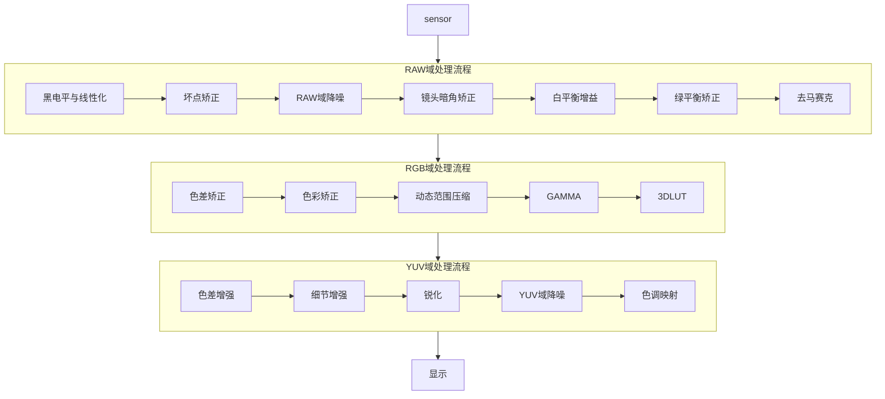

# ISP系统

## 数字成像系统

数字成像系统是为了模仿人的视觉系统，尽可能地把现实场景恢复得与人眼接近。

将自然界中光信号转化为电信号，然后将模拟电信号转化为数字信号的过程，将数字信号进行处理，最终到显示设备送显或者文件格式存储。

## 目的

图像是人类视觉的基础，是自然景物的客观反映，是人类认识世界和人类本身的重要来源。

”图“是物体反射或透射光的分布，”像“是人类视觉系统所接受的图在人脑中形成的印象或认识。

数字成像系统是为了模仿人的视觉系统，尽可能地把现实场景恢复得与人眼接近。整个ISP pipeline都是围绕对真实世界的还原而设计的。

## 组成

* 镜头（Lens）
  * 镜头由透镜组成，景物的光线通过透镜在sensor平面形成清晰的像。透镜越多，成像效果越出色，但是成本也越高。
* 红外滤光片（可选）
  * 人眼无法观察红外光线，但是sensor可以，所以需要滤除红外光，让图像更接近人类观察的效果。
* 图像传感器（Sensor）
  * 将镜头的光信号转化为电信号，再经过内部AD将模拟电信号转化为数字信号。
  * sensor中每个像素点只能感光R、G、B中的一种，这些最原始的感光数据称为RAW数据。
  * 类型
    * CCD
    * CMOS
* ISP
  * 将RAW数据处理成三通道的彩色图像。
* 显示

## 应用

* 手机相机
* 数码相机
* 行车记录仪
* 安防系统
* 无人机
* 汽车ADAS系统

## ISP处理流程

### pipeline

经过ISP的处理后，图像信号反映更加真实的现实场景。

ISP pipeline有多种，以下是其中一种。

### RAW域处理流程

* 黑电平与线性化
* 坏点矫正
* RAW域降噪
* 镜头暗角矫正
* 白平衡增益
* 绿平衡矫正
* 去马赛克

### RGB域处理流程

* 色差矫正
* 色彩矫正
* 动态范围压缩
* GAMMA
* 3DLUT

### YUV域处理流程

* 色彩增强
* 细节增强
* 锐化
* YUV域降噪
* 色调映射

### 主pipeline以外处理

* 自动曝光
* 自动对焦
* 自动白平衡
* 闪光灯
* 图像缩放
* 图像压缩
* 畸变矫正
* 图像防抖
* 深度图
* JPEG