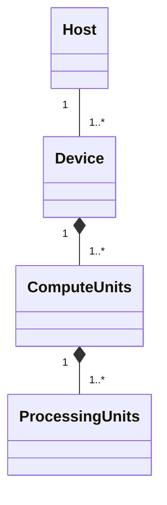
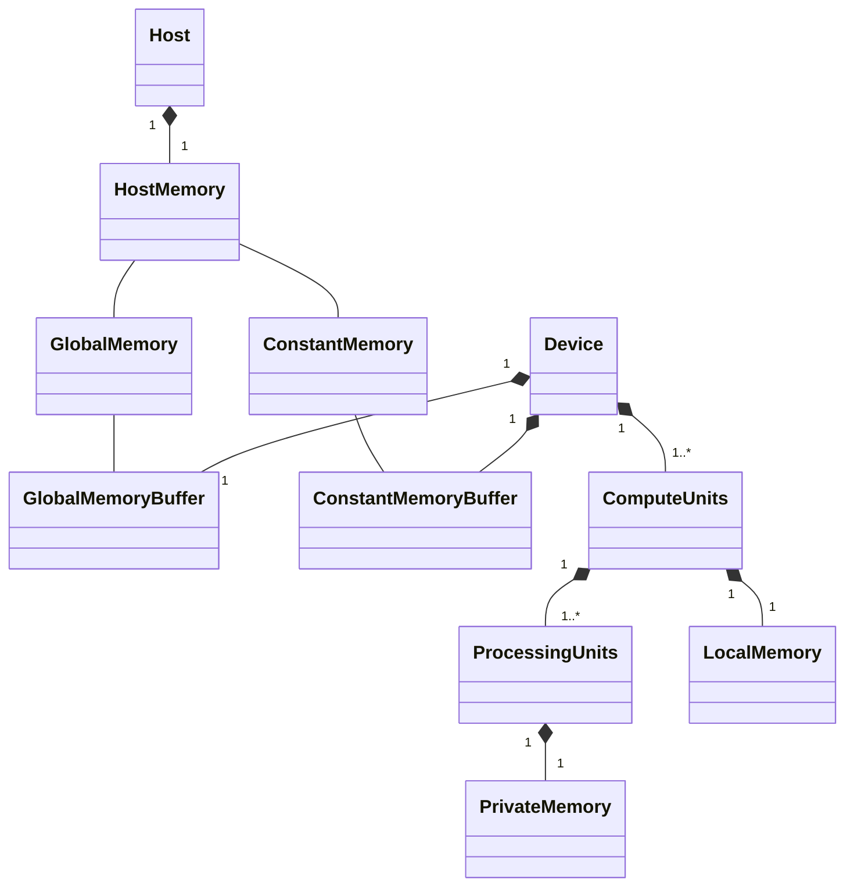
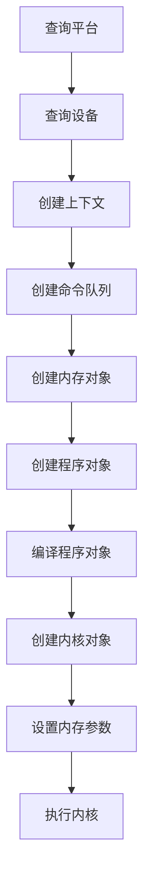

# OpenCL

## 基本概念

### 简介

OpenCL（Open Computing Language，开放计算语言）是异构平台并行编程开发标准，也是并行编程框架。

OpenCL支持数据并行和任务并行。

OpenCL支持多种处理器芯片，主要包括CPU、GPU、DSP和FPGA。

OpenCL提高了底层硬件结构的抽象模型，目的是使用一套通用的API，即减轻开发人员的编程难度，又让开发人员写出高效可移植的代码。

OpenCL包括两个部分：

* OpenCL C语言（OpenCL 2.1开始使用OpenCL C++作为内核编程应用）和主机端API
* 硬件架构抽象

OpenCL异构并行计算架构：

- **平台模型（platform model）**：将硬件抽象为主机（host）或设备（device）。
  - 指定一个主机处理器，用于任务调度。
  - 指定一个或多个设备处理器，用于执行OpenCL内核（OpenCL C kernel）。
- **内存模型（memory model）**：定义了内存对象的类型，抽象了内存层次，内核无需了解其使用的内存实际架构。
- **执行模型（execution model）**：定义了OpenCL在主机上运行的环境该如何配置，以及主机如何指定设备执行某项任务。
  - 主机运行环境。
  - 主机-设备交互的机制。
  - 配置内核时使用的并发模型。
    - 并发模型：定义如何将算法分解成OpenCL工作项和工作组。
- **编程模型（programming model）**：定义了并发模型如何映射到实际物理硬件。

### 平台模型

OpenCL平台模型由主机及其相连的一个或多个OpenCL设备组成。

* 主机包括X86或ARM处理器的计算平台。
* 设备可以是CPU（也可以将主机端的CPU作为OpenCL设备）、GPU、DSP、FPGA或硬件商提供、OpenCL开发商支持的任何其他处理器。

平台模型包括一个主机和一个或多个设备，每个设备有一个或多个计算单元（Compute Units， CU），每个计算单元由一个或多个处理元素（Processing Elements， PE）组成。

处理元素是设备上执行数据计算的最小元素。

### 执行模型

OpenCL程序包括**主机端程序**和**内核（kernel）程序**

* 主机端程序运行在主机处理器上，主机端程序以命令方式将内核程序从主机传输到设备。
* 内核程序在设备的处理单元上执行。内核通常是一些计算量大、逻辑简单的函数。设备通过内核将输入数据计算后输出给主机。

OpenCL三类内核

* **OpenCL内核**：用OpenCL C编程语言编写，并用OpenCL C编译器编译的函数。所有OpenCL实现都必须支持OpenCL内核和OpenCL C编程语言。
* **原生内核**：OpenCL之外创建的函数，在OpenCL中可以通过一个函数指针来访问。例如，这些函数可以是主机源代码中定义的函数，或者是从一个专门库导出的函数。需要指出的是，执行原生内核是OpenCL的一个可选功能，原生内核的语义依赖于具体OpenCL实现。
* **内建内核**：被绑定到特定设备，并不需要源码编译成程序对象的函数。常见用法是针对公开固定函数硬件或固件，将它们关联到一个特定的OpenCL设备或自定义设备。内建内核是OpenCL扩展功能，内建内核语义依赖于具体OpenCL实现

OpenCL设备通常没有IO处理能力，IO操作通常由主机承担，这意味着程序开始执行时，数据通常在主机上，设备需要从主机上获取数据，在设备完成计算后，又要将数据从设备复制到主机。

#### 上下文

上下文由主机创建和管理，执行内核。

上下文定义了内核执行的环境，包括：

* **设备**：平台包含一个或多个设备。
  * OpenCL支持的设备有CPU、GPU、DSP、FPGA等。主机可以根据具体问题和运行的内核选择设备的组合方案（例如1个CPU、1个GPU、1个CPU+1个GPU、多个GPU等方案），在定义的上下文中包含设备方案。
* **内核对象**：设备上运行的内存函数。
* **程序对象**：实现整个内核程序的源代码和目标二进制码。
  * 上下文包含一个或多个程序对象。
  * 程序对象可以理解为动态库。可以从程序对象中选取内核使用的函数。
  * 程序对象在运行时由主机程序构建。
    * 从程序源代码中构建。
    * 从源代码中已经编译好的代码上构建。
* **内存对象**：对主机和设备可见的对象，内核执行时操作内存对象的实例。
  * 在主机上定义。
  * 在主机与设备间交换数据。

#### 命令队列

主机通过命令队列与设备进行交互。

一个命令队列在上下文中会与一个设备进行关联。

命令由主机或运行在设备中的内核（支持OpenCL 2.0以上设备）提交给命令队列，然后等待，直到被调度到OpenCL设备上执行。

命令的类型：

* 内核入队命令
  * 在一个设备执行内核，需要将内核入队到与该设备关联的命令队列。
* 内存入队命令
  * 在主机与设备内存对象间传输数据。
  * 将内存对象映射到主机地址空间，或取消内存对象映射到主机地址空间。
* 同步命令
  * 对命令队列中需要执行的命令施加执行顺序约束，如只有某个命令执行完成其他命令才能开始执行。

命令是**异步执行**的：主机或运行在设备的内核将命令进入命令队列，无需等待命令完成，就可以继续工作。如果需要等待命令完成，可以利用命令执行相关的同步机制进行同步。

命令在命令队列中执行方式

* 按序（in-order）执行：命令按其进入命令队列中的先后顺序执行，并按顺序完成。
* 乱序（out-of-order）执行：命令以任意顺序执行，通过显式的同步点或显式事件依赖项来约束顺序。

只有在内核实例执行时才会做与内核相关的计算。如果通过主机程序多次启动内核实例进行执行，会增加开销或加重应用程序控制流。一个有效的办法是从内核内部嵌套内核命令，运行在设备上的内核（父内核）入队一个内核实例（子内核）到设备端命令队列，无需主机程序参与。

#### 内核

OpenCL运行时将会创建一个整数索引空间。索引空间是OpenCL支持的一个N维网格，称为NDRange，其中N为1、2或3。三个长度为N的数据确定了NDRange的以下特征：

- 每个维度索引空间（或全局大小）的范围；
- 一个偏移指数F表明每个维度的初始索引值（默认为0）；
- 一个工作组（局部大小）每个维度大小。

内核实例：

* 内核
* 关联内核参数的参数值
* 定义索引空间的参数

工作项：索引空间的每个点，用于执行内核实例。

工作项的全局ID：工作项在索引空间的坐标。

工作项的局部ID：工作项在工作组中的坐标。

虽然工作项执行内核定义的相同的指令，但是由于工作项的全局ID不同，工作项的行为可能不同。

工作项提供对索引空间细粒度的分解。

工作组：由多个工作项组成，数量由内核入队时的参数决定。

工作组ID：工作组在索引空间的坐标。

工作组提供对索引空间粗粒度的分解。

定义一个二维的索引空间：

工作项在索引空间的大小为(Ax, Ay)

工作项在工作组的大小为(Bx, By)

工作组在索引空间的大小为(Cx, Cy)
$$
Cx = ceil(Ax / Bx)\\Cy = ceil(Ay / By)
$$
工作项的全局ID为(Gx, Gy)

工作项的全局偏移为(Fx, Fy)

工作项的局部ID为(Lx, Ly)，范围从(0, 0)到(Bx-1, By-1)

工作组ID为(Wx, Wy)，范围从(0, 0)到(Cx-1, Cy-1)
$$
Gx = Wx * Bx + Lx + Fx\\Gy = Wy * By + Ly + Fy
$$

### 内存模型

#### 内存区域

内存区域包括主机和设备的内存。

类型：

* 主机内存（host memory）：主机直接可用的内存，OpenCL并未定义主机内存的具体行为。通过OpenCL API或者共享虚拟内存接口，实现内存对象在主机与设备间的传输。
* 全局内存（global memory）：这个内存区域允许上下文中任何设备中所有工作组的所有工作项的读写，工作项可以读写内存对象中的任意元素。全局内存的读写可能会被缓存，这取决于设备能力。
* 常量内存（constant memory）：全局内存中的一块区域，在内核实例执行期间其保存的数据保持不变。对工作项而言这个内存对象是只读的，主机负责对该内存对象的分配和初始化。
* 局部内存（local memory）：这个内存区域对工作组是局部可见的，它可以用来分配由该工作组中所有工作项共享的变量。
* 私有内存（private memory）：这个内存区域是一个工作项的私有区域。一个工作项私有内存中定义的变量对其他工作项是不可见的。

主机内存在主机中

全局内存和常量内存由上下文中一个或多个设备共享，设备可能包含缓存对这两个内存高效访问

局部内存在计算单元中

私有内存在处理元素中

#### 内存对象

内存对象表示全局内存区域中数据内容。

类型：

- 缓冲（buffer）：内核可用的一个连续的内存区域，编程人员可以将内建数据类型、矢量类型数据或用户自定义的数据结构（当然要符合OpenCL编程规范）映射到这个缓冲区，内核通过指针来访问缓冲区。
- 图像（image）：图像对象用于存储基于标准格式的图像。图像对象是一个不透明的数据结构，使用OpenCL API函数来管理。通常不允许OpenCL内核对单个图像同时进行读和写。然而在OpenCL 2.0中，提供了同步和栅栏操作来放宽这个限制。
- 管道（pipe）：管道内存是数据项有序的队列。管道有两个端点：一个是写端点，用于插入数据项；另一个是读端点，数据项从读端点被移除。同一时刻，仅有一个内核实例可向一个管道写入数据，同时仅有一个内核实例可从一个管道读出数据。

主机和设备的内存模型是独立的，内存模型的交互方式：

* 读/写/填充
  * 主机将读/写/填充的命令入队，数据在主机和全局内存之间传输。
* 映射和解映射
  * 将内存区域映射到主机可以访问的地址空间。
  * 在主机安全操作内存对象之前，主机需要将映射该内存对象的命令入队到命令队列。
  * 主机完成对内存对象操作后，主机需要将解映射的命令入队到命令队列，这样内存才能安全读写缓冲。
* 拷贝
  * 拷贝命令是将存储器对象在两个缓冲间拷贝，这两个缓冲可驻留在主机或设备上。

上述三个操作命令可以是阻塞或非阻塞操作。

#### 共享虚拟内存

通过映射，可以将全局内存区域映射到主机可以访问的地址空间。而除了这种方式，在OpenCL 2.0中，OpenCL通过共享虚拟内存（Shared Virtual Memory，SVM）机制扩展了全局内存区域到主机内存区域的方式。

OpenCL 2.0中定义了三种SVM类型：

- 粗粒度SVM：共享发生在OpenCL缓冲内存对象区域的粒度；
- 细粒度SVM：共享发生在OpenCL缓冲内存对象里独立地以字节加载/存储的粒度；
- 细粒度系统SVM：共享发生在主机内存内任何地方独立地以字节加载/存储的粒度。

粗粒度内存SVM是OpenCL的核心规范，而对于后两种细粒度实现是可选。

## 基础教程

类图

流程

平台

设备

上下文

命令队列

内存对象

程序对象

内核对象

## OpenCL C

内核代码

## 同步及事件机制

