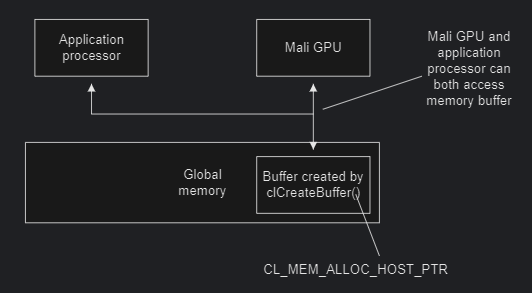
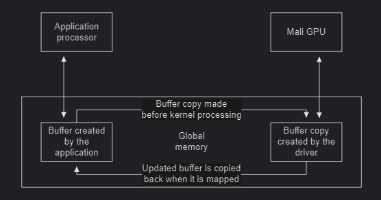
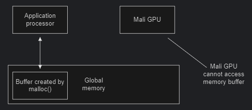

# Mali GPUs的OpenCL优化

## 优化步骤

识别计算最密集的部分去优化应用程序。在OpenCL应用程序中，这意味着识别花费最多时间的内核。

识别计算最密集的内核，必须单独测量每个内核的耗时：

* 测量单个内核
  * 每次检查一个内核，测量其多次运行的时间并求平均。
  * 在某些情况下，某些缓冲区的分配户延迟到第一次使用它们。这可能导致第一次内核运行比后续运行慢。
* 选择最耗时的内核
  * 选择最耗时的内核并优化它们。优化其他内核在整体性能上影响不大。
* 分析内核
  * 分析内核，看它们是否包含计算昂贵的操作：
    * 测量内核中的读写次数。为了获得高性能，在每次内存访问中执行尽可能多的计算。
    * 对于Mali GPU，可以使用Offline Shader Compiler检查不同单元之间的平衡。
* 测量内核中单独部分
  * 如果无法通过分析确定內核的计算密集型部分，则可以通过单独测量內核的不同部分来隔离它。
  * 可以通过删除不同的代码块开每次测量性能差异来实现此目的。
  * 花费最多时间的代码部分是最密集的。
* 应用优化
  * 考虑如何重写最密集的代码部分，以及适用哪些优化。应用相关优化。
* 检查结果
  * 每进行更改以优化代码时，请确保测量结果，以便确定优化是否成功。在一种情况下有益的许多更改可能在不同的条件下不会提供任何好处，甚至降低性能。
* 重申过程
  * 当通过优化提高了代码的性能时，请再次测量，了解是否还有其他方面可以提高性能。通常有几个方面可以提高性能，因此可能需要多次迭代该过程以获得最佳性能。

## 控制线程与OpenCL线程的负载均衡

确保控制线程与OpenCL线程并行运行。

* 不要使用`clFinish()`进行同步
  * 有时，应用程序处理器必须访问OpenCL写入的数据。此过程必须同步。
    您可以使用`clFinish()`执行同步，但Arm建议您尽可能避免这种情况，因为它将序列化执行。对`clFinish()`的调用会引入延迟，因为控制线程必须等到队列中的所有作业才能完成执行。控制线程在等待此进程完成时处于空闲状态。
    相反，在可能的情况下，便用`cIWaitForEvent()`或回调来确保控制线程和OpenCL可以并行工作。
* 不要将任何`clEnqueueMap()`操作与阻塞调用一起使用
  * 使用`clWaitForEvents()`或 回调来确保控制线程和OpenCL可以并行工作。
  * 步骤
    * 将工作分成许多部分。
    * 对于每个部分：
      1. 应用处理器上完成准备工作。
      2. 将OpenCL工作项提交到OpenCL设备。
    * 对于每个部分：
      1. 使用`clWaitForEvents()`等待在OpenCL设备的OpenCL工作项完成。
      2. 在应用处理器上处理来自OpenCL设备的结果。

## 优化内存分配

### 内存分配

为了避免复制，请使用 OpenCL API 分配内存缓冲区，并使用`map()`和`unmap()`操作。这些操作使应用程序处理器和 Mali GPU 能够在没有任何副本（copies）的情况下访问数据。

OpenCL 起源于桌面系统，其中应用处理器和 GPU 具有独立的内存。要在这些系统中使用 OpenCL，必须分配缓冲区以将数据复制到单独的内存中或从单独的内存中复制数据。

使用 Mali GPU 的系统通常具有共享内存，因此无需复制数据。然而，OpenCL 假设内存是独立的，缓冲区分配涉及内存拷贝。这是浪费的，因为复制耗时耗电。

`clCreateBuffer()`的不同`cl_mem_flags`参数。

| 范围                    | 描述                                                         |
| ----------------------- | ------------------------------------------------------------ |
| `CL_MEM_ALLOC_HOST_PTR` | 这是对驱动程序的提示，表明缓冲区已在主机端被访问。要在应用程序处理器端使用缓冲区，必须映射该缓冲区并将数据写入其中。这是唯一不涉及复制数据的方法。如果必须填充由 GPU 处理的图像，这是避免复制的最佳方法。 |
| `CL_MEM_COPY_HOST_PTR`  | 将`host_ptr`参数指向的数据复制到驱动程序分配的内存中。       |
| `CL_MEM_USE_HOST_PTR`   | 当第一个使用该缓冲区的内核开始运行时，将主机内存指针指向的数据复制到缓冲区中。该标志强制执行可能降低性能的内存限制。如果可能的话，避免使用这个。 当执行映射时，必须将内存复制回提供的主机指针。这大大增加了映射操作的成本。 |

Arm 建议如下：

- 不要使用私有内存或本地内存来提高内存读取性能。
- 如果内核受内存带宽限制，请尝试使用简单的公式来计算变量，而不是从内存中读取。这可以节省内存带宽，而且可能会更快。
- 如果内核受计算限制，请尝试从内存中读取，而不是计算变量。这可以节省计算量，而且可能会更快。

### 使用`CL_MEM_ALLOC_HOST_PTR`避免内存拷贝

Mali GPU 可以访问由`clCreateBuffer(CL_MEM_ALLOC_HOST_PTR)`分配的内存缓冲区。这是分配缓冲区的首选方法，因为不需要数据拷贝。

Arm 建议如下：

- 您必须通过 OpenCL API 进行初始内存分配。
- 始终使用返回的最新指针。如果重复映射和取消映射缓冲区，则不能保证缓冲区映射到的地址是相同的。

### 尽可能不使用`CL_MEM_USE_HOST_PTR`创建缓冲区

当使用`clCreateBuffer(CL_MEM_USE_HOST_PTR)`创建内存缓冲区时，驱动程序可能需要将数据复制到一个独立的缓冲区。拷贝使得运行在 GPU 上的内核能够访问该缓冲区。如果内核修改缓冲区并且应用程序映射缓冲区以便可以读取它，则驱动程序会将更新的数据复制回原始位置。驱动程序使用应用程序处理器来执行这些复制操作，这些操作的计算成本很高。

应用程序可以选择其他分配类型，则可以避免这些昂贵的复制操作。例如，`CL_MEM_ALLOC_HOST_PTR`。

### 对于OpenCL应用，不要使用`malloc()`分配内存

Mali GPU不能访问通过`malloc()`申请的内存，因为该内存可能未映射到 Mali GPU 的地址空间。

### 在I/O设备和OpenCL之间共享内存

对于与 OpenCL 共享内存的 I/O 设备，必须使用`CL_MEM_ALLOC_HOST_PTR`.

必须在 OpenCL 中分配内存，`CL_MEM_ALLOC_HOST_PTR`确保内存页始终映射到物理内存。

如果在应用程序处理器上分配内存，操作系统可能不会为页分配物理内存，直到第一次使用它们才会分配物理内存。如果 I/O 设备尝试使用未映射的页，则会发生错误。

### 在完全一致性系统中共享内存

完全一致性的系统使应用处理器和 GPU 能够轻松共享数据，从而提高性能。

凭借完全系统一致性，应用程序处理器和 GPU 可以访问内存，而无需对内存对象的cache的clean或invalidate操作。当数据在应用处理器和 GPU 之间共享时，这可以提供比 I/O 一致性系统更好的性能。

### 在I/O一致系统中共享内存

通过 I/O 一致分配，驱动程序无需在 Mali GPU 上使用内存对象前后，对内存执行cache的clean或invalidate操作。如果在应用程序处理器和 Mali GPU 上都使用内存对象，这可以提高性能。

如果平台是 I/O 一致的，则可以将`CL_MEM_ALLOC_HOST_PTR`标志传递给`clCreateBuffer()`或`clCreateImage()`来启用 I/O 一致内存分配。

## 参考

https://developer.arm.com/documentation/100614/0314/Optimizing-OpenCL-for-Mali-GPUs